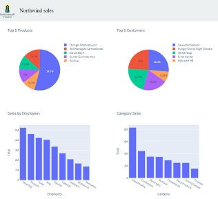
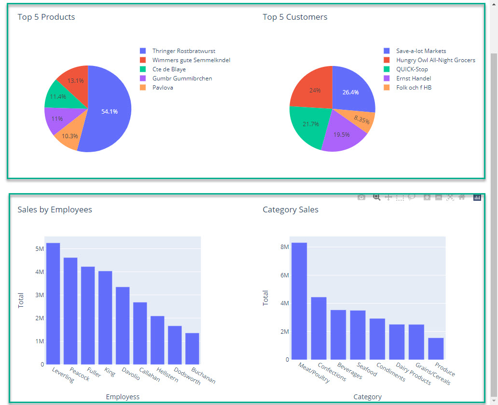
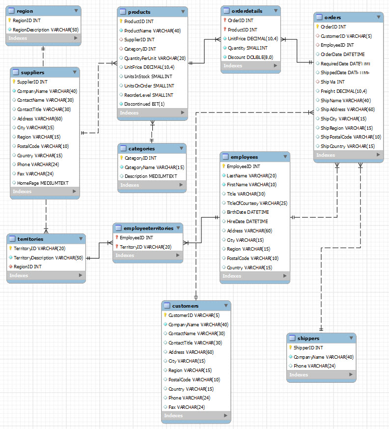

[Home](../README.md)

# Northwind Dashboard
This is a demo of creating a **dashboard** using **Python** and **Dash**



## Virtual Environment
Create and activate a new virtual environment - **northwind**

- python3 -m venv northwind

## Files
You have to download thise files and place them, in the right folders, in the **nortwind** virtuel Environment 

- **data**/[northwind_data.xlsx](./codefiles/dashdemo/northwind_data.xlsx)
- **assets**/[Northwind-Logo.gif](./codefiles/northwind/assets/Northwind-Logo.gif)

## Modules
You need to install the following modules, inside the virtual environment, using an **requirements.txt** file

- dash
- plotly
- pandas
- openpyxl
- dash_bootstrap_components

When they are installed you can import the modules:

```python
import dash
from dash import dcc
from dash import html
import dash_bootstrap_components as dbc
import plotly.express as px
import pandas as pd
```

## Data import
The data for this demo is located in one Excel file  - **northwind_data.xlsx**

The Excel file has 4 sheets:

- *EmployeesSale*
- *CategorySale*
- *Top5Products*
- *Top5Customers*

Each of the sheets are imported into a Pandas dataframe - using **pd.read_excel**

```python
Excel_file = 'data/northwind_data.xlsx'
EmployeesSale = pd.read_excel(Excel_file, "EmployeesSale")
CategorySale = pd.read_excel(Excel_file, "CategorySale")
Top5Products = pd.read_excel(Excel_file, "Top5Products")
Top5Customers = pd.read_excel(Excel_file, "Top5Customers")
```

## Create charts
For this demo we create 4 different charts, one for each dataframe.

```python
def top5_products():
    fig = px.pie(Top5Products, values='Total', names='ProductName', title='Top 5 Products')
    return fig

def top5_customers():
    fig = px.pie(Top5Customers, values='Total', names='CompanyName', title='Top 5 Customers')
    return fig

def employesssale():
    fig = px.bar(EmployeesSale, x='EmployeesName', y='Total', title='Sales by Employees')
    return fig    

def categorysale():
    fig = px.bar(CategorySale, x='CategoryName', y='Total', title='Category Sales')
    return fig
```

## Initialize the Dash App
Now you have to define the Dash App and make the layout of the different charts

- The 4 charts has to be in 2 rows. Each row with a hight of 200 px
- For the design we are using the predefined [Flatly Theme](https://bootswatch.com/flatly/) 



```python
app = dash.Dash()

# Flatly theme
app = dash.Dash(external_stylesheets = [ dbc.themes.FLATLY],)

body_app = dbc.Container([
    
    dbc.Row([
        # 1 column, 1 row, covering 6 columms
        dbc.Col(
            dcc.Graph(id = 'top5products', figure = top5_products()),
            style = {'height':'400px'},xs = 12, sm = 12, md = 6, lg = 6, xl = 6),
         
        # 2 column, 1 row, coving 6 columns 
        dbc.Col(
            dcc.Graph(id = 'top5customers', figure = top5_customers()),
            style = {'height':'400px'},xs = 12, sm = 12, md = 6, lg = 6, xl = 6),         
    ]), 

    dbc.Row([
        # 1 column, 2 row, coving 6 columns 
        dbc.Col(
            dcc.Graph(id = 'employeessale', figure=employesssale()),
            style = {'height':'400px'},xs = 12, sm = 12, md = 6, lg = 6, xl = 6),

        # 2 column, 2 row, coving 6 columns 
        dbc.Col(
            dcc.Graph(id = 'categorysale', figure=categorysale()),
            style = {'height':'400px'},xs = 12, sm = 12, md = 6, lg = 6, xl = 6),
    ]),

],fluid = True)  # Using Fluid   
```

## Top bar - Logo
In the top of the webpage we would like to have a logo.

- The Flatly theme has a **Navbar** definitionen
- The logo (*Northwind-Logo.gif*) are placed in the folder **assets**

```python
logo = './assets/Northwind-Logo.gif'

topbar = dbc.Navbar(
    [
        dbc.Row(
            [
                dbc.Col(html.Img(src = logo, height = "70px"), ),
                dbc.Col(
                    dbc.NavbarBrand("Northwind sales", style = {'color':'black', 'fontSize':'25px','fontFamily':'Times New Roman'}
                    ),
                )
            ],
            align="center",
            className="g-10",
        ),
    ]
)
```

## Dash Layout
You have to define the **app layout**. It has to include, the *topbar* and the *body_app*

```python
app.layout = html.Div(id = 'parent', children = [topbar, body_app])
```

## Run the app
You have to start the Dash app server.

It is, by default, running local on the IP adresse: http://127.0.0.1:8050

```python
if __name__ == "__main__":
    app.run_server()
```

You can terminate the Dash server with: **CTRL + C**

# Database extension
Until now you have usede data from Excel (*northwind_data.xlsx*), now we change this to your local MySQL database.

You have to create the **Northwind** database. It is done with the **northwind_kea.sql** script - [northwind_kea.sql](./codefiles/sql/northwind_kea.sql)

The script creates the Northwind database, 11 tables with data and the relations between the different tables.



# Views
In the Northwind database you have to create 4 view's - It can be done without the 4 view's but it is more connivent to work with the view's - [dash_views.sql](./codefiles/sql/dash_views.sql)

```sql
create view CategorySale
as
	select 
		CategoryName,
		sum(orderdetails.UnitPrice * orderdetails.Quantity) as Total
	from categories join products
	on categories.CategoryID = products.ProductID
	join orderdetails
	on products.ProductID = orderdetails.ProductID
	group by CategoryName
	order by total desc;

# EmployeesSale
create view EmployeesSale
as
	select 
		concat(employees.FirstName, ' ', employees.LastName) as EmployeeName,
		sum(orderdetails.UnitPrice * orderdetails.Quantity) as Total
    from employees join orders
    on employees.EmployeeID = orders.EmployeeID
    join orderdetails
    on orders.OrderID = orderdetails.OrderID
    group by FirstName
	order by Total desc;    
    
# Top5Products
create view Top5Products
as
	select 
		ProductName,
		sum(orderdetails.UnitPrice * orderdetails.Quantity) as Total
    from products join orderdetails
    on products.ProductID = orderdetails.ProductID
    group by ProductName
    order by Total desc
	limit 5;
    
# Top5Customers
create view Top5Customers
as
	select
		CompanyName,
        sum(orderdetails.UnitPrice * orderdetails.Quantity) as Total
	from customers join orders
    on customers.CustomerID = orders.CustomerID
    join orderdetails
    on orders.OrderID = orderdetails.OrderID
    group by CompanyName
    order by Total desc
    limit 5;

```

## Links
Collection of some relevant links:

- [plotly.com](https://plotly.com)
    - [Pie Charts](https://plotly.com/python/pie-charts)
    - [Bar Charts](https://plotly.com/python/bar-charts)
- [Dash](https://dash.plotly.com)
- [dash-bootstrap-components.opensource.faculty.ai](https://dash-bootstrap-components.opensource.faculty.ai)
- [Flatly Theme](https://bootswatch.com/flatly)
