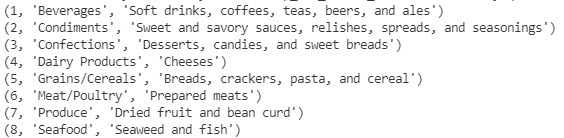
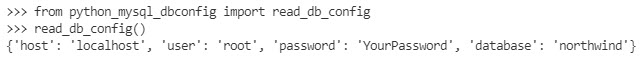

# Python MySQL connection
Python needs a MySQL driver to access the MySQL database.

MySQL provides standards-based drivers for Python enabling developers to build database applications.

- [MySQL Connectors](https://www.mysql.com/products/connector/)
- [MySQL Connector/Python Release Notes](https://dev.mysql.com/doc/relnotes/connector-python/en/)
- [MySQL Connector/Python Developer Guide](https://dev.mysql.com/doc/connector-python/en/)

The driver can be installed on your system with: **pip3 install mysql-connector-python**

## Northwind
We are using a demo database called **Northwind**. It is a Microsoft demo database.

You can create the Northwind database with this SQL script: [northwind_kea.sql](./codefiles/sql/northwind_kea.sql)

The script creates the database, 11 tables, the relationships between them and inserts the data.

### Er diagram


## Virtual Environment
Create and activate a new virtual environment - **demomysql**

## Modules
You need to install the following modules, inside the virtual environment, using an **requirements.txt** file:

- mysql-connector-python

## Connect to MySQL
This Python code includes error handling and it prints a message if the connections is a success.

- Create a Python file: **LokalMysql_1.py**
- We connect to the **northwind** database on the local server

```python
# Import
import mysql.connector
from mysql.connector import Error

# MySQL connection
def connect():
    conn = None
    try:
        conn = mysql.connector.connect(host='localhost',
                                       user='root',
                                       password='xxxx',
                                       database='northwind')
        if conn.is_connected():
            print('Connected to MySQL database')

    except Error as e:
        print(e)

    finally:
        if conn is not None and conn.is_connected():
            conn.close()

if __name__ == '__main__':
    connect()
```

## Select
You can test the connection with a *simpel* select statement - **SELECT * FROM categories**

```python
if conn.is_connected():
    print('Connected to MySQL database')
            
    # SQL - SELECT * FROM categories
    cursor = conn.cursor()
    cursor.execute('SELECT * FROM categories')

    row = cursor.fetchone()

    while row is not None:
        print(row)
        row = cursor.fetchone()
```



If you get 8 rows, the connection is working.

## Connecting to MySQL Database using MySQLConnection object
In previous example, we **hard-coded** the database configuration such as *localhost* , *northwind* , *root* and the *password* within the code. 

**It is not a good practice!** - Let’s fix the code by using a database configuration file.

### config.ini
Create a database configuration file named **config.ini** and define a section **[mysql]** with four parameters:

```python
[mysql]
host = localhost
user = root
password = YourPassword
database = northwind
```
Save the **config.ini** file in the virtual environment.

### python_mysql_dbconfig.py
Create a new module named **python_mysql_dbconfig.py** that reads the database configuration from the **config.ini** file and returns a dictionary object.

We are using the *ConfigureParser* package to read the configuration file.

```python
# Import
from configparser import ConfigParser

def read_db_config(filename='config.ini', section='mysql'):

    # Create parser and read config.ini configuration file
    parser = ConfigParser()
    parser.read(filename)

    # Get section, default to mysql
    db = {}
    if parser.has_section(section):
        items = parser.items(section)
        for item in items:
            db[item[0]] = item[1]
    else:
        raise Exception('{0} not found in the {1} file'.format(section, filename))

    return db
```

- *filename*: name of the configuration file
- *section*: section of database configuration
- *return*: a **dictionary** of database parameters from the *config.ini* file

You can test the connection parameters by running thise 2 commands in a terminal:

- *from python_mysql_dbconfig import read_db_config*
- *read_db_config()*



If you get your parameters from the config.ini file everything is fine.

### LocalMysql_2.py
Create a new module **LocalMysql_2.py**  that uses the MySQLConnection object to connect to the  database.

```python
# Import
from mysql.connector import MySQLConnection, Error
from python_mysql_dbconfig import read_db_config

# Connect to MySQL database
def connect():

    db_config = read_db_config()
    conn = None
    try:
        print('Connecting to MySQL database...')
        conn = MySQLConnection(**db_config)

        if conn.is_connected():
            print('Connection established')
        else:
            print('Connection failed')

    except Error as error:
        print(error)

    finally:
        if conn is not None and conn.is_connected():
            conn.close()
            print('Connection closed')


if __name__ == '__main__':
    connect()
```

- Import necessary objects including MySQLConnection, Error from *MySQL Connector* package and  **read_db_config** from **python_mysql_dbconfig** module
- Read the database configuration and pass it to create a *new instance of MySQLConnection object* in the connect() function

If you get thise, it is working


# Select 
You can test the connection with a *simpel* select statement - **SELECT * FROM categories**

```python
try:
    print('Connecting to MySQL database...')
    conn = MySQLConnection(**db_config) # ** defining db_config to "capture" all keywords

    if conn.is_connected():
        print('Connection established')
            
        # SQL - SELECT * FROM categories
        cursor = conn.cursor()
        cursor.execute('SELECT * FROM categories')

        row = cursor.fetchone()

        while row is not None:
            print(row)
            row = cursor.fetchone()

                    else:
            print('Connection failed')

except Error as error:
    print(error)

finally:
    if conn is not None and conn.is_connected():
        conn.close()
        print('Connection closed')
```

- Instantiate the MySQLCursor object from the MySQLConnection object
- Execute a query that selects all rows from the books table
- After that, fetch the next row in the result set by calling the **fetchone()**
- In the  while loop block, print the contents of the row and move to the next row until all rows are fetched
- Finally, close both cursor and connection objects by invoking the **close()** method of the corresponding object

There is 2 other *fetch* metodes:

- fetchall()
- fetchmany()

Use **fetchall()** if you have a *small* table and **fetchmany()** if you have a table with *many* rows

# Stored Procedures
A stored procedure is a segment of SQL statements stored inside the MySQL Server. Once you save the stored procedure, you can invoke it by using the CALL statement:

    CALL StoredProcedureName

The first time you invoke a stored procedure, MySQL looks up for the name in the database catalog, compiles the stored procedure’s code, place it in a memory area known as a cache, and execute the stored procedure.

If you invoke the same stored procedure in the same session again, MySQL just executes the stored procedure from the cache without having to recompile it.

A stored procedure can have **parameters** so you can pass values to it and get the result back. For example, you can have a stored procedure that returns customers by *country* and *city*. In this case, the *country* and *city* are parameters of the stored procedure.

A stored procedure may contain control flow statements such as **IF**, **CASE**, and **LOOP** that allow you to implement the code in the procedural way.

A stored procedure can call other stored procedures or stored functions, which allows you to modularize your code.

### Stored procedures advantages
- Reduce network traffic
- Centralize business logic in the database
- Make database more secure

### Stored procedures disadvantages
- Resource usages
- Troubleshooting
- Maintenances

## Create Stored procedure


```sql
DELIMITER $$

CREATE PROCEDURE EmployeesSaleByMonth(
	month_nr int
)
BEGIN
	select 
		employees.LastName,
		orders.OrderID,
		month(orders.OrderDate) as 'monthnr',
		sum(orderdetails.Quantity * orderdetails.UnitPrice) as Total
	from employees join orders
	on employees.EmployeeID = orders.EmployeeID
	join orderdetails
	on orders.OrderID = orderdetails.OrderID
	group by employees.LastName, monthname(orders.OrderDate)
	having monthnr = month_nr
    order by Total desc;
END$$

DELIMITER ;
```