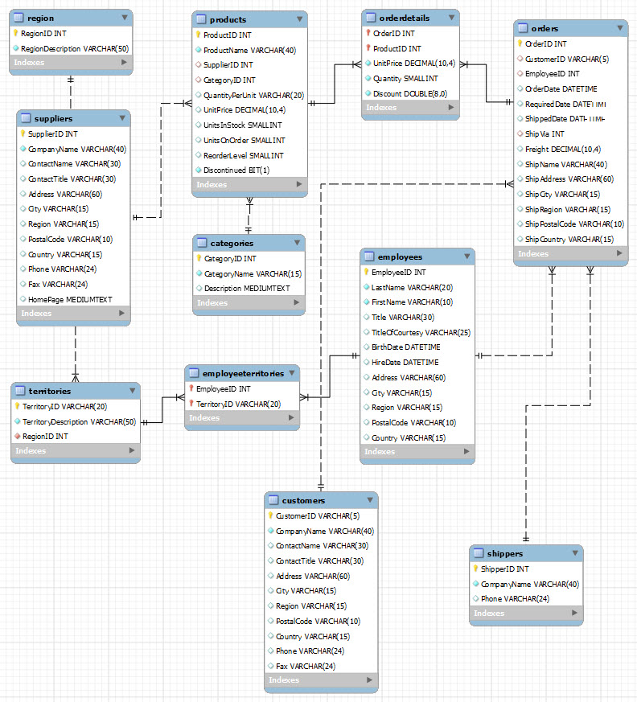

# Python MySQL connection
Python needs a MySQL driver to access the MySQL database.

MySQL provides standards-based drivers for Python enabling developers to build database applications.

- [MySQL Connectors](https://www.mysql.com/products/connector/)
- [MySQL Connector/Python Release Notes](https://dev.mysql.com/doc/relnotes/connector-python/en/)
- [MySQL Connector/Python Developer Guide](https://dev.mysql.com/doc/connector-python/en/)

The driver can be installed on your system with: **pip3 install mysql-connector-python**

## Northwind
We are using a demo database called **Northwind**. It is a Microsoft demo database.

You can create the Northwind database with this SQL script: [northwind_kea.sql](./codefiles/sql/northwind_kea.sql)

The script creates the database, 11 tables, the relationships between them and inserts the data.

### Er diagram



## Virtual Environment
Create and activate a new virtual environment - **demomysql**

## Modules
You need to install the following modules, inside the virtual environment, using an **requirements.txt** file:

- mysql-connector-python

## Connect to MySQL
This Python code includes error handling and it prints a message if the connections is a success.

- Create a Python file: **LokalMysql_1.py**
- We connect to the **northwind** database on the local server

```python
# Import
import mysql.connector
from mysql.connector import Error

# MySQL connection
def connect():
    conn = None
    try:
        conn = mysql.connector.connect(host='localhost',
                                       user='root',
                                       password='Naimo6868/?',
                                       database='northwind')
        if conn.is_connected():
            print('Connected to MySQL database')

    except Error as e:
        print(e)

    finally:
        if conn is not None and conn.is_connected():
            conn.close()

if __name__ == '__main__':
    connect()
```

## Select
You can test the connection with a *simpel* select statement - **SELECT * FROM categories**

```python
mycursor = mydb.cursor()
mycursor.execute("SELECT * FROM categories")
myresult = mycursor.fetchall()

for x in myresult:
  print(x)
```


If you get 8 rows, the connection is working.

## Connecting to MySQL Database using MySQLConnection object
In previous example, we **hard-coded** the database configuration such as *localhost* , *northwind* , *root* and the *password* within the code. 

**It is not a good practice!** - Let’s fix the code by using a database configuration file.

### config.ini
Create a database configuration file named **config.ini** and define a section **[mysql]** with four parameters:

```python
[mysql]
host = localhost
user = root
password = YourPassword
database = northwind
```
Save the **config.ini** file in the virtual environment.

### python_mysql_dbconfig.py
Create a new module named **python_mysql_dbconfig.py** that reads the database configuration from the **config.ini** file and returns a dictionary object.

We are using the *ConfigureParser* package to read the configuration file.

```python
# Import
from configparser import ConfigParser

def read_db_config(filename='config.ini', section='mysql'):

    # Create parser and read config.ini configuration file
    parser = ConfigParser()
    parser.read(filename)

    # Get section, default to mysql
    db = {}
    if parser.has_section(section):
        items = parser.items(section)
        for item in items:
            db[item[0]] = item[1]
    else:
        raise Exception('{0} not found in the {1} file'.format(section, filename))

    return db
```

- *filename*: name of the configuration file
- *section*: section of database configuration
- *return*: a **dictionary** of database parameters from the *config.ini* file

You can test the connection parameters by running thise 2 commands in a terminal:

- *from python_mysql_dbconfig import read_db_config*
- *read_db_config()*


If you get your parameters from the config.ini file everything is fine.

### LocalMysql_2.py


```python

```


