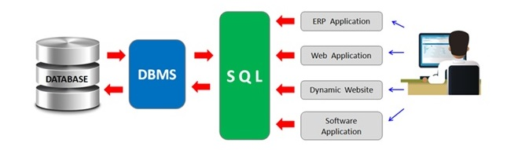
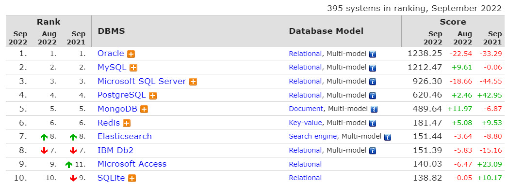
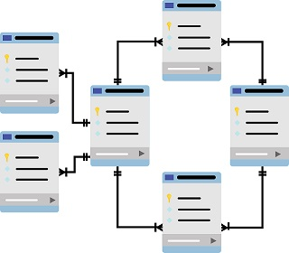
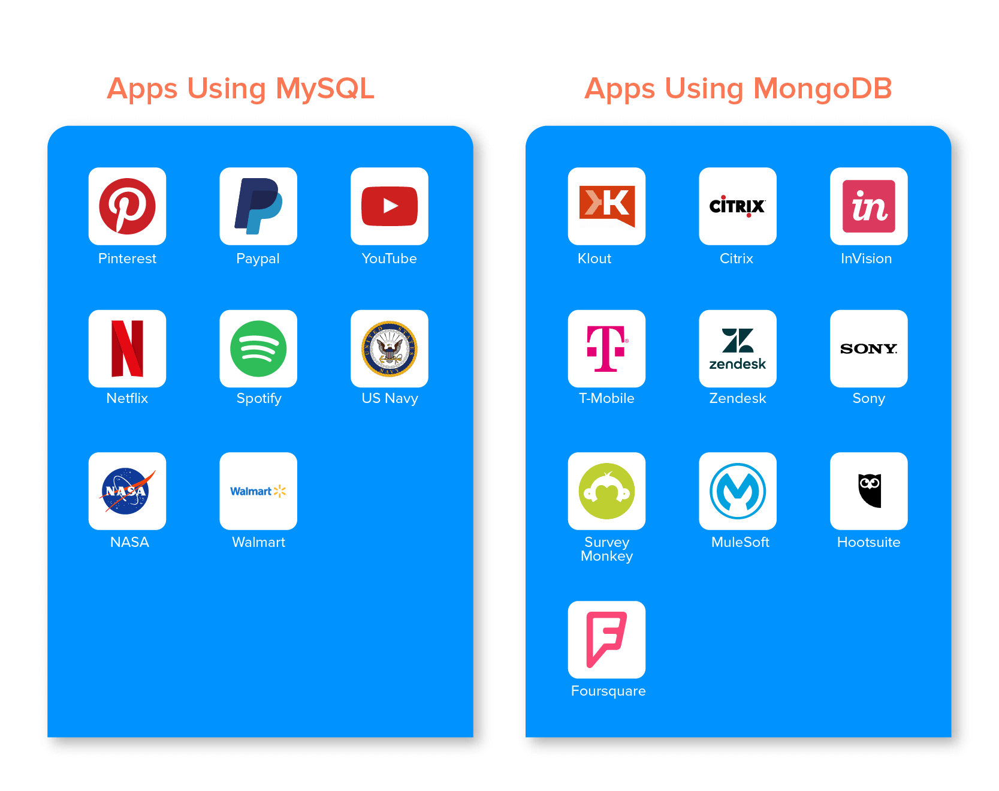
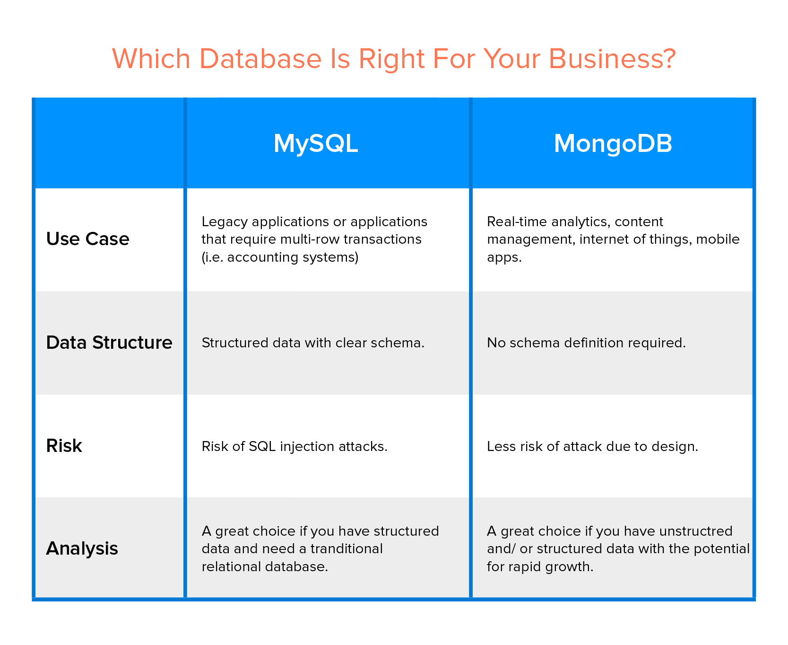

[Home](../modul-4-2.md)

# What is The Right Database for Your Use Case?
Companies out there use different types of databases to store all the information they collected throughout the years. Although all these databases might seem the same, they have some functionalities that make them more suitable for certain situations, so it’s worth learning more about them.

# What is a Database?
A database is a collection of data typically stored electronically in a computer system and controlled by a database management system (*DBMS*). 

The data, the DBMS, and the applications associated with them are referred to as a database system or just "*database*".

**Database management system** and **Database** are often used interchangeably, but technically they’re not the same.

# Database Ranking
It’s hard to rank the database based on their functionality because they suit different needs and can be more convenient in certain scenarios than in others. 

The **DB-Engines** Ranking ranks database management systems according to their popularity.

[db-engines.com/en/ranking](https://db-engines.com/en/ranking)

Among the top 10 databases, you’ll see both relational and non-relational databases. **One type of database is not better than the other, but they suit different needs.**

# Types of Databases
Databases are typically divided into **Relational** and **Non-Relational** databases.

## Relational databases
A relational database (*SQL database*), stores data in tables and rows also referred to as records. This type of database links information from different tables through keys.

A key is a unique value in a table that is also known as the "*primary key*". When this key is added to a record located in another table, it’s called "*foreign key*" in this second table. This connection between primary and foreign keys creates a relationship between records within both tables.

Some popular **relational** database management systems (*RDBMS*) are MySQL, SQL Server, Oracle and PostgreSQL.

Here’s a basic schema that shows how a relational database works.

To query data in a RDBMS, we use Structured Querying Language (SQL). With SQL we can create new records, update them, and more.

This makes the RDBMS good for apps that need transactional functionality, data mining, and complex reporting.

### MySQL
MySQL is one of the most popular databases to use in 2022 in the computer world, especially in  web application development. The main focus of this database is on stability, robustness, and maturity. The most popular application of this database is for web development solutions. 

MySQL is written in C and C++ and uses a structured query language (*SQL*).

It’s open-source so any person or company can use MySQL for free, but if the code needs to be integrated into a commercial application, you need to purchase a license.

MySQL was developed by Oracle and it’s a relational database management system. Companies such as Facebook, Twitter, Wikipedia, and YouTube employ MySQL backends.

**Pros**
- It’s open source
- It’s cross-platform: Runs on Linus, Solaris, macOS and Windows and supports platforms with programming languages such as C, C++, Java, Python, etc.
- Reliable data security: *MySQL is known for being a secure database management system.*
- It’s easy to use: *Anyone can download, install and start to use MySQL in a few minutes.*

**Cons**
- It’s not for large-sized data
- It doesn’t support SQL check constraints
- It doesn’t have a good debugging tool compared to paid databases
- It doesn’t handle transactions very efficiently

## Non-Relational databases
A non-relational database (*NoSQL database*), stores data without tables, rows, or keys.

A non-relational database stores data in a non-tabular form. This adds some flexibility and helps satisfy specific requirements of the type of data being stored.

*You can think of a non-relational database as a collection of documents. A document can contain a lot of detailed information about a customer. Each customer can have different types of information, but they can be stored in the same document.*

The ability to process and organize different types of information makes non-relational databases more flexible than relational databases

    "document1" : {
        name: "Ole",
        age: 45,
        address: {
            country: "UK",
        },
        metadata: {...}
    },
    "document2" : {
        name: "Tue",
        age: 29,
        address: {
            street: "Guldbergsgade 12",
            city: "Copenhagen"
            country: "DK",
        },
        metadata: {...}
    }

There are four popular non-relational types: 

- Document data store
- Column-oriented database
- Key-value store
- Graph database

One of the most popular NoSQL databases is **MongoDB**.

### MongoDB
MongoDB is an open-source document database that uses a flexible schema for storing data.

MongoDB is the first Document Database management software that was released in 2009. It is challenging to load and access data into RDBMS using object-oriented programming languages which also require additional application-level mapping. Thus, to overcome this problem, Mongo was developed to handle Document Data.

**MongoDB is good if you’re looking for a database that:**
- Supports rapid iterative development
- Enables the scale to high levels of read and write traffic
- Stores, manages, and searches data when creating apps

**Pros**
- It offers a flexible schema that it’s not possible to get in a RDBMS
- Scalability: *MongoDB uses sharding, which allows the database to use horizontal scalability*
- It’s free and supports Windows, macOS, and Linux

**Cons**
- High memory usage: *The data size in MongoDB is higher than in other databases*
- Less flexibility with querying: *It fails to support joins as a relational database*

# Which Database is Better For Your Business?
MySQL database had become one of the go-to inexpensive options for companies looking for relational database around the globe.

But with the growing variety and volume of data, new non-relational databases like MongoDB have arisen to attend to the enterprise’s needs of fluid data. 

This new class of non-relational database has brought with itself a stiff competition between the two – a newbie vs a veteran: MongoDB vs MySQL. 

In a situation like this, it has become all the more difficult to choose one database over another, for, at the end of the day, both come with their fair share of benefits.

This gives you a very basic idea of where you should be headed in the choice of the database model.

## MySQL vs MongoDB: Database Structure
MySQL database structure stores the data values in tables and makes use of the SQL to access them. It uses schema for defining database structure. The schemas require that the rows inside the table have the same structures, with the values also been represented by specific data types.  

In the MongoDB database, data gets stored in the JSON-like documents which come with varied structures. In order to better the query speed, it stores related data sets together which are then accessed with the help of MongoDB query language. 

The database is schema-free, meaning it allows the mobile app developers to create documents without the need to defining the document structures.

# MySQL vs MongoDB : Index Optimization
Both MongoDB and MySQL use indexes for finding data quickly. The difference in approach, however, comes when an index is not found or defined.  

In the case of MySQL index optimization, when the index has not been defined, database engines are made to scan the complete table for finding relevant rows.  

In MongoDB, when an index cannot be found, every single document inside a collection should be scanned for selecting the document that offers a match to query statement.

# MongoDB vs MySQL: Speed
In the MySQL database, the data gets spread across various tables, meaning multiple tables have to be accessed for reading and writing the data. This lowers the application speed to some extent. 

One of the MongoDB advantages is that the data for an entity gets stored on a single document. This makes the applications faster. It also brings the facility to write and read data all in one place.

## Which Database Would Best Suit Your Business Need?

The table above although gives a crisp idea of when to choose which when you are comparing the two databases: MongoDB vs MySQL’s performance points.

## When to Choose MongoDB
- When you require high data availability in addition to a fast, automatic, and instant data recovery.
- In case you work with an unstable schema and would want to lower the schema migration cost.
- If your services are mostly cloud-based, the native scale-out architecture that MongoDB comes with will be suitable for your business. For the architecture is enabled by sharding, which aligns with the agility and horizontal scaling offered through cloud computing.

### When to Choose MySQL 
- In case you are only starting your business and the database is not going to scale much. 
- If you have a fixed schema and a data structure which won’t change over time.
- If you are looking for high-performance ability on a low budget.
- If your requirement would be a high transaction rate 
- If the security of the data is your foremost priority (MySQL is a lot more secure than any DBMS).

# FAQ About MongoDB vs MySQL

## Can MongoDB replace MySQL?
MySQL comes with a different set of advantages compared to MongoDB, so it won’t be possible to comment with surety that MySQL will be replaced by MongoDB program. 

## What are the advantages of MongoDB?
There are a number of benefits that come associated with MongoDB database:

- It is schema-less
- The clarity in a single object structure
- Deep query ability
- Tuning
- Ease of scaling

## What type of database is MongoDB?
MongoDB is a non-relational database. 

## When to use MongoDB in place of MySQL?
Here are the instances where using MongoDB makes more sense:

- When you need higher data availability 
- When you want to lower the schema migration cost
- If your services are mostly cloud-based.