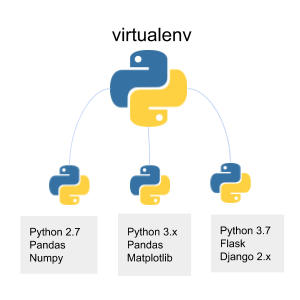

<!--
_backgroundColor: black
_color: white
-->

# Python brushup Docker and Azure
### 2022 - Tue Hellstern

---

# Agenda

- GitHub
- Virtual Environment
- MySQL
- Dashboard - Dash - Python

---
<!--
_backgroundColor: black
_color: white
-->

# GitHub <!-- fit -->

---

<!--
_backgroundColor: black
_color: white
-->

# Virtual Environment <!-- fit -->
[Using Virtual Environment](./Using_Virtual_Environments.md)

---

## Virtual environments help you to:

- Resolve dependency issues by allowing you to use different versions of a package for different projects. *For example, you could use Package A v2.7 for Project X and Package A v1.3 for Project Y.*
- Make your project self-contained and reproducible by capturing all package dependencies in a requirements file.
- Install packages on a host on which you do not have admin privileges.
- Keep your global site-packages/directory tidy by removing the need to install packages system-wide which you might only need for one project.

---

## Step by Step

2. **Create a new virtual environment**
    - *python3 -m venv venv-name*
3. **Activate the virtual environment**
    - macOS - *source env/bin/activate*
    - Windows - *.\Scripts\activate*
4. **Packages**
    - Install 
        - *pip3 install name*
    - requirements.txt
        - *pip3 install -r requirements.txt*

---

# Opgave

- Create a new Virtual Environment with the name - **northwind**
- Activate the Virtual Environment
- Create 2 folders inside **northwind**: *data* and *assets*
- Download and place thise 2 files:
    - *data* - northwind_data.xlsx
    - *assets* - Northwind-Logo.gif
- Create and run a **requirements.txt** file with thise packages:
    - *dash*
    - *plotly*
    - *pandas*
    - *openpyxl*
    - *dash_bootstrap_components*

---

<!--
_backgroundColor: black
_color: white
-->

# Dashboard - Dash <!-- fit -->

Dash apps give a point-&-click interface to models written in Python, vastly expanding the notion of what's possible in a traditional "dashboard".

With Dash apps, data scientists and engineers put complex Python analytics in the hands of business decision-makers and operators.

---

# Dash Introduction video

<iframe width="1100" height="600"
src="https://player.vimeo.com/video/458223712?h=ac77255d72">
</iframe>

---

# Demo Dashboard - Northwind
[Northwind Dashboard](./NorthwindDashboard.md)

---

<!--
_backgroundColor: black
_color: white
-->

# MySQL <!-- fit -->

---

## Make sure that you have:

- MySQL installed as a local server
- MySQL Workbench installed

---

# Opgave

