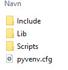
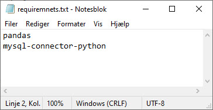
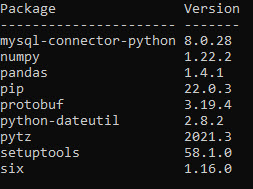

[Home](./README.md)

# Using Virtual Environments
Virtual environments provide a simple solution to a lot of potential problems. In particular, they help you to:

- Resolve dependency issues by allowing you to use different versions of a package for different projects. *For example, you could use Package A v2.7 for Project X and Package A v1.3 for Project Y.*
- Make your project self-contained and reproducible by capturing all package dependencies in a requirements file.
- Install packages on a host on which you do not have admin privileges.
- Keep your global site-packages/ directory tidy by removing the need to install packages system-wide which you might only need for one project.

## Install
In Python 3 the Virtual Environment are pre installed from the standard library - [venv](https://docs.python.org/3/library/venv.html).

## Create a new virtual environment
Create a new virtual environment, **my_env**, inside the directory you just created.

    python3 -m venv my_env

By default, this new environment will **not include any of your existing packages**!

## Activate the virtual environment
Before you can start installing or using packages in your virtual environment you'll need to activate it. Activating a virtual environment will put the virtual environment-specific python and pip executables into your shell's PATH .

### macOS
    source env/bin/activate

### Windows
    .\Scripts\activate

When you have activate the virtuel environment you will se the *name* to the left in the terminal.

![](./image/my_env_2.jpg

You can confirm you’re in the virtual environment by checking the location of your Python interpreter.

### macOS
    which python

### Windows
    where python

It should be in the env directory!

## Deactivate the virtual environment
When you want to leave your virtual environment, run:

    deactivate

## Installing packages
In your virtual environment you can install all the packages you need, the same way you normally install packages.

    pip3 install *package*

### Using requirements files
Instead of installing packages individually, pip3 allows you to declare all dependencies in a Requirements File. For example you could create a **requirements.txt** file containing:

- pandas
- mysql-connector-python

When you have created the **requirements.txt** file, you can tell pip to install all of the packages in this file using the -r flag:

    pip3 install -r requirements.txt

    or

    python -m pip3 install -r requirements.tx

## Listing Packages
To list installed packages

    python -m pip list

## Step by Step
1. **Create a new virtual environment**
    - *python3 -m venv venv-name*
2. **Activate the virtual environment**
    - macOS - *source env/bin/activate*
    - Windows - *.\Scripts\activate*
3. **Packages**
    - Install 
        - *pip3 install name*
    - requirements.txt
        - pip3 install -r requirements.txt

# Links
- [docs.python.org/3/library/venv.html](https://docs.python.org/3/library/venv.html)
- [installing-using-pip-and-virtual-environments/](https://packaging.python.org/en/latest/guides/installing-using-pip-and-virtual-environments/)