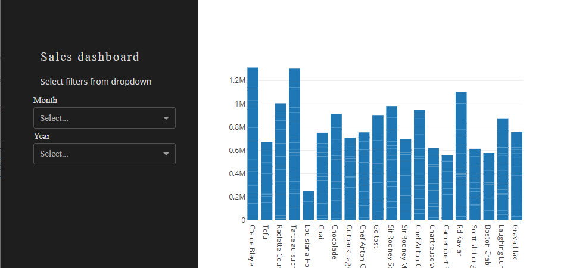

# Dash app >> Azure
Dash is a powerful software tool for creating dashboards, *but if you need to share your dashboards with other?*


# Workflow


- Create the Dash app on your local computer
- Push the app to a GitHub Repository
- Connect Azure App Service with the GitHub Repository

# Local
First you have to create a local version of your Dash app.

My app has 3 files:

- app.py
- datamodel.py
- requirement.txt
- style.css in the folder assets

## app.py
You need a Python file with the name **app.py** for Azure to deployed the Dash app.

The setup and design of the Dash app is done in this file.

```python


```

## datamodel.py
We need *some* data, I have create a Excel file **fake_data.xlsx**. The Excel file is located on GitHub in a repository - 

# GitHub

# Azure