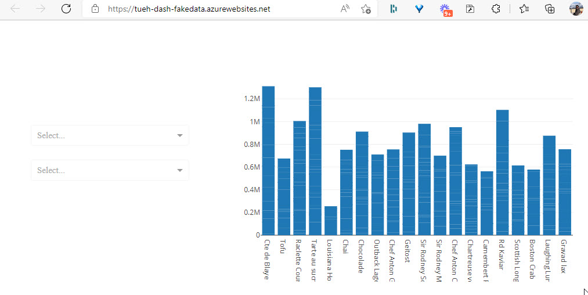

# Dash app >> Azure
Dash is a powerful software tool for creating dashboards, *but if you need to share your dashboards with other?*


# GitHub
The code and other files for this demo are hostede on GitHub in the repository - **TueHellsternKea/kea_dash_fakedata**

You can clone this GitHub Repository to you local computer.

# Workflow


- Create the Dash app on your local computer
- Push the app to a GitHub Repository
- Connect Azure App Service with the GitHub Repository

# Local
First you have to create a local version of your Dash app.

My Dash app has this files:

- app.py
- datamodel.py
- fake_data.xlsx *in the folder* **data**
- requirement.txt
- style.css *in the folder* **assets**

## app.py
You need a Python file with the name **app.py** for Azure to deployed the Dash app.

The setup and design of the Dash app is done in this file.

```python
# ***************************************
# Imports
# ***************************************
# Dash
import dash
from dash import html
from dash import dcc
from dash.dependencies import Input, Output

# Div.
import pandas as pd
import numpy as np
import calendar

# Plotly
import plotly.express as px
import plotly.graph_objects as go

# ***************************************
# Get data
# ***************************************
import datamodel
order = datamodel.get_data()
df_year = datamodel.get_year()
df_month = datamodel.get_month()

# ***************************************
# Diagram - Employee Sales
# ***************************************
fig_employee = px.bar(order, 
    x='emp_name', y='total', 
    color='type', text='total', title='Sales by Employee',
    hover_data=[],
    labels={'total':'Total sales', 'emp_name':'Employee', 'type':'Product Type'})
fig_employee.update_traces(texttemplate='%{text:.2s}', textposition='outside')
fig_employee.update_layout(uniformtext_minsize=8, uniformtext_mode='hide', xaxis_tickangle=45)

# ***************************************
# Activate the app
# ***************************************
#app = dash.Dash(__name__)

dash_app = dash.Dash(__name__)
app = dash_app.server

# ***************************************
# Layout
# ***************************************
dash_app.layout = html.Div(
    children=[
        html.Div(className='row',
                children=[
                    html.Div(className='four columns div-user-controls',
                            children=[
                                html.H2('Sales dashboard'),
                                html.P('Select filters from dropdown'),

                    html.Div(children="Month", className="menu-title"),
                            dcc.Dropdown(
                                id='drop_month',
                                options=[{'label':selectmonth, 'value':selectmonth} for selectmonth in df_month['monthnames']],
                            ),
                    html.Div(children="Year", className="menu-title"),
                            dcc.Dropdown(
                                id='drop_year',
                                options=[{'label':selectyear, 'value':selectyear} for selectyear in df_year]
                            ),
                            ]
                    ),
                    html.Div(className='eight columns div-for-charts bg-grey',
                            children=[
                                dcc.Graph(id="sales_employee", figure=fig_employee)
                            ]
                    ),
                ]
            )
        ]
)

# ***************************************
# Callbacks
# ***************************************
# Output er diagrammet
# Input er DropDown
@dash_app.callback(Output('sales_employee', 'figure'),
              [Input('drop_month', 'value')],
              [Input('drop_year', 'value')])

def update_graph(drop_month, drop_year):
    if drop_year:
        if drop_month:
            # Data i både drop_month og drop_year
            order_fig1 = order.loc[(order['orderyear'] == drop_year) & (order['ordermonth'] == drop_month)]
        else:
            # Data i drop_year. men ikke drop_month
            order_fig1 = order.loc[order['orderyear'] == drop_year]
    else:
        if drop_month:
            # Data i drop_month, men ikke drop_year
            order_fig1 = order.loc[order['ordermonth'] == drop_month]
        else:
            # Ingen data - ikke noget valgt
            order_fig1 = order
        
    return {'data':[go.Bar(
        x = order_fig1['productname'],
        y = order_fig1['total']
            )
        ]
    }

# ***************************************
# Run the app
# ***************************************
if __name__ == '__main__':
    dash_app.run_server(debug=True)


```

## datamodel.py
We need *some* data, I have create a Excel file **fake_data.xlsx**. The Excel file is located on GitHub in the data folder.

The Python file **datamodel.py** are getting the data from the Excel file.

```python
# Imports
import pandas as pd
import numpy as np
import calendar

# ***************************************
# Import af datamodel
# ***************************************

githubpath = './data/'

# Import from Excel file, 4 different sheets
df_customers = pd.read_excel(githubpath + "fake_data.xlsx", sheet_name="customers")
df_order = pd.read_excel(githubpath + "fake_data.xlsx", sheet_name="order")
df_employee = pd.read_excel(githubpath + "fake_data.xlsx", sheet_name="employee")
df_products = pd.read_excel(githubpath + "fake_data.xlsx", sheet_name="products")


def get_data():
    # Employee name
    df_employee['emp_name'] = df_employee['firstname'] + ' ' + df_employee['lastname']

    # Customers name
    df_customers['cust_name'] = df_customers['first_name'] + ' ' + df_customers['last_name']

    # Data - Add: total, order, year, month
    df_order['total'] = df_order['unitprice'] * df_order['quantity']
    df_order['deliverytime'] = df_order['deliverydate'] - df_order['orderdate']
    df_order['orderyear'] = df_order['orderdate'].dt.strftime("%Y")
    df_order['ordermonth'] = pd.to_datetime(df_order['orderdate'])
    df_order['ordermonth'] = df_order['ordermonth'].dt.month_name()

    # ***************************************
    # Data - Relationer
    # ***************************************
    order = pd.merge(df_order, df_products, on='product_id')
    order = pd.merge(order, df_employee, on='employee_id')
    order = pd.merge(order, df_customers, on='customer_id')

    # Order - Select colomns
    order = order[['order_id', 
                'product_id', 'productname', 'type',
                'customer_id', 'cust_name', 'city', 'country',
                'employee_id', 'emp_name', 
                'orderdate', 'deliverydate', 'deliverytime', 'orderyear', 'ordermonth',
                'total']]

    # Retuner til app.py
    return order


def get_year():
    # Year - Create a dataframe with years usede in the order dataframe
    df_year = df_order['orderdate'].dt.strftime("%Y").unique()
    df_year.sort()

    return df_year


def get_month():
        # Month - Create a dataframe with month names
    months = []
    for x in range(1, 13):
        months.append(calendar.month_name[x])

    df_month = pd.DataFrame(months, columns=["monthnames"])

    return df_month
```

## requirements.txt
We need an requirements.txt file for Azure.

```txt
dash==2.0.0
dash-bootstrap-components==1.0.2
dash-core-components==2.0.0
dash-extensions==0.0.66
dash-html-components==2.0.0
dash-table==5.0.0
numpy==1.21.4
openpyxl==3.0.9
pandas==1.3.5
plotly==5.4.0
```

You can test the App on your local computer.

# GitHub
You need to push the files to a GitHub repository. It is from this repository Azure are getting the data.


# Azure

Login to Azure [portal.azure.com](https://portal.azure.com/).


- Select **App Services**
- Select **Create**


- Click **Review : Create**
- Click **Create**
- Click **Go to resource**

The next step is to deploy the code from your GitHub repository. If you're not signed into GitHub already, sign in.


Select the **Source** to - **GitHub** and fill in your own GitHub information:

- Organization
- Repository
- Branch

Select the **Activity Log** tab to view the status of the deployment. It takes a to to 10 minutes to build and deploy.

When deployment is complete, select Overview on the left-hand menu to return to the main page for the web app. Select the **URL** that contains address of the web app.


