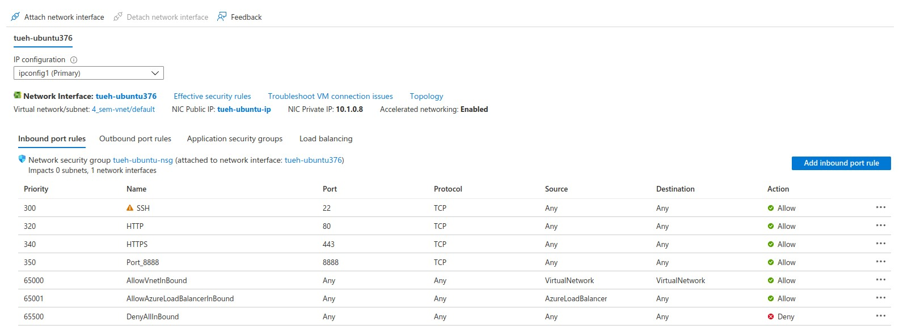
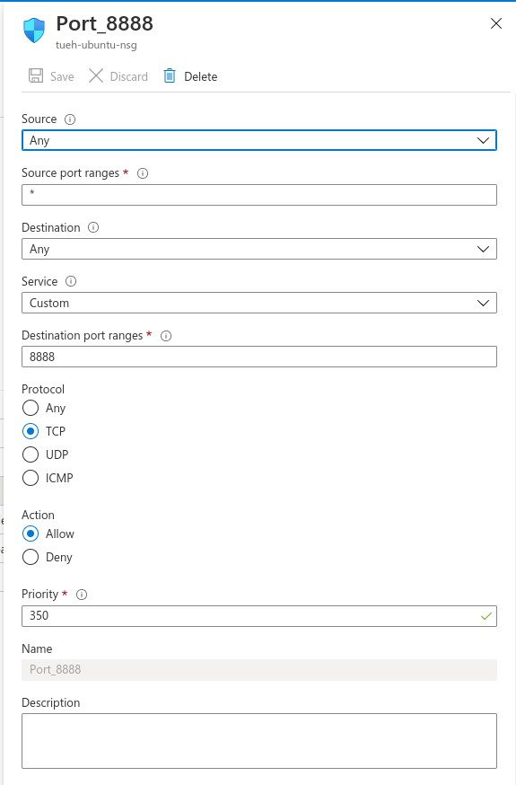
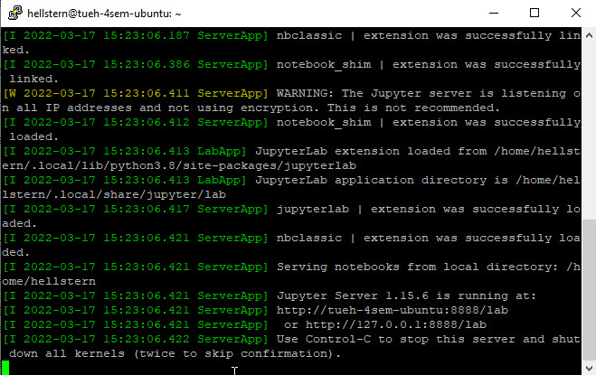
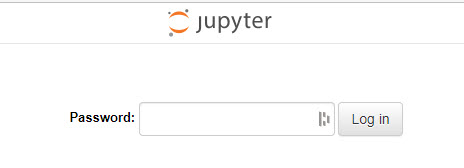
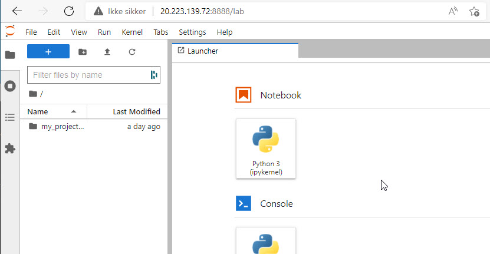
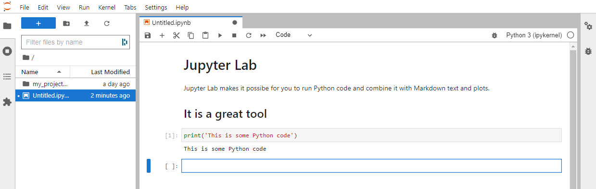
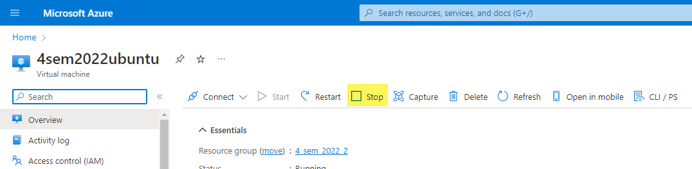

# Jupyter Lab
Project Jupyter's tools are available for installation via the Python Package Index, the leading repository of software created for the Python programming language.

# Azure Virtual Machine - Ubuntu

## Python
Let's **test** that Python3 is running on the Virtual Machine

    sudo apt update
    sudo apt -y upgrade
    python3 -V

The last command returns the version of Python, could be **Python 3.8.10**

# Installing pip for Python
Ubuntu ships with Python 3, as the default Python installation. Complete the following steps to install pip3:

    sudo apt install python3-pip

Thise command will install all the dependencies required for building Python modules.

Once the installation is complete, verify the installation by checking the pip version:

    pip3 --version

# Install Jupyter Lab
You have to install Jupyter Lab on the Virtual Machine.

    sudo pip3 install markupsafe==2.0.1
    sudo pip3 install jupyterlab

# JupyterLab Security
You have to set the security on the Virtual Machine and on Jupyter Lab in order to access remote.

**Firewall setup**

    sudo ufw enable
    sudo ufw allow 8888
    sudo ufw allow 22
    sudo ufw status

In Azure you have to **open port 8888**.

- Select **Add indbound port rule**

- Open port 8888

Jupyter Notebook servers **can** include a password for security, to create a password, you first need to generate a config file:

    jupyter server --generate-config

Running this command creates a configuration file at the following location:

- ~/.jupyter/jupyter_server_config.py

Then enter the following command to create a server password:

    jupyter server password

*Remember this password!*

After you enter a password a hashed version will be written to:

- ~/.jupyter/jupyter_server_config.json
    
Now JupyterLab is secure and you will be able to log in with a password.

# Start Jupyter Lab
    jupyter lab --no-browser --ip "*"

The jupyter lab command has a couple of important flags attached to it:

- --no-browser → Tells the server not to open a browser - *we do not have a browser on the server :-)*
- --ip "*" → Configures the notebook server to listen on all network interfaces and not just the default *localhost/127.0.0.1*

# Access Jupyter Lab
Open a browser on your local computer and go to:

- ip_adresse_for_your_VM:8888

Now you have access to Jupyter Lab running on your Ubuntu Virtuel Machine in the Azure Cloud.

*Use the password you created before :-)*

# Using Jupyter Lab
Now you can start using your cloud Jupyter Lab server

- Klik on Notebook - **Python3**
- Write som markdown and Python code

# Stop Jupyter Lab
Use Control-C, in the ssh terminal on the server, to stop Jupyter Lab

# Stop Virtuel Machine
Remember to shut down the server when you no longer need it!

# Video
- [What is Jupyter Notebook? | Jupyter Notebook Tutorial in Python](https://www.youtube.com/embed/q_BzsPxwLOE)
- [5 awesome Jupyter Notebook features](https://www.youtube.com/embed/AUQT0MKpf6Y)

