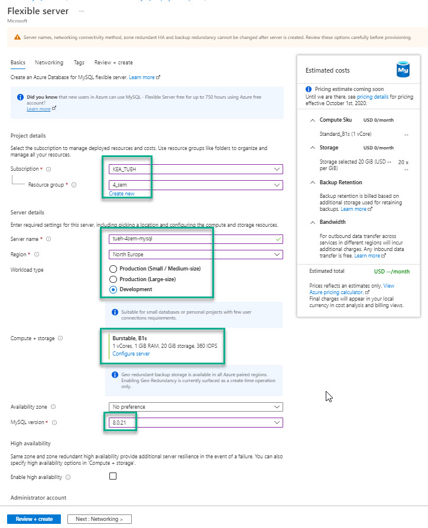
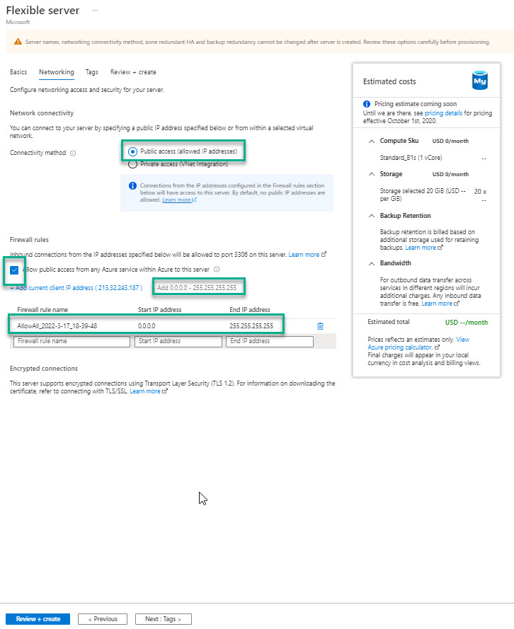
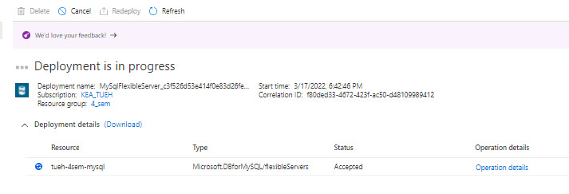
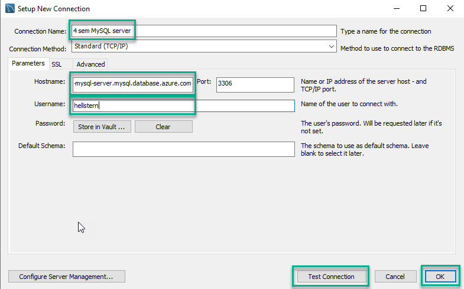
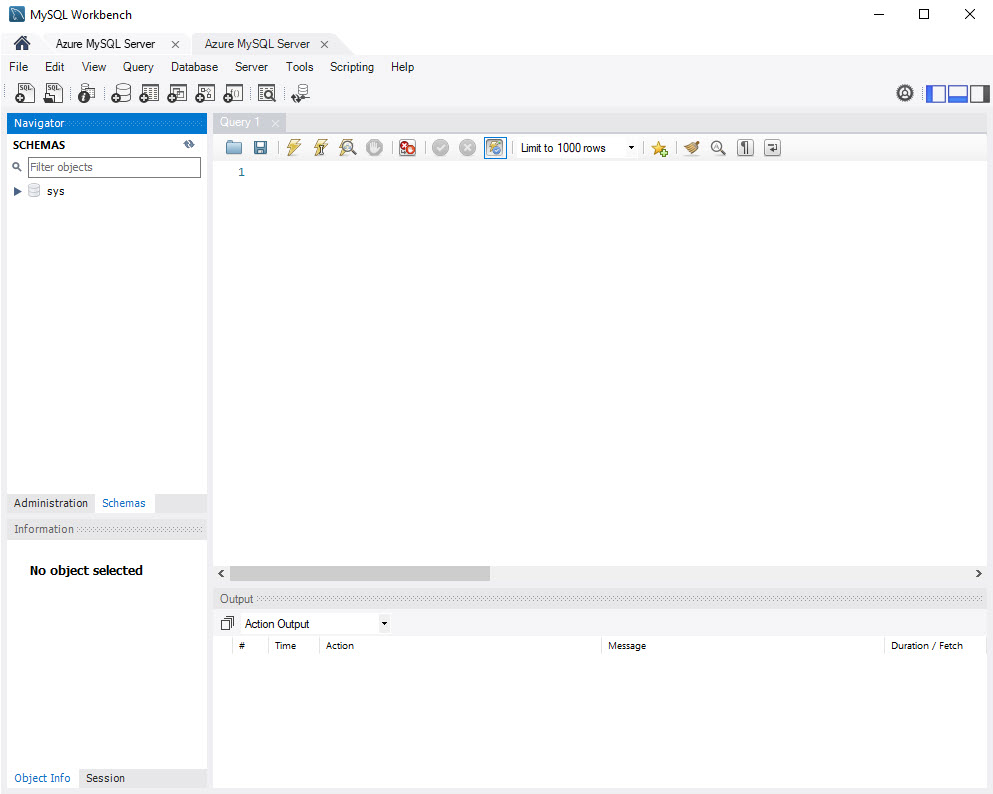

[Home](./README.md)
# Create MySQL Database

## Video

<iframe src="https://www.loom.com/embed/9a6e29c758734790ad3e920aae758b16" frameborder="0" webkitallowfullscreen mozallowfullscreen allowfullscreen style="position: absolute; top: 0; left: 0; width: 100%; height: 100%;"></iframe>

## Creating a MySQL Database server on Azure

- Login with your students email at [portal.azure.com] (https://portal.azure.com)
- Select *All services*
- Select the section with *Databases*
- Select *Azure Database for MySQL server*
- Click on *Create Azure Database for MySQL server*
- Select *Flexible server* - Click on *Create*
- Select the following options:
  - **Project details**
    - Subscription: *Your subscription name*
    - Resource group: *Create a new one*: mysqlserver
  - **Server details**
    - Server name: *Name for your server*: xxxhmysqlserver
    - Data source: *None*
    - Location: *(Europa) North Europa*
    - Version: *8.0.21*
    - Compute + storage: *Select configure server*: 
      - *Basic*
      - *1 vCore*
      - *Storage: 20 GB*
  - **Administrator account**
    - Admin username:*Your admin name*
    - Password: *Your password*
    - Confirm password: *Your password*

- Click *Next: Networking*

We need to be able to connect to the MySQL server from your local computer, it has to allow for all IP adresses.

- Click on: Add 0.0.0.0 - 255.255.255.255

- Click *Next: Tags*
- Click *Next: Review + create*
- Click *Create*

Your mysql database server is now set up and you can start using it, e.g. with *Workbench*

To connect to server you need:

- Server name
- Server admin login name
- Server password

# MySQL Workbench
You need to use MySQL Workbench to connect from your local computer to the cloud MySQL Server.

## Video

<iframe src="https://www.loom.com/embed/d6e6045493224a3a812215ab18636edc" frameborder="0" webkitallowfullscreen mozallowfullscreen allowfullscreen style="position: absolute; top: 0; left: 0; width: 100%; height: 100%;"></iframe>

## Create connection
You have to create a connection, for that you need:

- Hostname - *The name for the MySQL Azure Server*
- Username
- Password

You can test the connection by clicking the **Test Connection** button.

When you activate the connection you have access to the MySQL server in the samer way as your local server.

### Northwind
If you want to create a database on the server you can upload and run the [northwind_kea.sql](../01-Python-brushup_and_Docker_1/codefiles/sql/northwind_kea.sql) file.

# Links
- [Azure documation MySQL Server](https://docs.microsoft.com/en-us/azure/mysql/)
