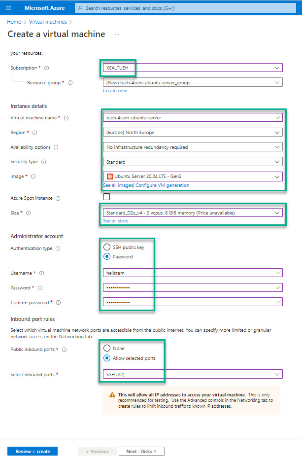
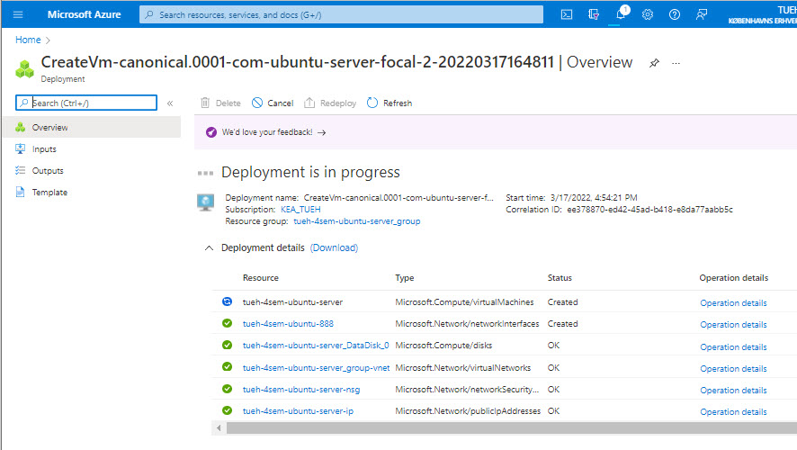

# Virtual Machine
Azure Virtual Machines are image service instances that provide on-demand and scalable computing resources with usage-based pricing.

More broadly, a virtual machine behaves like a server: It's a computer within a computer that provides the user the same experience they would have on the host operating system itself. In general, virtual machines are sandboxed from the rest of the system, meaning that the software inside a virtual machine can't escape or tamper with the underlying server itself.

Each virtual machine provides its own virtual hardware including CPUs, memory, hard drives, network interfaces, and other devices.

## Login Azure
Login to: [https://portal.azure.com/](https://portal.azure.com/)

# Create Virtual Machine
You have to create a Virtual Machine running [Ubuntu](https://ubuntu.com/) Server.

Click on **Virtual Machines** and then **Create** and the sub menu **Virtual Machine**

- Next : Disks

- Next : Networking
- Next : Management
- Next : Advanced
- Next : Tags
- Next : Review + create
- Create

- Go to resource

The Virtual Machine is now created and running

*Check the servers public IP adresse your are going to use it. It is something like 14.54.45.255* 

## Connect - SSH
The **Secure Shell Protocol** (SSH) is a cryptographic network protocol for operating network services securely over an unsecured network.

Its most notable applications are remote login and command-line execution.

SSH applications are based on a client–server architecture, connecting an SSH client instance with an SSH server.

## Windows - PuTTY
On windows you can use a small program called PuTTY.

Download and install it - [www.putty.org](https://www.putty.org/)

Now you can Open PuTTY and use it to connect to your Virtuel Machine.

Use the IP adresse of **your** Virtual Machine.

PuTTY will open a terminal widow on your Virtual Machine.

Use the Azure username and password to login:

## macOS
On mac you don't need a program when you are using shh.

- Open a terminal
- Type the ssh command
    - ssh username@server_ip
    - *like*
    - ssh hellstern@12.13.45.255

Username is the Azure username, IP adresse and the password.

# Links
- [linux-commands-handbook.pdf](./linux-commands-handbook.pdf)
- [https://portal.azure.com/](https://portal.azure.com/)
- [https://ubuntu.com/server/docs](https://ubuntu.com/server/docs)