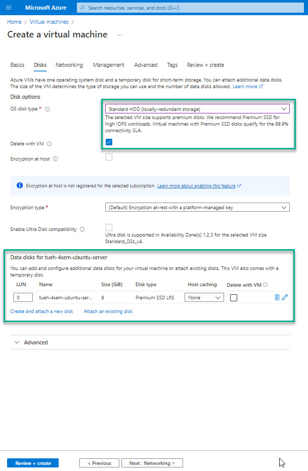

# Virtual Machines

Login to: [https://portal.azure.com/](https://portal.azure.com/)

- Virtual Machines
- Create
    - Virtual Machine

- Next : Disks

- Next : Networking
- Next : Management
- Next : Advanced
- Next : Tags
- Next : Review + create
- Create

- Go to resource

The Virtual Machine is now created and running

## Connect

### Networking

Now you have to connect from your local macine to the Virtal Machine

- Select **Connect** in the left menu

- Select **RDP**
- Download RDP File

### Windows
- Doubelt click on the RPD file

- Click: Opret forbindelse

Login with the:

- usernavne
- password

# Links
- [Troubleshoot Remote Desktop connections to an Azure virtual machine](https://docs.microsoft.com/en-us/troubleshoot/azure/virtual-machines/troubleshoot-rdp-connection)

