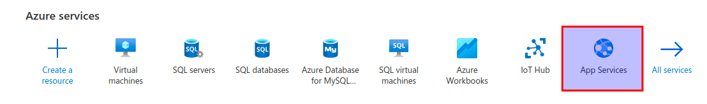

[Home](modul-4-2.md)
# Virtualisering (Azure)
    - 17-03-2021 - Torsdag- INT
    - 18-03-2021 - Fredag - DK


# Beskrivelse
You need Microsoft Azure as your Cloud Provider.

You need to set up a virtual PC / Server on Azure and use it.

# Resources & Activities

**Topics:**

- Azure - Introduction
- Azure Database for MySQL service
- Introduction to Linux (Ubuntu)
- Installation of Python, MySQL
- Connection to an Azure MySQL Server from Python
- Using the Azure App Service

## Deploying Dash Apps on Azure


### Step 1: Create a virtual environment
- Created a folder to store your *app.py* script, cd into your directory.
- Create a Virtuel Environment for your Dash app inside the folder you just created
- Activate the Virtuel Environment you created
- Create a requirements.txt file with the modules you nede:


### Step 2: Create the Dash app - app.py
We will use this Python code as an example, it is the following Python files:

Azure is looking for a Flask app variable named **app** - *app = dash_app.server*

```python
```


### Step 3: Sign up on Azure and Deploy your app
- Login to Azure: [https://portal.azure.com/](https://portal.azure.com/)
- Select **App Services**



- 
