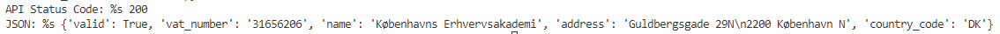

[Home](../modul-4-2.md)
# Python, Web Service API
    - 13-10-2022 - Torsdag

# Beskrivelse
**Introduction to:**
- Web Services
- SOA
- API

# Slides
- [HTML](./Webservices_API_Slide.html)
- [PDF](./Webservices_API_Slide.pdf)

# Content - [Mindmap](../mindmap.html)
- [SOAP Python dialing code](#soap-python-dialing-code)
- [Newscatcher API](#newscatcher-api)

# SOAP Python dialing code
Use SOAP in Python to get the dialing code using a country code

[Step by Step guide](./SOAP_API_calls_using_Python.md)


# API
**What is an API?**

Application Programming Interface (API) is a software middleman that allows two apps to communicate with one another. You use an API every time you use an app like Facebook, send an instant message, or check the weather on your phone.

## OpenAPI - Specification
The OpenAPI Specification, previously known as the Swagger Specification, is a specification for machine-readable interface files for describing, producing, consuming, and visualizing RESTful web services.

Previously part of the Swagger framework, it became a separate project in 2016, overseen by the OpenAPI Initiative, an open-source collaboration project of the Linux Foundation.

- [www.openapis.org](https://www.openapis.org)
- [github.com/OAI/OpenAPI-Specification](https://github.com/OAI/OpenAPI-Specification)

# Making API Requests in Python
In order to work with APIs in Python, you need tools that will make those requests. 

In Python, the most common library for making requests and working with APIs is the requests library. 

You must install the requests library.

    pip3 install requests

## API Request
There are many different types of requests. The most commonly used one, a GET request, is used to retrieve data.

This code is using [www.vatcomply.com](https://www.vatcomply.com) for checking a company VAT number.

```python
# Imports
import requests

# VAT no.
vat = 'DK31656206'

# HTTP request
response = requests.get("https://api.vatcomply.com/vat?vat_number=" + vat)

# Print
print("API Status Code: %s", (response.status_code))
print("JSON: %s", (response.json()))
```



## API Status Codes
Status codes are returned with every request that is made to a web server. Status codes indicate information about what happened with a request. Here are some codes that are relevant to GET requests:

- **200**: Everything went okay, and the result has been returned (*if any*).
- **301**: The server is redirecting you to a different endpoint. This can happen when a company switches domain names, or an endpoint name is changed.
- **400**: The server thinks you made a bad request. This can happen when you don’t send along the right data, among other things.
- **401**: The server thinks you’re not authenticated. Many APIs require login credentials, so this happens when you don’t send the right credentials to access an API.
- **403**: The resource you’re trying to access is forbidden: you don’t have the right permissions to see it.
- **404**: The resource you tried to access wasn’t found on the server.
- **503**: The server is not ready to handle the request.

# FastAPI
FastAPI is a modern, fast (high-performance), web framework for building APIs with Python 3.7+ based on standard Python type hints.

[Step by Step Guide](./fastapi.md)


# Newscatcher API
 *Search multi-language worldwide news articles published online with NewsCatcher's News API*

 [Step by Step guide](https://github.com/TueHellsternKea/newsapi)

# Links
 - [openlibrary.org/developers/api](https://openlibrary.org/developers/api)
 - [newsapi.org](https://newsapi.org)
 - [api.nasa.gov/](https://api.nasa.gov/)
 - [github.com/public-apis/public-apis](https://github.com/public-apis/public-apis)


