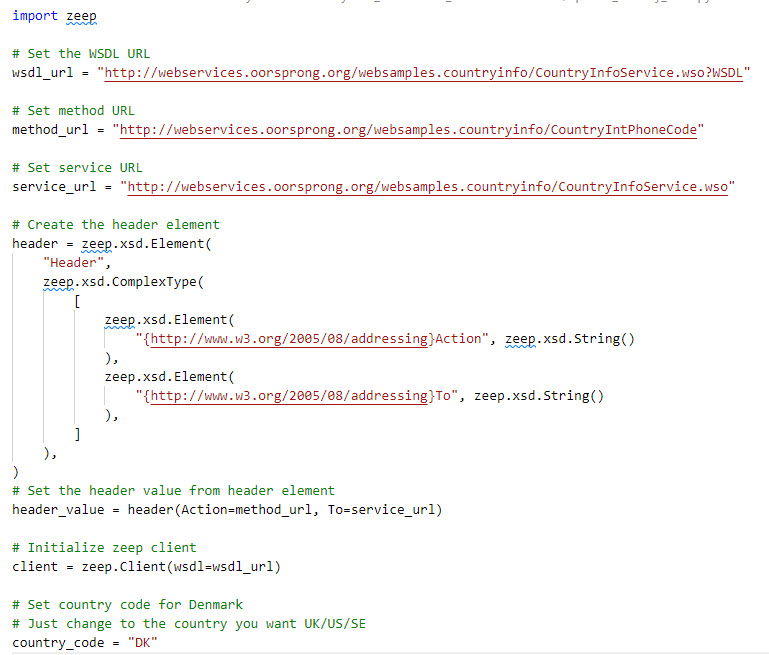
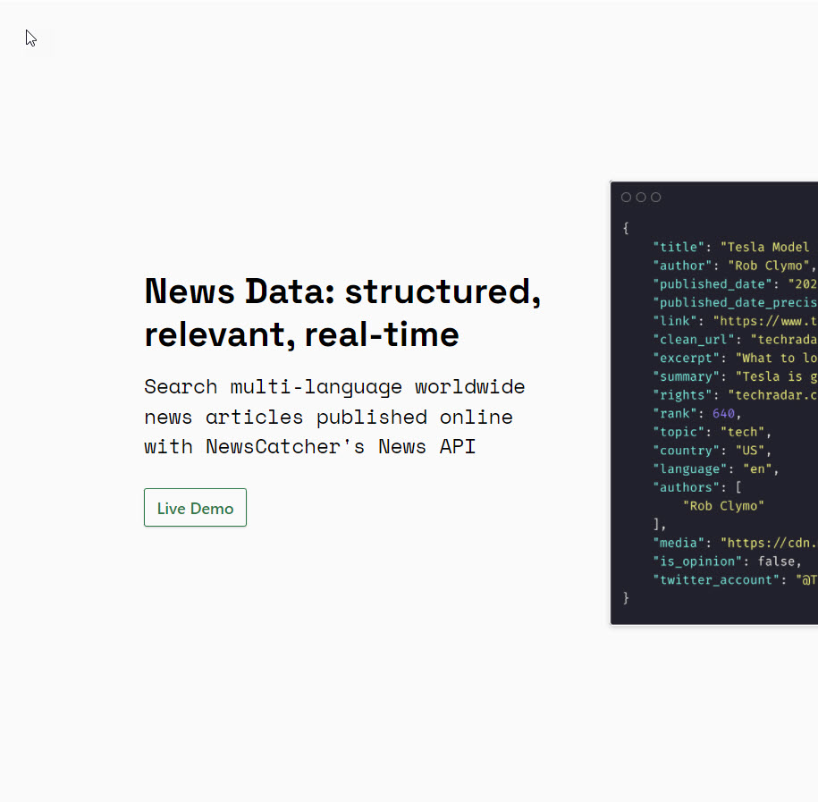

# Web Services  22/23-03-2022
### Agenda

- Introduction
- Web Services
- SOA
- API
- Restcountries API - *Code*
- Spotify API - *Code*
- ToDo FastAPI App - *Demo*

<!-- _footer: Tue Hellstern © 2022-->

---

# Why We Need Software Architecture
Architecture-less software becomes **unmanageable** with time and hence enhance the maintenance cost drastically with every new iteration.

As each and every change becomes costlier, this approach is termed as **Big Ball of Mud**

---

<!-- _backgroundColor: black -->
<!-- _color: white -->

# In your programs, have you thought about **Software Architecture?**

### If **Yes**, in what way?

### If **No**, is it something you missed?

---

# Architectural approaches
Over the years of evolutions in software design, developers have come up with different architectural approaches in order to avoid the issues of architecture less software design - **Big Ball of Mud**.

The most *famous* ones.

- *Layered Architecture*
- *Tiered Architecture*
- **Service Oriented Architecture (SOA)**

---

# Layered Architecture
This approach works on principle of **separation of concerns**.

Software design is **divided into layer** laid over one another. Each layer performs a **dedicated responsibility**.

Architecture divides the software into the following layers

- **Presentation Layer**
- **Business Logic Layer**
- **Data Link Layer**

---

# Layered Architecture

**Advantages**
- Simpler to implement
- Abstraction due to separation of concerns among layers
- Isolation between layers
- More manageable due to **low coupling**

**Disadvantage**
- Less scalability
- Monolith structure, lacking ease of modifications
- Data has to flow from each layer one after another

---

<!-- _footer: Oracle -->

---

# Tiered Architecture
Divided the software into into **tiers** based on **client server communication principle**.

Can have **one**, **two** of **n-tiered** system separating the responsibilities among data provider and the consumer.

---

# Single Tiered System
In this approach, **single system** is responsible to work **as client as well as server** and can offer ease of deployment eliminating the need of *Inter System Communications* (ISC).

This system are suitable **only for small scale single user application** and should not be used for multi user complex applications.

---

# 2-Tiered System
This system consist of **two physical machines**

- **server**
- **client**

It provides **isolation** among the **data management** operations and **data processing** and representation operations.

- *Client* holds **Presentation, Business Logic and Data link layer**.
- *Server* holds the **Data stores** such as Databases

---

# 3-Tiered / n-Tiered System
**Highly scalable** both horizontally and vertically. Implementing n-tiered architecture is generally **costlier but offer high performance**. Hence it is preferred in **large complex software solutions**.

It can be **combined** with advanced **Service Oriented Architectural** style to generate highly sophisticated model.

It is **recommended** to use this architecture when the software is **complex** and requires **performance** as well as **scaling** as it can be a costlier approach in terms of resources as well as time.

---

# Difference between Layers and Tiers

**Layer**
*Layers are the **logical** separation of code*

- Presentation Layer or *UI Layer*
- Business Layer or Business Logic Layer
- Data Access Layer and/or Data Layer

**Tiers**
*Tiers are the **physical** deployment of layers*
- Presentation Tier - *UI Tier*
- The Application Tier or Business Tier 
- The Data Access Tier 
- The Database Tier – *SQL Server, MySQL*

---

<!-- _backgroundColor: black -->
<!-- _color: white -->
# Web Services <!-- fit -->

---

# Web Services
There a different definitions to Web Services - **W3C** is using:

    A web service is a software system designed to support interoperable 
    machine-to-machine interaction over a network. It has an interface described 
    in a machine-processable format (specifically WSDL). 
    
    Other systems interact with the web service in a manner prescribed by its description 
    using SOAP-messages, typically conveyed using HTTP with an XML serialization in 
    conjunction with other web-related standards.

For many, web services are synonymous with **SOA** (*Services Oriented Architecture)* and primarily rely on standards such as **XML-RPC** and **SOAP** (*Simple Object Access Protocol*). 

<!-- _footer: https://www.w3.org/TR/2004/NOTE-ws-gloss-20040211/#webservice -->

---

<!-- _backgroundColor: black -->
<!-- _color: white -->

# Web Services Assignment <!-- fit -->
# What are Web Services? <!-- fit -->

# Find **3** uses of web services

---

# Web Service example - Dollar Rent Car

The **frontend** or **presentation layer** can be in different programming languages and still have the ability to communicate with the Web Service.

<!-- _footer: MIS - Chapter 5 - Page 225 -->

---

# What are Web Services?

- Web Services include any **software, application, or cloud technology** that provides standardized web protocols (*HTTP* or *HTTPS*) to **interoperate**, **communicate**, and exchange **data messaging**
- Applications can be written in **various languages** and are still able to communicate by **exchanging data** with one another via a web service between clients and servers.

---

# Summarize - Web Service

- Is available over the **Internet** or private (intranet) **networks**
- Uses a **standardized XML** messaging system
- Is **not tied** to any one operating system or programming language
- Is **self-describing** via a common **XML grammar**
- Is **discoverable** via a simple find mechanism

---

# Components - Web Services
The basic web services platform is **XML + HTTP** 

All the standard web services work using the following components:

- **SOAP**
*Simple Object Access Protocol*
- **UDDI**
*Universal Description, Discovery and Integration*
- **WSDL**
*Web Services Description Language*

---

# How does a Web Service work?
A Web Service enables communication among various applications by using open standards such as **HTML**, **XML**, **WSDL**, and **SOAP**

- XML to **tag the data**
- SOAP to **transfer a message**
- WSDL to **describe the availability of service**

>You can use **C#** to build a new **Web Services** on **Windows** that can be invoked from your web application that is based on **JavaServer Pages** (JSP) and runs on **Linux**.

---

# XML
Extensible Markup Language (*XML*) is a **markup language** that defines a set of **rules for encoding documents** in a format that is both **human**-readable and **machine**-readable. 

*The World Wide Web Consortium's XML 1.0 Specification of 1998 and several other related specifications—all of them free open standards — define XML.*

<!-- _footer: https://www.w3.org/XML -->

---

# WSDL

- **WSDL** stands for **Web Services Description Language**
- **WSDL** is used to describe web services
- **WSDL** is written in XML
- **WSDL** is a W3C recommendation from 26. June 2007

<!-- _footer: https://www.w3.org/TR/wsdl/ -->

---

# SOAP

- **SOAP** stands for **Simple Object Access Protocol**
- **SOAP** is an application **communication protocol**
- **SOAP** is a **format** for sending and receiving messages
- **SOAP** is **platform independent**
- **SOAP** is based on **XML**
- **SOAP** is a W3C **recommendation**

<!-- _footer: https://www.w3.org/TR/soap -->

---

# REST - Representational State Transfer
In 2000 Roy Thomas Fielding defines **REST** (**RE**presentational **S**tate **T**ransfer), which is the software architectural style of WWW.

It consist of a coordinated set of **architectural constraints applied to components, connectors, and data elements**, within a distributed hypermedia system.

*Performance, Scalability, Simplicity, Modifiability, Visibility, Portability and Reliability*

---

# REST - Definition

    REST is intended to evoke an image of how a well-designed Web application behaves:

    a network of web pages (a virtual state-machine), where the user progresses through 
    an application by selecting links (state transitions), resulting in the next page 
    (representing the next state of the application) being transferred to the user 
    and rendered for their use.

*Roy Fielding in his Ph.D. dissertation in 2000*

---

# REST style

REST can be described as Set of **formal** and **informal** guides to creating architectures — *constraints*

- Client-server
- Stateless
- Cacheable
- Uniform interface
- Layered system
- Code on demand (optional)

---

# REST vs. SOAP - 1

https://youtu.be/bPNfu0IZhoE

---

<!-- _backgroundColor: black -->
<!-- _color: white -->

# SOAP Python Demo <!-- fit -->
- [Python SOAP Country code ](./SOAP_API_calls_using_Python.md)

---

<!-- _backgroundColor: black -->
<!-- _color: white -->
# SOA  <!-- fit -->

---

---

---

---

# SOA - Service Oriented Architecture

**SOA** can be described as an **approach** to the **development process**, which, based on the business, leads to the development, acquisition and use of IT solutions as a set of business support, **reusable and flexible services**.

---

- SOA organize contexts in a **vertical way**
- **Multiples components** can be part of the **same service** providing multiples capabilities (operations)
- An SOA service is like a bounded context
- SOA fosters **reuse** and composition inside the **same domain**
- Each SOA service represents a group of **smaller components**
- In SOA, it is common to see all **services** using the **same technology** stack and the **same database technology**

---

---

<!-- _backgroundColor: black -->
<!-- _color: white -->
 # API <!-- fit -->

---

# What is an API? <!-- fit -->

### Find the best, in your opinion, **description of an API**
### Come up with some **examples of API's**

---

# What is an API? <!-- fit -->
**API** stands for **Application Programming Interface**

## But what is a *Interface*?

---

# Interfaces <!-- fit -->
*Every* device you use has some kind of **interface**. 

We use these interfaces to get the device to **do the thing we want**.

We **don't need to understand** the underlying functionality.

---

## Abstraction <!-- fit -->

API's provide a layer of abstraction for the user. 

Abstraction **hides everything but what is relevant** to the user, making it *simple* to use.

*An API is how applications talk to each other*

---

# API - Application Programming Interface
**API** is a software intermediary that allows two applications to talk to each other.

You can ask an API for **data**, and they API will return what you want, usually in the form of **JSON** or **XML**. You can then use the data in your application.

*Every time you use an app like Facebook, send an SMS, or check the weather on your phone, you’re using an API.*

---

# API's as a way to serve your customers
Some companies are packaging API's as products. 

- Weather Underground sells access to its weather data API
    - www.wunderground.com

- e-conomic has an API where the customers can access there data
    - www.e-conomic.com

*When a company offers an API to their customers, it just means that they’ve built a set of dedicated URLs that return pure data responses — meaning the responses won’t contain the kind of presentational overhead that you would expect in a graphical user interface like a website.*

---

# Microservices, SOA, and API's combined

<!-- _footer: https://developer.ibm.com/tutorials/1601_clark-trs -->

---

# What is the difference between a Web service and an API?
An **API** is an **interface** that allows you to build on the data and functionality of another application, while a **web service** is a **network-based resource** that fulfills a **specific task**. 

Yes, there's **overlap between the two**: 

- **All** web services are API's
- **Not all** API's are web services
- Web services require a network. APIs can be on- or offline, web services must use a network
- **Web services** are usually associated with **SOA**
- **API's are protocol agnostic**. API's can use any protocols or design styles - **Web services** use SOAP, REST, UDDI, XML-RPC

---
<!-- _backgroundColor: black -->
<!-- _color: white -->
# API DEMO <!-- fit -->

---

# API - restcountries - Demo

- [Python file - .py](https://github.com/officegeek/image/raw/main/code/restcountries.py)
- [Jupyter Lab - .ipynb](https://github.com/officegeek/image/raw/main/code/restcountries.ipynb)

<!-- _footer: https://pypi.org/project/python-restcountries -->

---

# Spotify API <!-- fit -->
Spotify provides software and app developers access to some of their data about users, playlists, and artists through a Web API.

- [Spotify_API_Spotipy.pdf](https://github.com/officegeek/image/raw/main/pdf/Spotify_API_Spotipy.pdf)
- [Jupyter Lab Code .ipynb](https://github.com/officegeek/image/raw/main/code/Spotipy.ipynb)
- [Python Code .py](https://github.com/officegeek/image/raw/main/code/Spotipy.py)

---

# Newscatcher

- [Demo GitHub Reporitory](https://github.com/TueHellsternKea/newsapi)
- https://newscatcherapi.com

---

# IBM - SOA <!-- fit -->

[SOA for Dummies](https://github.com/officegeek/image/raw/main/pdf/SOA_for_dummies.pdf)

---

# Links

- https://martinfowler.com/microservices
- https://www.ibm.com/cloud/learn/soa
- https://morioh.com/p/422b616d71a2
- https://fastapi.tiangolo.com/