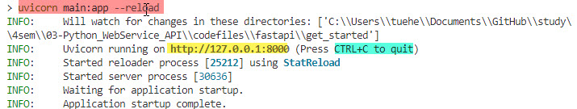
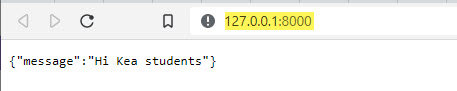
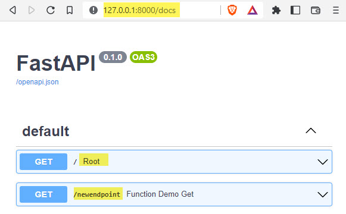
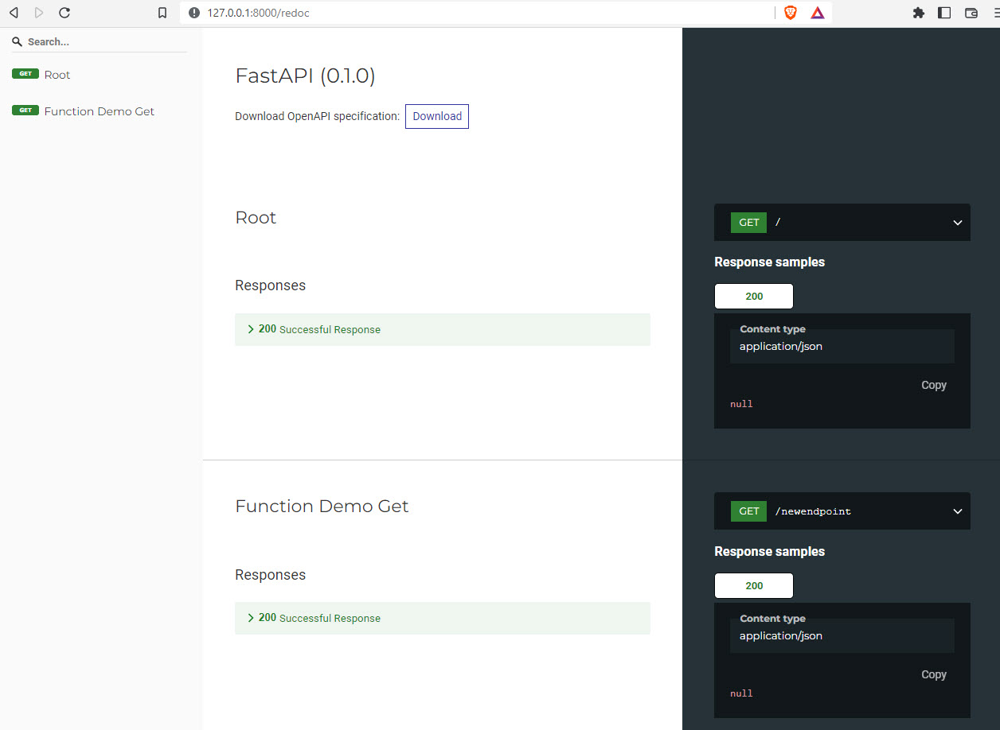

[Home](./README.md)

# FastAPi
FastAPI is a modern, fast (high-performance), web framework for building APIs with Python 3.7+ based on standard Python type hints.

The key features are:
- **Fast**: Very high performance, on par with NodeJS and Go (thanks to Starlette and Pydantic). One of the fastest Python frameworks available.
- **Fast to code**: Increase the speed to develop features by about 200% to 300%. *
- **Fewer bug**s: Reduce about 40% of human (developer) induced errors. *
- **Intuitive**: Great editor support. Completion everywhere. Less time debugging.
- **Easy**: Designed to be easy to use and learn. Less time reading docs.
- **Short**: Minimize code duplication. Multiple features from each parameter declaration. Fewer bugs.
- **Robust**: Get production-ready code. With automatic interactive documentation.
- **Standards-based**: Based on (and fully compatible with) the open standards for APIs: OpenAPI (previously known as Swagger) and JSON Schema.

# Getting startede
This is a simple example of how to get FastAPI working

## Install FastAPI
You need to install FastAPI

    pip3 install fastapi

## Install Uvicorn
You will also need Uvicorn to run the server

    pip3 install uvicorn

This will install Uvicorn with minimal (*pure Python*) dependencies.

## Simpel main.py
Let's create the simpels possible implementation of FastAPI. Create this Python file - **main.py**:

```python
# Import
from fastapi import FastAPI

# Define an API object
app = FastAPI()

# Map HTTP method and path to python function
@app.get("/")
async def root():
    return {"message": "Hello Kea students. Welcome to the FastAPI page!"}

@app.get("/newendpoint")
async def function_demo_get():
    return {"message": "This is /newendpoint endpoint"}
```
Get the codefile: [main.py](./codefiles/fastapi/get_started/main.py) 

## Run the server
To run the server, use this command in the samen foldes as your main.py file

    uvicorn main:app --reload



The **--reload** flag tells Uvicorn to reload the server whenever new code is added to the application. Next, open your browser and navigate to http://127.0.0.1:8000, where you’ll see a JSON response.



## Interactive API docs
FastAPI has a 2 automatic interactive API documentation

First one is - docs

    http://127.0.0.1:8000/docs



Second one is - redocs

     http://127.0.0.1:8000/redocs    



# Links
- [fastapi.tiangolo.com](https://vfastapi.tiangolo.com/)
- [github.com/tiangolo/fastapi](https://github.com/tiangolo/fastapi)
- [www.uvicorn.org](https://www.uvicorn.org/)