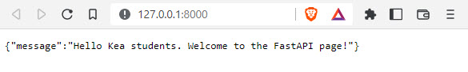

[Home](../modul-4-2.md)

# FastAPi
FastAPI is a modern, fast (high-performance), web framework for building APIs with Python 3.7+ based on standard Python type hints.

The key features are:
- **Fast**: Very high performance, on par with NodeJS and Go (thanks to Starlette and Pydantic). One of the fastest Python frameworks available.
- **Fast to code**: Increase the speed to develop features by about 200% to 300%. *
- **Fewer bug**s: Reduce about 40% of human (developer) induced errors. *
- **Intuitive**: Great editor support. Completion everywhere. Less time debugging.
- **Easy**: Designed to be easy to use and learn. Less time reading docs.
- **Short**: Minimize code duplication. Multiple features from each parameter declaration. Fewer bugs.
- **Robust**: Get production-ready code. With automatic interactive documentation.
- **Standards-based**: Based on (and fully compatible with) the open standards for APIs: OpenAPI (previously known as Swagger) and JSON Schema.

# Getting startede
This is a simple example of how to get FastAPI working

## Install FastAPI
You need to install FastAPI

    pip3 install fastapi

## Install Uvicorn
You will also need Uvicorn to run the server

    pip3 install uvicorn

This will install Uvicorn with minimal (*pure Python*) dependencies.

## Simpel main.py
Let's create the simpels possible implementation of FastAPI. Create this Python file - **main.py**:

```python
# Import
from fastapi import FastAPI

# Define an API object
app = FastAPI()

# Map HTTP method and path to python function
@app.get("/")
async def root():
    return {"message": "Hello Kea students. Welcome to the FastAPI page!"}

@app.get("/newendpoint")
async def function_demo_get():
    return {"message": "This is /newendpoint endpoint"}
```
Get the codefile: [main.py](./codefiles/fastapi/get_started/main.py) 

## Run the server
To run the server, use this command in the samen foldes as your main.py file

    uvicorn main:app --reload


The **--reload** flag tells Uvicorn to reload the server whenever new code is added to the application. Next, open your browser and navigate to http://127.0.0.1:8000, where you’ll see a JSON response.



## Interactive API docs
FastAPI has a 2 automatic interactive API documentation

First one is - docs

    http://127.0.0.1:8000/docs


Second one is - redocs

     http://127.0.0.1:8000/redocs    


# FastApi ToDo Demo
This is a smalle demo of a ToDo API cerated with FastApi.

The dome contains 3 file and the structure is:

- main.py
- database.json
- *templates*
    - todolist.html

You can get the files at [github.com/TueHellsternKea/fastapitodo](https://github.com/TueHellsternKea/fastapitodo)


## main.py
This is the Python code file

```python
from fastapi import FastAPI, Request
from fastapi.responses import RedirectResponse
from fastapi.templating import Jinja2Templates
import json

app = FastAPI()
templates = Jinja2Templates(directory="templates")

@app.get("/")
async def root(request: Request):
    with open('database.json') as f:
        data = json.load(f)
    return templates.TemplateResponse("todolist.html",{"request":request,"tododict":data})

@app.get("/delete/{id}")
async def delete_todo(request: Request, id: str):
    with open('database.json') as f:
        data = json.load(f)
    del data[id]
    with open('database.json','w') as f:
        json.dump(data,f)
    return RedirectResponse("/", 303)

@app.post("/add")
async def add_todo(request: Request):
    with open('database.json') as f:
        data = json.load(f)
    formdata = await request.form()
    newdata = {}
    i=1
    for id in data:
        newdata[str(i)] = data[id]
        i+=1
    newdata[str(i)] = formdata["newtodo"]
    print(newdata)
    with open('database.json','w') as f:
        json.dump(newdata,f)
    return RedirectResponse("/", 303)
```

## database.json
This is a simpel"database" file created in json

```json
{"1": "4. semester api", "2": "GitHub demo", "3": "Azure demo", "4": "Test and test"}
```

## todolist.html
This is the HTML styling file of the ToDo list,

The file are in the folder **templates**, it is a basic HTML file.

```html
<html>
    <head>
        <title>My KEA TODO list</title>
    </head>
    <style>
        *{
            margin: 0;
        }
        table {
            align-items: center;
            margin-right: auto;
            margin-left: auto;
        }
        h1 {
            width: fit-content;
            font-family: 'Courier New', Courier, monospace;
            margin-left: auto;
            margin-right: auto;
            font-size: 50px;
        }
        th,td {
            width: 250px;
            justify-content: center;
            font-size: 20px;
            font-family: 'Lucida Sans';
        }
        td:nth-child(2) {
            text-align: center;
        }
    </style>
    <body>
        <h1>My TO DO list</h1>
        <br/>
        <table>
            <tr>
                <th>ToDo</th>
                <th>Options</th>
            </tr>
            
            <tr>
                <td>{{ tododict[id] }}</td>
                <td><a href="/delete/{{ id }}"><button>Delete</button></a></td>
            </tr>
            
            <tr>
                <form method="POST" action="/add">
                <td><input type="text" name="newtodo" required></td>
                <td style="text-align: center;"><button type="submit">Add New</button></td>
                </form>
            </tr>
        </table>
    </body>
</html>
```

## Docs ToDo


# Links
- [fastapi.tiangolo.com](https://vfastapi.tiangolo.com/)
- [github.com/tiangolo/fastapi](https://github.com/tiangolo/fastapi)
- [www.uvicorn.org](https://www.uvicorn.org/)