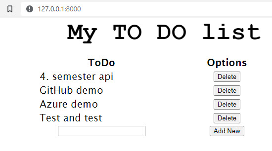
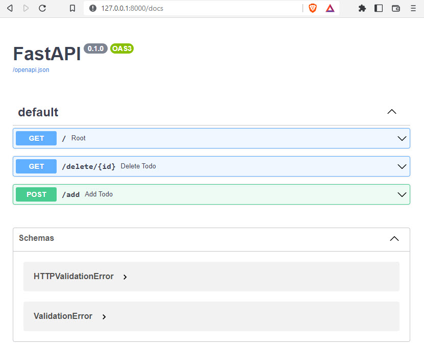

[Home](README.md)

# FastAPI ToDo - Demo
This is a smalle demo of a ToDo API cerated with FastApi.

The dome contains 3 file and the structure is:

- main.py
- database.json
- *templates*
    - todolist.html

You can get the files at [github.com/TueHellsternKea/fastapitodo](https://github.com/TueHellsternKea/fastapitodo)



## main.py
This is the Python code file

```python
from fastapi import FastAPI, Request
from fastapi.responses import RedirectResponse
from fastapi.templating import Jinja2Templates
import json

app = FastAPI()
templates = Jinja2Templates(directory="templates")

@app.get("/")
async def root(request: Request):
    with open('database.json') as f:
        data = json.load(f)
    return templates.TemplateResponse("todolist.html",{"request":request,"tododict":data})

@app.get("/delete/{id}")
async def delete_todo(request: Request, id: str):
    with open('database.json') as f:
        data = json.load(f)
    del data[id]
    with open('database.json','w') as f:
        json.dump(data,f)
    return RedirectResponse("/", 303)

@app.post("/add")
async def add_todo(request: Request):
    with open('database.json') as f:
        data = json.load(f)
    formdata = await request.form()
    newdata = {}
    i=1
    for id in data:
        newdata[str(i)] = data[id]
        i+=1
    newdata[str(i)] = formdata["newtodo"]
    print(newdata)
    with open('database.json','w') as f:
        json.dump(newdata,f)
    return RedirectResponse("/", 303)
```

## database.json
This is a simpel"database" file created in json

```json
{"1": "4. semester api", "2": "GitHub demo", "3": "Azure demo", "4": "Test and test"}
```

## todolist.html
This is the HTML styling file of the ToDo list,

The file are in the folder **templates**, it is a basic HTML file.

```html
<html>
    <head>
        <title>My KEA TODO list</title>
    </head>
    <style>
        *{
            margin: 0;
        }
        table {
            align-items: center;
            margin-right: auto;
            margin-left: auto;
        }
        h1 {
            width: fit-content;
            font-family: 'Courier New', Courier, monospace;
            margin-left: auto;
            margin-right: auto;
            font-size: 50px;
        }
        th,td {
            width: 250px;
            justify-content: center;
            font-size: 20px;
            font-family: 'Lucida Sans';
        }
        td:nth-child(2) {
            text-align: center;
        }
    </style>
    <body>
        <h1>My TO DO list</h1>
        <br/>
        <table>
            <tr>
                <th>ToDo</th>
                <th>Options</th>
            </tr>
            
            <tr>
                <td>{{ tododict[id] }}</td>
                <td><a href="/delete/{{ id }}"><button>Delete</button></a></td>
            </tr>
            
            <tr>
                <form method="POST" action="/add">
                <td><input type="text" name="newtodo" required></td>
                <td style="text-align: center;"><button type="submit">Add New</button></td>
                </form>
            </tr>
        </table>
    </body>
</html>
```

## Docs ToDo

