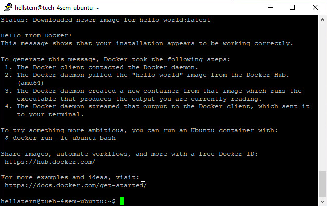
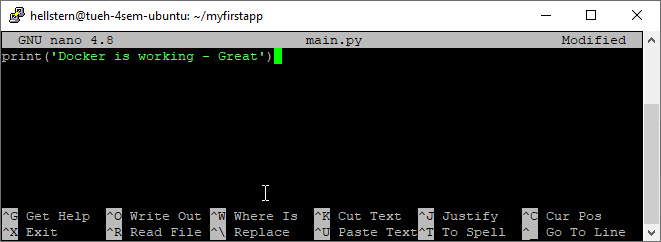
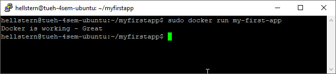
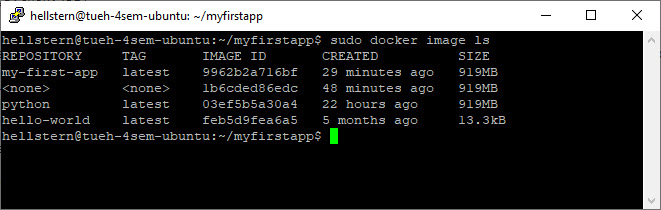

# Docker - Virtual Machine Azure
We are going to install Docker on your Azure Ubuntu Virtual Machine.

## Connect
You need to connect via SSH to the Virtual Machine:

- IP adresse
- Username
- Password

# Install Docker on Ubuntu
When connected to the Virtual Machine, we can start the Docker Installation.

Update the system

    sudo apt update

Install Docker with **apt**

    sudo apt install docker.io

Verify that Docker is installed

    sudo docker run hello-world



# Your first Docker application
To create your first Docker application, you need to create a folder and move to the folder:

    mkdir myfirstapp
    cd myfirstapp

You have to create the following two files:

1. **main.py** - *Python file that will contain the code to be executed*
2. **Dockerfile** - *Docker file that will contain the necessary instructions to create the environment*

## main.py
We do not need a *complicated* Python file for this demo :-)

**main.py**
```python
print('Docker is working - Great')
```

*Simpel enough :-)*

Create the main.py file on Ubuntu

    nano main.py

This starts the Nano text editor, where you write the Python code

    print('Docker is working - Great')

Save the **main.py** file

- CTRL X
- Y
- Enter



## Dockerfile
A Dockerfile is a text document that contains all the commands a user could call on the command line to assemble an image.

**A Docker file has NO extension!**

```txt
FROM python:latest
COPY main.py /
CMD [ "python", "./main.py" ]
```

**FROM python:latest**

A dockerfile must always start by importing the base image. You use the keyword **FROM** to do that.

We want import the Python image, so you write **python** for the image name and **latest** for the version.

**COPY main.py /**

In order to launch your Python code, you must import it into your image.

For that you use the keyword **COPY**

The first parameter **main.py** is the name of the Python file on the host.

The second parameter */* is the path where to put the file on the image. Here we put the file at the image root folder.

**CMD [ "python", "./main.py" ]**

You need to define the command to launch when you are going to run the image. 

Use the keyword **CMD** to do that.

The following command will execute **python ./main.py**

## Create Dockerfile on Ubuntu
In the **ssh terminal** you write:

    nano Dockerfile

This starts the Nano text editor, where you write:

    FROM python:latest
    COPY main.py /
    CMD [ "python", "./main.py" ]


Then you have to save the Dockerfile:

- CTRL X
- Y
- Enter

Now you could have a folder (*myfirstapp*) with 2 files:


# Create the Docker image
When your code (*main.py*) are ready, and the Dockerfile is written, all you have to do is create your image to contain your application.

    sudo docker build -t my-first-app .

The **-t** option allows you to define the name of your image. I'm using **my-first-app** but you can use what you want.

*Note - Remember the . at the end*


# Run the Docker image
Once the image is created, your code is ready to be launched.

    sudo docker run my-first-app



**Remember**: *If you make any changes to the Python file (main.py) or the Dockerfile, you have to run the Docker build command agin*

# Commands for Docker
List your images
    
    docker image ls



Delete a specific image

    docker image rm [image name]

Delete all existing images

    docker image rm $(docker images -a -q)

List all existing containers (*running and not running*)

    docker ps -a

Change a container name at running time

    docker run --name [container name] [image name]

Stop a specific container

    docker stop [container name]

Stop all running containers

    docker stop $(docker ps -a -q)

Delete a specific container (*only if stopped*)

    docker rm [container name]

Delete all containers (*only if stopped*)

    docker rm $(docker ps -a -q)

Display logs of a container

    docker logs [container name]
