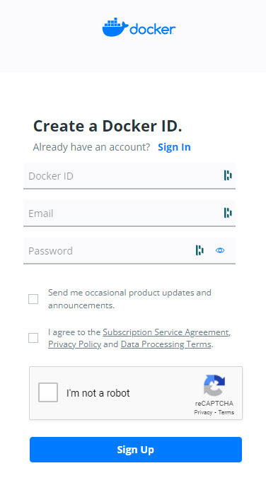

[Home](../modul-4-2.md)
# Docker
    - 24-03-2022 - Torsdag - DK
    - 25-03-2022 - Fredag - INT

# Topic - [mindmap](../mindmap.html)
- [Docker - Virtual Machine Azure](./docker_ubuntu.md)

# What is Docker
Docker is an open platform for developing, shipping, and running applications.

Docker is free software developed by Docker Inc. It was presented to the general public on March 13, 2013, and has become since that day a must in the world of IT development.

Docker enables you to separate your applications from your infrastructure so you can deliver software quickly. With Docker, you can manage your infrastructure in the same ways you manage your applications.

By taking advantage of Docker’s methodologies for shipping, testing, and deploying code quickly, you can significantly reduce the delay between writing code and running it in production.

[www.docker.com](https://www.docker.com/)

# Create Docker Hub account
Docker Hub is a hosted repository service provided by Docker for finding and sharing container images.

**Create an account on Docker Hub.**

When you have created the account you can upload your own Docker images and you have access to a lot of different Docker images.

# Is Docker a virtual machine?
It is one of the most asked questions about Docker. The answer is: **actually, not quite**

It may *look* like a virtual machine at first, but the functionality is not the same.

Unlike Docker, a **virtual machine will include a complete operating system**. It will work independently and act like a computer.
**Docker will only share the resources** of the host machine to run its environments.

# Docker architecture
Docker uses a **client-server architecture**. 

The Docker **client** talks to the **Docker daemon**, which does the heavy lifting of building, running, and distributing your Docker containers. 

The Docker client and daemon can run on the same system, or you can connect a Docker client to a remote Docker daemon. The Docker client and daemon communicate using a REST API, over UNIX sockets or a network interface. 

Another Docker client is **Docker Compose**, that lets you work with applications consisting of a set of containers.

## The Docker daemon
The Docker daemon (*dockerd*) listens for Docker API requests and manages Docker objects such as images, containers, networks, and volumes. A daemon can also communicate with other daemons to manage Docker services.

## The Docker client
The Docker client (*docker*) is the primary way that many Docker users interact with Docker. When you use commands such as docker run, the client sends these commands to dockerd, which carries them out. The docker command uses the Docker API. The Docker client can communicate with more than one daemon.

## Docker Desktop
**Docker Desktop** is an easy-to-install application for your **Mac** or **Windows** environment that enables you to build and share containerized applications and microservices. 

Docker Desktop includes the Docker daemon (*dockerd*), the Docker client (*docker*), Docker Compose, Docker Content Trust, Kubernetes, and Credential Helper. 

[Docker Desktop](./DockerDesktop.md)

## Docker registries
A Docker registry stores Docker images. Docker Hub is a public registry that anyone can use, and Docker is configured to look for images on Docker Hub by default. You can even run your own private registry.

When you use the docker pull or docker run commands, the required images are pulled from your configured registry. When you use the docker push command, your image is pushed to your configured registry.

## Docker objects
When you use Docker, you are creating and using images, containers, networks, volumes, plugins, and other objects. This section is a brief overview of some of those objects.

## Images
An image is a read-only template with instructions for creating a Docker container. Often, an image is based on another image, with some additional customization. For example, you may build an image which is based on the ubuntu image, but installs the Apache web server and your application, as well as the configuration details needed to make your application run.

You might create your own images or you might only use those created by others and published in a registry. To build your own image, you create a Dockerfile with a simple syntax for defining the steps needed to create the image and run it. Each instruction in a Dockerfile creates a layer in the image. When you change the Dockerfile and rebuild the image, only those layers which have changed are rebuilt. This is part of what makes images so lightweight, small, and fast, when compared to other virtualization technologies.

## Containers
A container is a runnable instance of an image. You can create, start, stop, move, or delete a container using the Docker API or CLI. You can connect a container to one or more networks, attach storage to it, or even create a new image based on its current state.

By default, a container is relatively well isolated from other containers and its host machine. You can control how isolated a container’s network, storage, or other underlying subsystems are from other containers or from the host machine.

A container is defined by its image as well as any configuration options you provide to it when you create or start it. When a container is removed, any changes to its state that are not stored in persistent storage disappear.

# Docker Desktop
The Docker Desktop application makes it easy for you to work with Docker. There are versions of Docker Desktop for; *macOS*, *Windows* and *Linux*

## Download and Install
You can download the version you need her: [www.docker.com/products/docker-desktop](https://www.docker.com/products/docker-desktop/)

- [Install Docker Desktop on **Windows**](https://docs.docker.com/desktop/windows/install/)
- [Install Docker Desktop on **Mac**](https://docs.docker.com/desktop/mac/install/)

# Links
- [www.docker.com](https://www.docker.com/)
- [docs.docker.com/get-started/overview](https://docs.docker.com/get-started/overview/)
- [Microsoft - What is Docker](https://docs.microsoft.com/en-us/dotnet/architecture/microservices/container-docker-introduction/docker-defined)
- [Migrate custom software to Azure App Service using a custom container](https://docs.microsoft.com/en-us/azure/app-service/tutorial-custom-container?pivots=container-linux)
