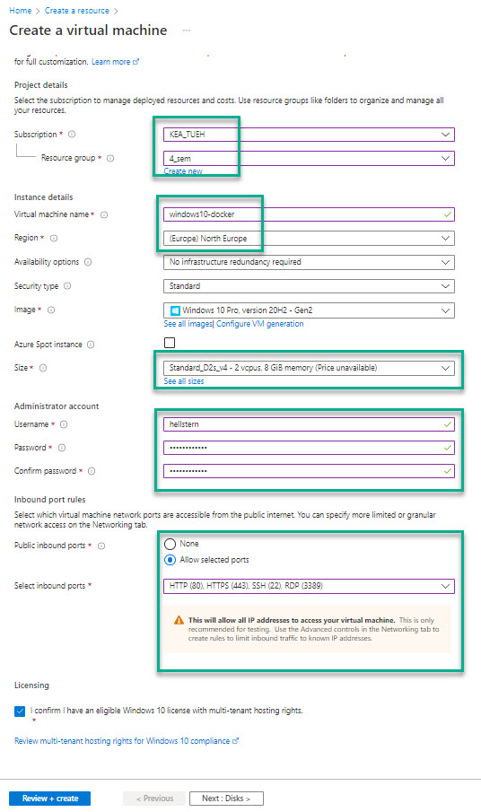
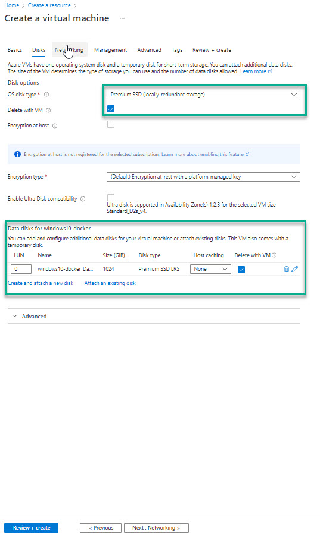
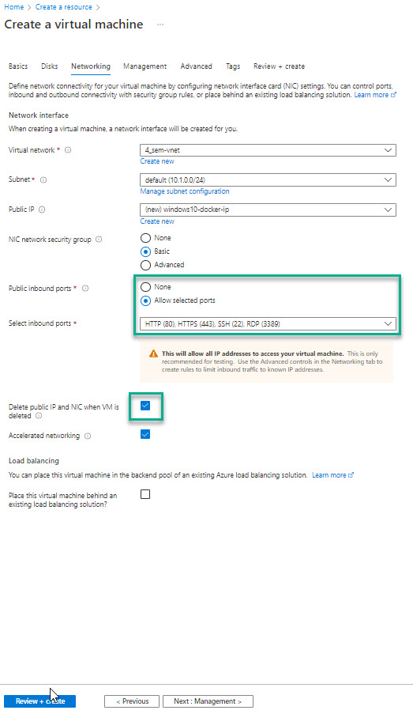
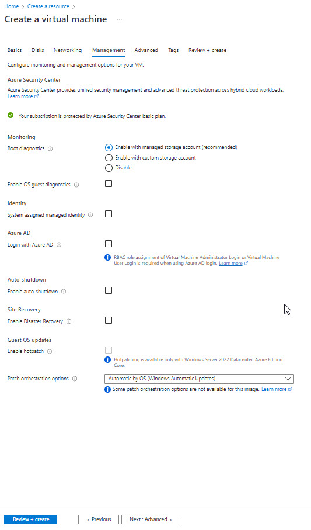
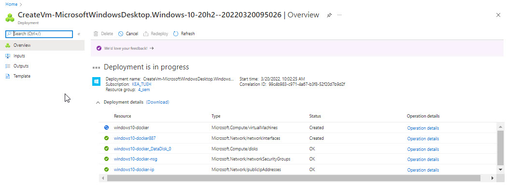
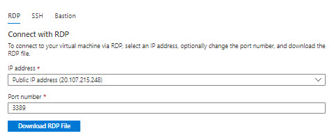
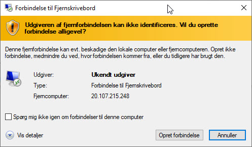
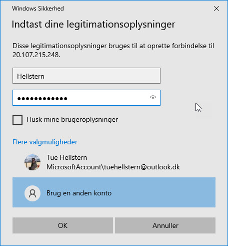
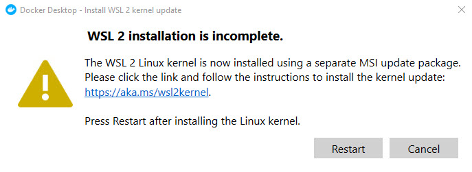
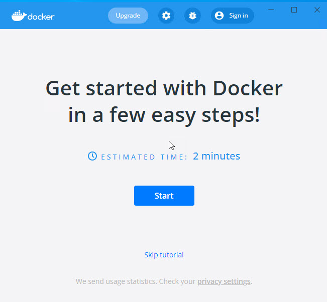

# Azure Virtual Machine - Windows 10
For the use of Docker Desktop, we are creating a Virtual Machine on Azure running Windows 10 Pro.

On that VM we will install **Docker Desktop**.

# Create VM

- Create
- Select **Windows 10 Pro**

**Next : Disks**

**Next : Networking**

**Next : Management**

**Review + Create**

**Create**

**Go to resource**

# Connect

- Select **Connect** in the left panel
- Select **RDP**
- Click **Download RDP File**

## Windows RDP
When you have downloaded the RDP file:

- Double click on the **RDP file**
- Click **Opret forbindelse**

- Click **Flere valgmuligheder**
- Click **Brug en anden konto**
- Use the username from the Azure VM
- Use the password from the Azure VM

- Click **Ja**

Now you are connect to the VM.

# Installing Docker
Download and install Docker Desktop for Windows, from the [www.docker.com](https://www.docker.com)

You have to restart the VM for the installation to complete

After restart, you have to accept the Docker *Service Agreement* and update the Linux kernel

Click the link **https://aka.ms/wsl2kernel**

Click the download link -[WSL2 Linux kernel update package for x64 machines](https://wslstorestorage.blob.core.windows.net/wslblob/wsl_update_x64.msi)

Run the update package downloaded in the previous step. (*Double-click to run - if you are prompted for elevated permissions, select "yes" to approve.*)

Once the installation is complete, you have to set **WSL 2** as your default version.

Open PowerShell and run this command to set **WSL 2** as the default version when installing a new Linux distribution:

    wsl --set-default-version 2

Install **Ubuntu** Linux distribution. Open the Microsoft Store and select the Ubuntu Linux distribution. Follow the instruction regarding installing af running Ubuntu.

The first time you launch a newly installed Linux distribution, a console window will open and you'll be asked to wait for a minute or two for files to de-compress and be stored on your PC. All future launches should take less than a second.

You will then need to create a user account and password for your new Linux distribution - **Remember the username/password**

**Restart the VM**

After restart - reconnect - start Docker Desktop and go true the Start Up Guide

## Install adtional software
We need som *extra* software, install the flowing:

- Git
- GitHub Desktop
- Python3 - *You can use Windows store*
- Visual Studio Code