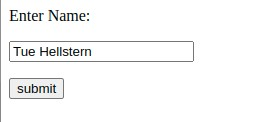

# Flask demo
Flask is a micro web framework written in Python.

It is classified as a microframework because it does not require particular tools or libraries.

It has no database abstraction layer, form validation, or any other components where pre-existing third-party libraries provide common functions.

Flask supports extensions that can add application features as if they were implemented in Flask itself. Extensions exist for object-relational mappers, form validation, upload handling, various open authentication technologies and several common framework related tools.

Flask follows the **MVC** Architecture - Design Patten.
Flask Project is a single application where you can add countless **views** and **models**.

## Install Flask
You have to install Flask with

    pip3 install flask

*Consider using a virtual environment*

## Code - Simpel app
A minimal Flask application, without HTML could be something like this:

```python
# Import
from flask import Flask

# Flask constructor
app = Flask(__name__)

# The route() function of the Flask class is a decorator,
# which tells the application which URL should call
# the associated function.
@app.route('/')
def index():
    return 'Index Page - Start page'

@app.route('/hello')
def hello():
    return 'Hello, World'

@app.route('/hello/<name>')
def hello_name(name):
   return 'Hello %s!' % name

# Start Flask
if __name__ == '__main__':
	app.run()
```

# HTML

It is possible to combine a HTML page and Flask.

- Start by running the Python Falsk application - **app.py**
- When the Flask server is running open the HTML page in a browser




## Code - HTML version

This is the code for the HTML page - **login.html**

```html
<html>
	<body>	
		<form action = "http://localhost:5000/login" method = "post">
			<p>Enter Name:</p>
			<p><input type = "text" name = "username" /></p>
			<p><input type = "submit" value = "submit" /></p>
		</form>	
	</body>
</html>
```

Code for the Python file - app.py

```python
from flask import Flask, redirect, url_for, request
app = Flask(__name__)

@app.route('/success/<name>')
def success(name):
    return 'Welcome %s' % name

@app.route('/login',methods = ['POST', 'GET'])
def login():
    if request.method == 'POST':
        user = request.form['username']
        return redirect(url_for('success',name = user))
    else:
        user = request.args.get('username')
        return redirect(url_for('success',name = user))

if __name__ == '__main__':
    app.run(debug = True)
```

## Links
- [Flask](https://flask.palletsprojects.com/en/2.1.x/)
- [How to structure large Flask applications](https://www.digitalocean.com/community/tutorials/how-to-structure-large-flask-applications)