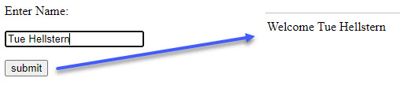

# Flask
Flask is a micro web framework written in Python.

It is classified as a microframework because it does not require particular tools or libraries.

It has no database abstraction layer, form validation, or any other components where pre-existing third-party libraries provide common functions. 

Flask supports extensions that can add application features as if they were implemented in Flask itself. Extensions exist for object-relational mappers, form validation, upload handling, various open authentication technologies and several common framework related tools.

## Code - Simpel

```python
# Import
from flask import Flask

# Flask constructor
app = Flask(__name__)

# The route() function of the Flask class is a decorator,
# which tells the application which URL should call
# the associated function.
@app.route('/')
def index():
    return 'Index Page'

@app.route('/hello')
def hello():
    return 'Hello, World'

@app.route('/hello/<name>')
def hello_name(name):
   return 'Hello %s!' % name

# Start Flask
if __name__ == '__main__':
	app.run()
```

## Code - html
This example uses a HTML file and a Python - Flask file

- Start the Falsk server by running the **app.py** file
- Open the HTML file **login.html** in a browser



### HTML file - login.html

```html
<html>
    <body>	
        <form action = "http://localhost:5000/login" method = "post">
            <p>Enter Name:</p>
            <p><input type = "text" name = "username" /></p>
            <p><input type = "submit" value = "submit" /></p>
        </form>	
    </body>
</html>
```

### Python file - app.py

```python
from flask import Flask, redirect, url_for, request
app = Flask(__name__)

@app.route('/success/<name>')
def success(name):
    return 'Welcome %s' % name

@app.route('/login',methods = ['POST', 'GET'])
def login():
    if request.method == 'POST':
        user = request.form['username']
        return redirect(url_for('success',name = user))
    else:
        user = request.args.get('username')
        return redirect(url_for('success',name = user))

if __name__ == '__main__':
    app.run(debug = True)
```    

## GitHub
You can find the code at GitHub - [github.com/TueHellsternKea/4_sem_code/tree/main/flask_demo](https://github.com/TueHellsternKea/4_sem_code/tree/main/flask_demo)

