[HOME](./README.md)

# Exploratory data analysis
In statistics, **Exploratory Data Analysis** (*EDA*) is an approach of analyzing data sets to summarize their main characteristics, often using statistical graphics and other data visualization methods.

A statistical model can be used or not, but primarily EDA is for seeing what the data can tell us beyond the formal modeling and thereby contrasts traditional hypothesis testing.

EDA will give you the basic understanding of your data, it's distribution, null values and much more. You can either explore data using graphs or through some Python functions.

## Content
- [Data](#data---supermarket-sales)


https://towardsdatascience.com/exploratory-data-analysis-using-spermarket-sales-data-in-python-e99d329a07fc

# Data - Supermarket sales
We are using a data set from [www.kaggle.com](https://www.kaggle.com/datasets/aungpyaeap/supermarket-sales) with historical record of sales data in 3 different supermarkets.

The dataset consists of data from 3 cities or 3 branches in Myanmar:
- Branch A (*Yangoon*)
- Branch B (*Mandalay*)
- Branch C (*Naypyitaw*)

Download the data as CSV: [supermarket_sales.csv](./data/supermarket_sales.csv)

## Attribute information
- **Invoice id**: Computer generated sales slip invoice identification number
- **Branch**: Branch of supercenter (3 branches are available identified by A, B and C).
- **City**: Location of supercenters
- **Customer type**: Type of customers, recorded by Members for customers using member card and Normal for without member card.
- **Gender**: Gender type of customer
- **Product line**: General item categorization groups - Electronic accessories, Fashion accessories, Food and beverages, Health and beauty, Home and lifestyle, Sports and travel
- **Unit price**: Price of each product in $
- **Quantity**: Number of products purchased by customer
- **Tax**: 5% tax fee for customer buying
- **Total**: Total price including tax
- **Date**: Date of purchase (Record available from January 2019 to March 2019)
- **Time**: Purchase time (10am to 9pm)
- **Payment**: Payment used by customer for purchase (3 methods are available – Cash, Credit card and Ewallet)
- **COGS**: Cost of goods sold
- **Gross margin percentage**: Gross margin percentage
- **Gross income**: Gross income
- **Rating**: Customer stratification rating on their overall shopping experience (On a scale of 1 to 10)

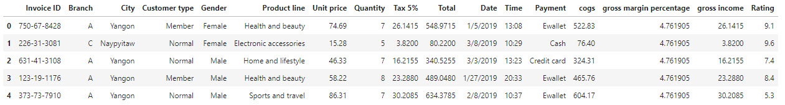

# Uni-variate analysis
Uni-variate analysis is the analysis involving a single variable (*uni*) without considering relationships with other variables.

This is the stand-alone analysis of a variable/column without considering any casual relationships with other variables. 

We will see how a simple uni-variate analysis can help to get more insights into the data.

## Question 1
**What does the customer rating look like and is it skewed?**


The rating distribution looks uniform and there seems to be no skewness on the left or right side of the distribution.

We can plot the mean and the percentiles to show this as well.

The red dotted lime is the mean and the green and orange lines indicate the 25th and 75th quartiles respectively.

The mean rating is ~7 across products.

```python
sns.distplot(df['Rating'])
plt.axvline(x=np.mean(df['Rating']), c='red', ls='--', label='mean')
plt.axvline(x=np.percentile(df['Rating'],25),c='green', ls='--', label = '25th percentile:Q1')
plt.axvline(x=np.percentile(df['Rating'],75),c='orange', ls='--',label = '75th percentile:Q3' )
plt.legend()
```
## Question 2
*Is there any difference in aggregate sales across branches?*

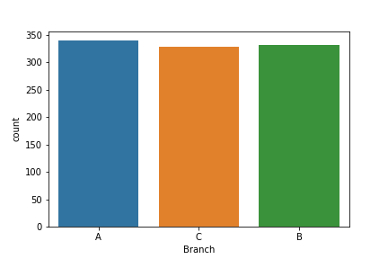

There is not much difference in sales across the 3 branches of A, B and C. 

The sales in branch A is a bit higher than the rest of the branches.

```python
sns.countplot(df['Branch'])
df['Branch'].value_counts()
```

## Question 3
*Which is the most popular payment method used by customers?*

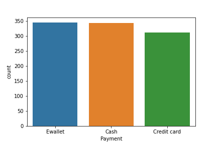

The most popular payment method is E-wallet and not credit cards.
Cash payment is also popular

```python
sns.countplot(df['Payment'])
```

# Bi-variate analysis
Let us consider two (*bi*) variables together and look at the interaction/relationship between them. 

This is bi-variate analysis that can help to draw important conclusions about the data.
Let us consider gross income and try to answer the following questions:

## Question 4
*Does gross income affect the ratings that the customers provide?*

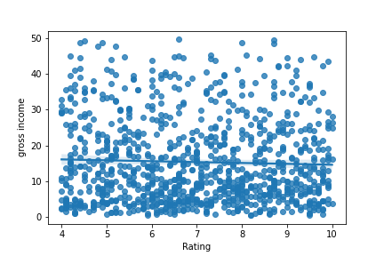

As you can see from the scatter plot and the trend line which is pretty flat that there is no relationship between gross income of a customer and his rating.

```python
sns.regplot(df['Rating'], df['gross income'])
```

## Question 5: 
*Which branch is the most profitable?*

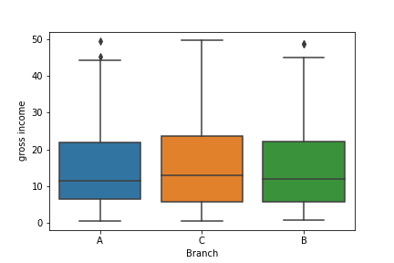

There is not much difference in gross income by branches at an average level. Branch C has a slightly higher income than A or B, As observed earlier, though branch A has slightly higher sales than the rest C is the most profitable branch in terms of gross income.

```python
sns.boxplot(x=df['Branch'], y=df['gross income'])
```

## Question 6
*What is the relationship between Gender and Gross income?*

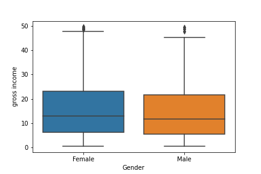

Gross income is similar for both male and female, though female customers spend a bit higher at the 75th percentile.

```python
sns.boxplot(x=df['Gender'], y=df['gross income'])
```

## Question 7
*Is there any time trend in gross income?*

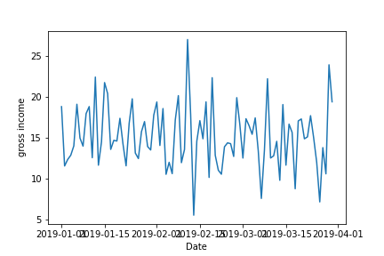


No particular time trend except for some days the gross income is pretty high and some days it is pretty low. Overall it remains at a certain average level.

```python
df.groupby(df.index).mean()
sns.lineplot(x= df.groupby(df.index).mean().index, 
             y = df.groupby(df.index).mean()['gross income'])
```

## Question 8
*Which product line generates most income?*

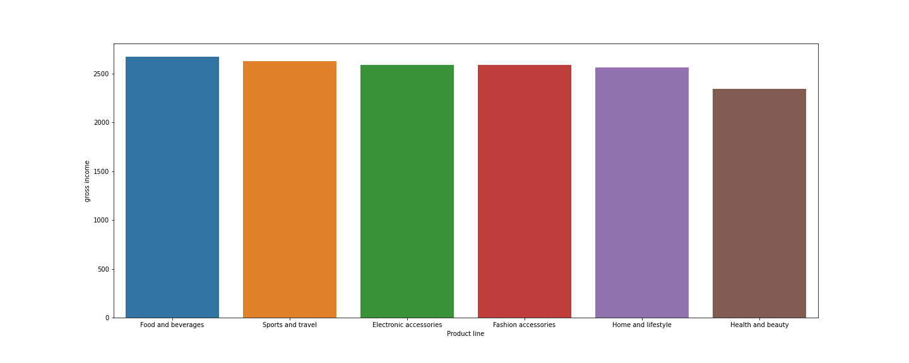

Gross income is highest in sports and travel.

```python
cat=df[["Product line", "gross income"]].groupby(['Product line'], as_index=False).sum().sort_values(by='gross income', ascending=False)
plt.figure(figsize=(20,8))
sns.barplot(x='Product line', y='gross income', data=cat)
```

# Correlation analysis
## Individual correlations

-0.04

```python
round(np.corrcoef(df['gross income'], df['Rating'])[1][0],2)
```

## Pairwise correlations

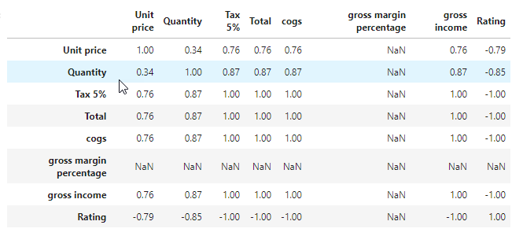

```python
np.round(df.corr(),2)
```

# Other analysis
## Question 9
*What is the spending patterns of females and males and in which category do they spend a lot?*

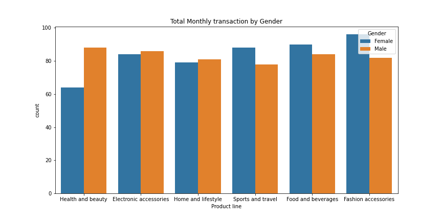

Females spend on '*fashion accessories*' the most and for males surprisingly it is 'Health and beauty'. Females also spend more on '*Sports and travel*'.

```python
plt.figure(figsize=(12, 6))
plt.title('Total Monthly transaction by Gender')
sns.countplot(df['Product line'], hue = df.Gender)
```

# Dummy method
```python
gender_dummies  = pd.get_dummies(df['Gender'])
gender_dummies.head()
```
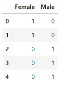


```python
df1 = pd.concat([df, gender_dummies], axis = 1)
df1.head()
```
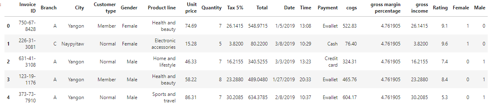

# Spending pattern of Female
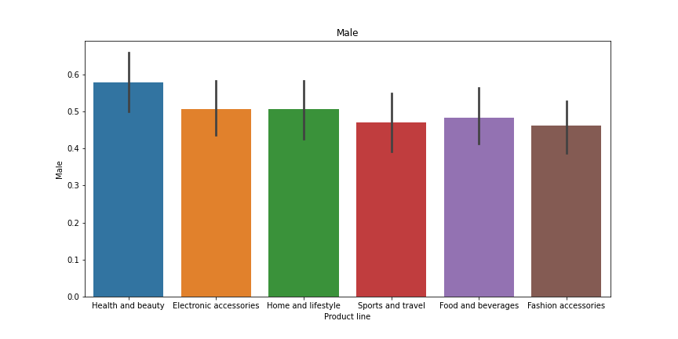

```python
plt.figure(figsize = (12,6))
sns.barplot(x = 'Product line', y = 'Female', data = df1)
```
## Question 10
*How many products are bought by customers?*

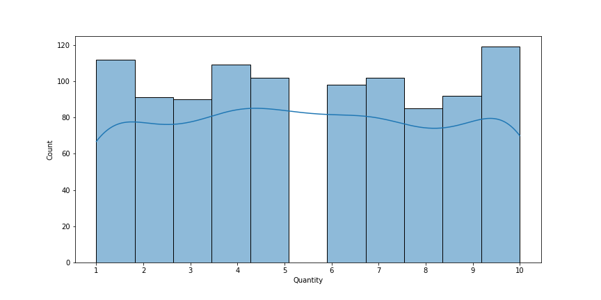

Most of the customers buy 10 quantities.

```python
xdata = [1,2,3,4,5,6,7,8,9,10]
plt.figure(figsize = (12,6))
sns.distplot(df['Quantity'])
plt.xticks(xdata)
```

## Question 11
*Which day of the week has maximum sales?*

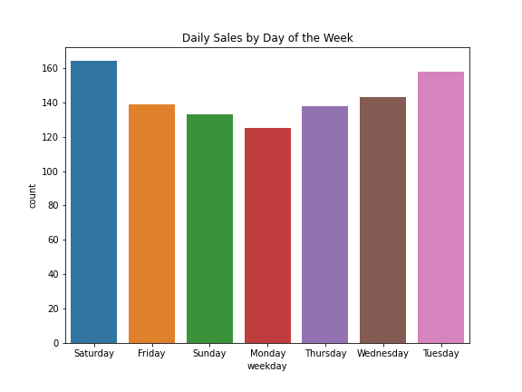

Sales is highest on **Saturdays** probably because it is the weekend.

**Tuesdays** is a close second. **Mondays** is the lowest in sales.

```python
plt.figure(figsize=(8, 6))
plt.title('Daily Sales by Day of the Week')
sns.countplot(df['weekday'])
```

## Question 12 
*Which hour of the day is the busiest?*