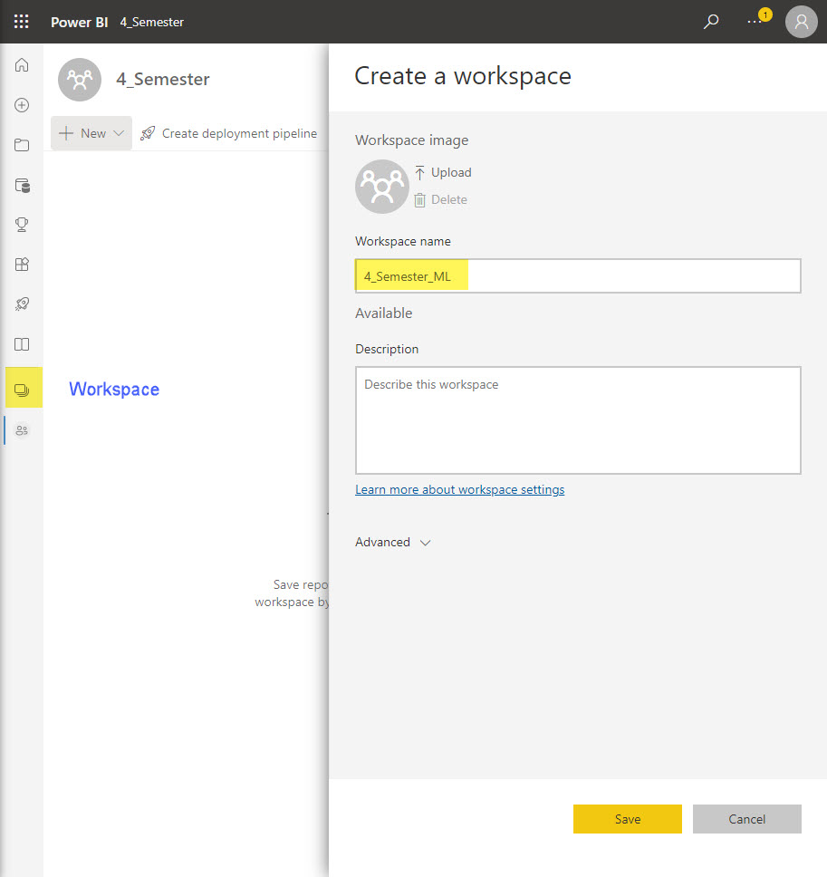

[Home](../modul-4-2.md)
# Power BI
    - 04-10-2022 - Fredag
    - 08-10-2022 - Tirsdag

# Microsoft Power BI
Use 
## Steps
- Create a Workspace
- Create a Dataflow

## Data
We will use a machine learning dataset from a set of online sessions, some of which culminated in a purchase.

The dataset contains a set of attributes about these sessions, which we'll use for training our model.

You can download the dataset from the **UC Irvine website**. 
I have also downloaded it: [online_shoppers_intention.csv](https://raw.githubusercontent.com/TueHellsternKea/4_sem_code/main/power_bi/online_shoppers_intention.csv)

## Create Workspace

- In Power BI Services (web)
- Create Workspace, **button left menu**
- Clik **New workspace****
- Create the Workspace **4_Semester_ML**

## Create Dataflow

- Click **New**
- Select **Dataflow**
- Click **Add new tables**
- Select **Text/CSV**
- Insert URL for the CSV file: [https://raw.githubusercontent.com/TueHellsternKea/4_sem_code/main/power_bi/online_shoppers_intention.csv](https://raw.githubusercontent.com/TueHellsternKea/4_sem_code/main/power_bi/online_shoppers_intention.csv)
- Click **Next**
- Click **Transform data** - The online version of *Power Query Editor* opens
- Change the *datatype* of **Revenue** to **True/False**
- Select **Replace current**
- Click **Save & close**
- Name the dataflow - **OnlineShoppers**
