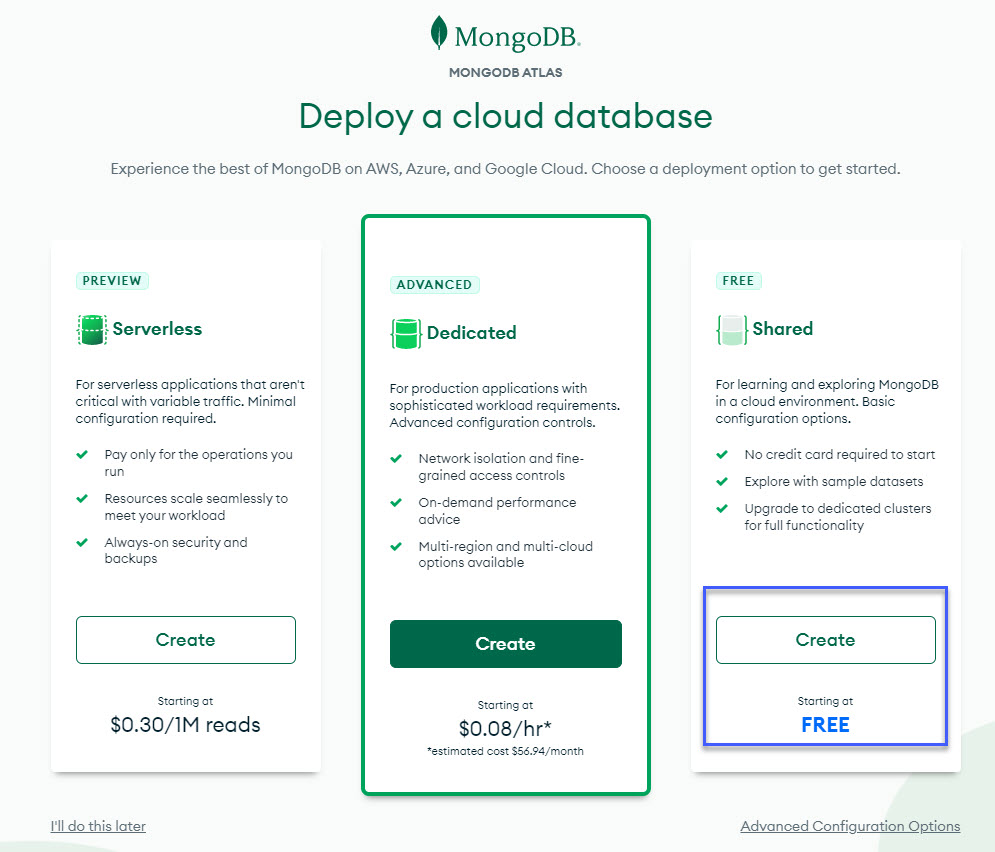
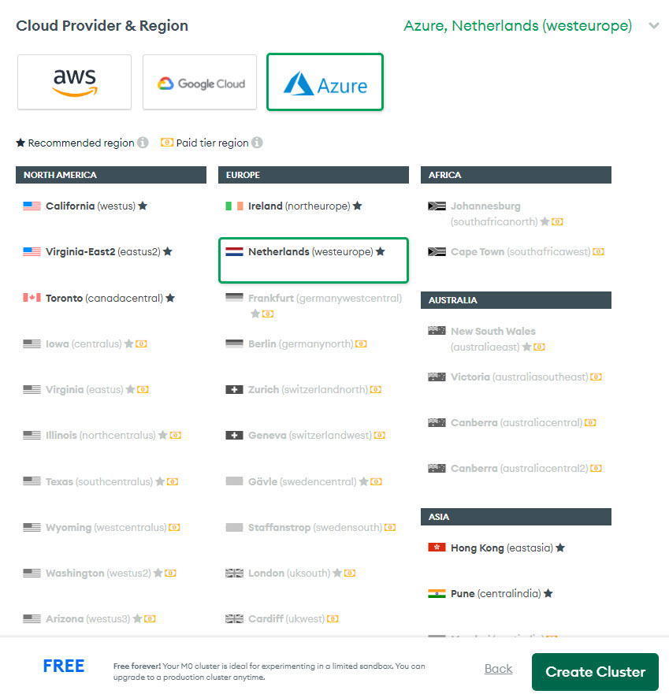
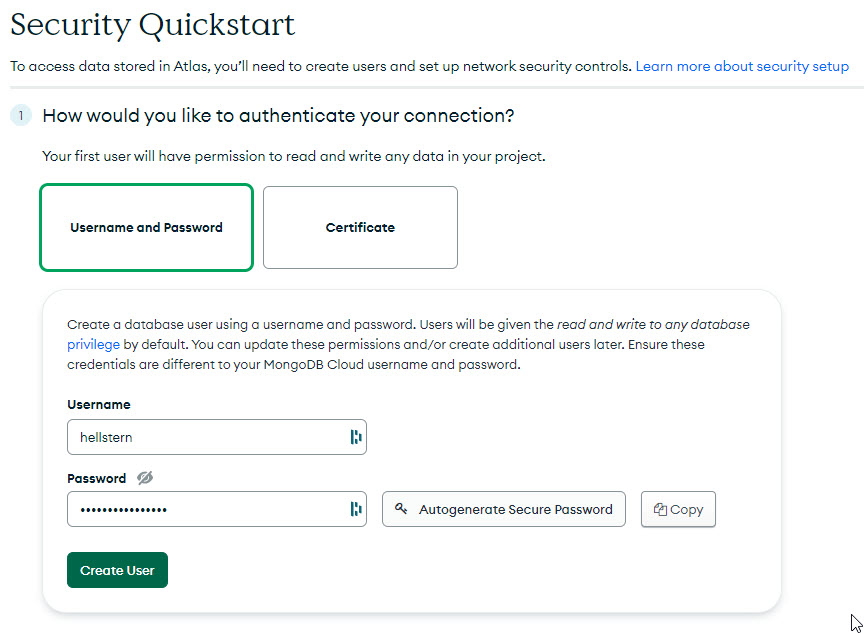
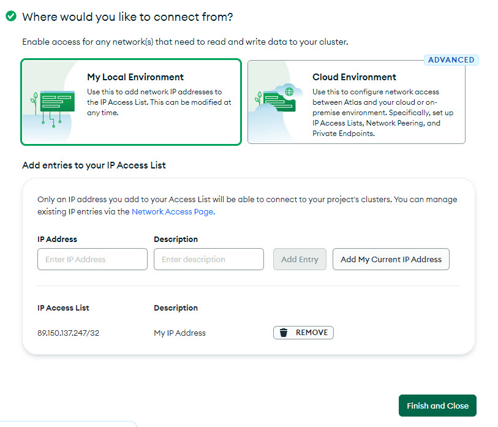
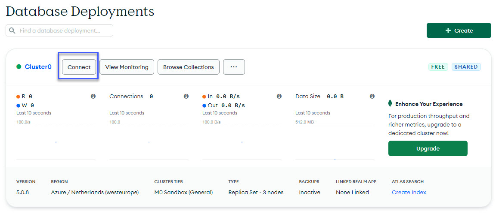
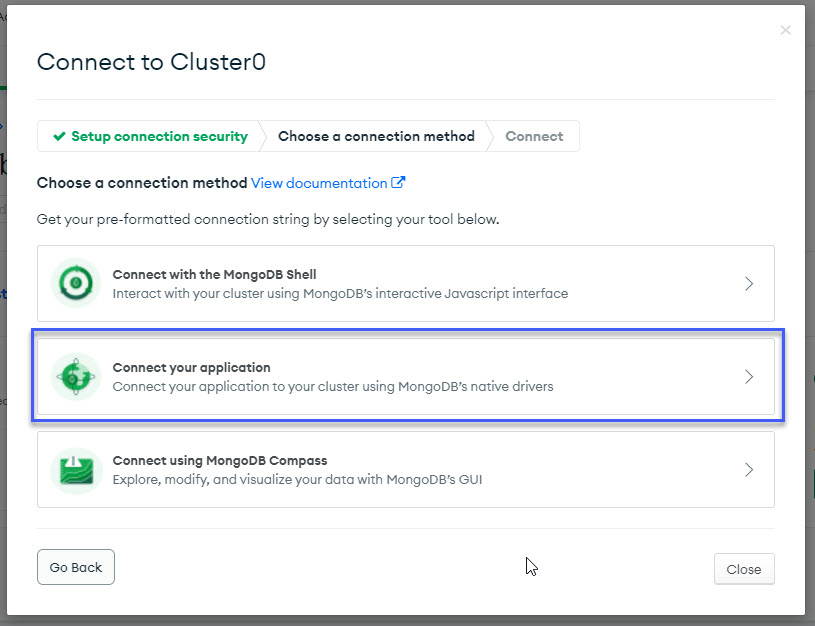
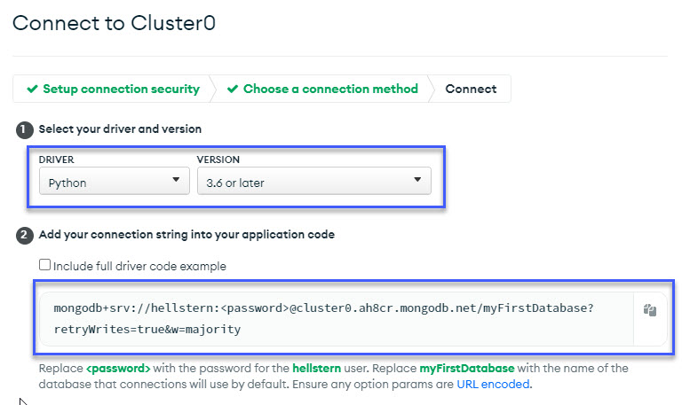
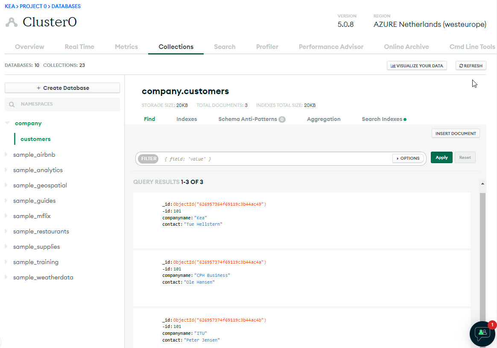

# MongoDb in the cloud
How to use a MongoDB server there are hostede in the cloud - [cloud.mongodb.com](https://cloud.mongodb.com)

# Create account
Create an account at [cloud.mongodb.com](https://cloud.mongodb.com).
Use an email account you have access to - You have to confirm the email.

It is free and you don't need a credit card.

When you have created the account and confirmed the email adresse, select the **Free Shared** solution



Select **Azure** and click **Create Cluster**



Create a user - *remember the Password* :-)



Select My Local Environment and add your IP adresse



Click **Finish and Close**

# Connect
Now you need a connection string for the Python connection



Click on Connect and select **Connect your application**



Select:
- Driver: Python
- Version: 3.6 or later
- Copy the connection string
    - "mongodb+srv://<USERNAME>:<PASSWORD>@xxxx.yyyy.mongodb.net/myFirstDatabase?retryWrites=true&w=majority"



# Install
You need to install the **pymongo** driver with the parameter **srv**

    pip3 install "pymongo[srv]"

# Create the Python app
Now you have all the information you need to create the Python app.

Create a new Python file with this code.

Remember to use your own connection string and replace the *Username* and *Password*.

```python
# Modules
import pymongo
from pymongo import MongoClient

# Connection
# Connection string
connstring = "mongodb+srv://<USERNAME>:<PASSWORD>@xxxx.yyyy.mongodb.net/myFirstDatabase?retryWrites=true&w=majority"
cluster = MongoClient(connstring)

# Create database - company
db = cluster["company"]

# Create collection - clients
collection = db["customers"]

# Create a new document
collection.insert_one({"-id":101, "companyname":"Kea", "contact":"Tue Hellstern"})
collection.insert_one({"-id":101, "companyname":"CPH Business", "contact":"Ole Hansen"})
collection.insert_one({"-id":101, "companyname":"ITU", "contact":"Peter Jensen"})

# Find
print(collection.find_one({ "companyname":"Kea" }))
```

You can use your account at [cloud.mongodb.com](https://cloud.mongodb.com) to check if the different posts are create.

