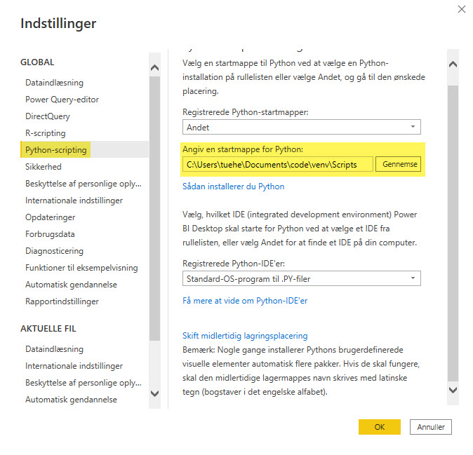
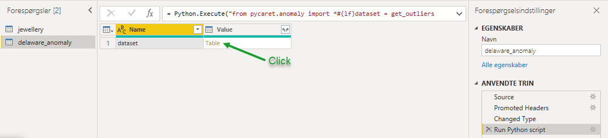
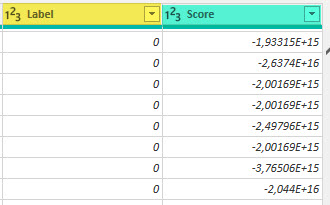
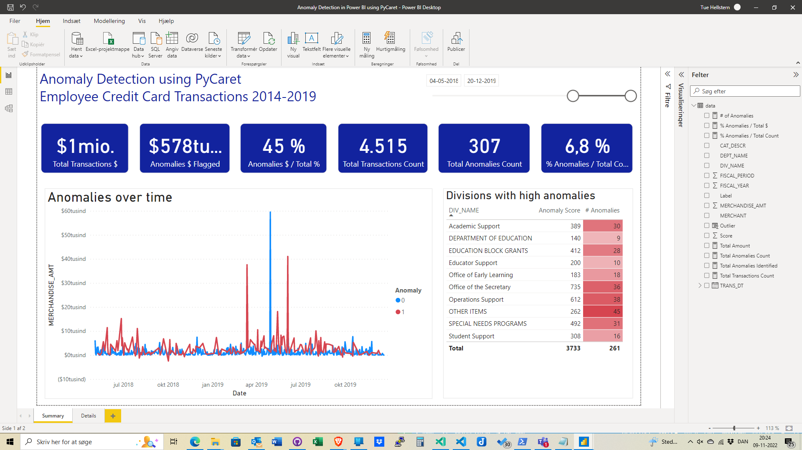
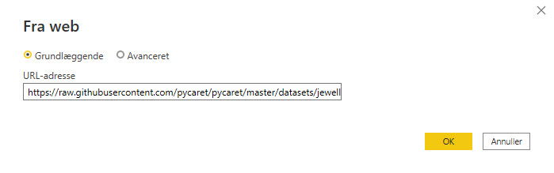
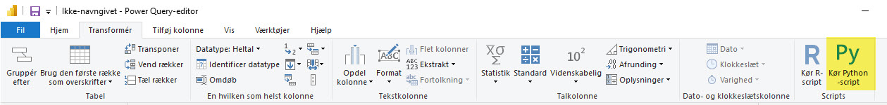
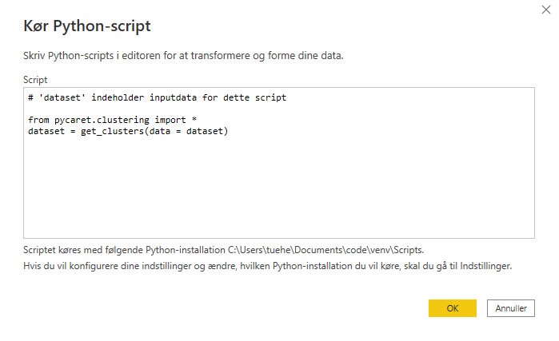

# Machine Learning in Power BI using PyCaret

## Setting up the Environment
Before we start using PyCaret’s machine learning capabilities in Power BI we have to create a virtual environment and install PyCaret.

Create a virtuel environment see this guide: [/Using Jupyter Lab in Virtual Environment](./Using_Jupyter_Lab_in_Virtual_Environme.md)

## Install modules
You have to install the module:

    pip install pycaret[full]

You can do a **pip list** to see all the modules installed.

## Set Python Directory in Power BI
The virtual environment created must be linked with Power BI. This can be done using Global Settings in Power BI Desktop:

    File → Options → Global → Python scripting

Use the path from the Virtuel Environment you just created.



# Anomaly Detection
Anomaly Detection is a machine learning technique used to identify rare items, events, or observations that differ significantly from most data and raise suspicion.

Typically, abnormal items will turn into some sort of issue, such as bank fraud, a structural defect, medical issues, or error.

**There are three ways to implement an anomaly detector:**

- **Controlled**: Used when there are labels in the dataset that indicate which operations are abnormal and which are normal.

- **Semi-supervised**: The idea behind semi-supervised anomaly detection is to train a model on normal data only (without any anomalies). When the trained model is then used on unseen data points, it can predict whether the new data point is normal (based on the distribution of data in the trained model).

- **Unsupervised**: Unsupervised as it seems, means no labels and thus no training and test datasets. In unsupervised learning, a model is trained on the entire dataset and assumes that most of the samples are normal. There are several unsupervised anomaly detection algorithms such as the Isolation Forest or Single Class Support Vector Machine. Each has a method of detecting anomalies in the dataset.

We will use 2014–2019 Government Employees Credit Card Processing for the U.S. Department of Education in Delaware. Data is available online on open data platforms [Link](https://data.delaware.gov/Government-and-Finance/Credit-Card-Spend-by-Merchant/8pzf-ge27)

## Data Upload
The first step is to import the dataset into Power BI Desktop. 

You can upload data using a web connector.
From Power BI Desktop use:  Get Data → Web

https://raw.githubusercontent.com/pycaret/pycaret/master/datasets/delaware_anomaly.csv

## Model Training

To train an anomaly detector in Power BI, we will need to run a Python script in the Power Query Editor

Power Query Editor → Transform → Run Python script 

Run the code below as a Python script:

```python
from pycaret.anomaly import *
dataset = get_outliers(dataset, ignore_features=['DEPT_NAME', 'MERCHANT', 'TRANS_DT'])
```

We ignored some columns in the dataset under the ignore_features parameter. 

- DEPT_NAME
- MERCHANT
- TRANS_DT

There are many reasons why you might not want to use certain columns to train a machine learning algorithm.

PyCaret allows you to hide unnecessary columns from a dataset instead of leaving it, as you may need these columns for later analysis. 

For example, in this case we don’t want to use the transaction history (TRANS_DT) to train an algorithm and therefore we have stored it as ignore_features.

There are o12 ready-to-use anomaly detection algorithms in PyCaret:

- **abod** - Angle-base Outlier Detection
- **cluster** - Clustering-Based Local Outlier
- **cof** - Connectivity-Based Outlier Factor
- **histogram** - Histogram-based Outlier Detection
- **iforest** - Isolation Forest
- **knn** - k-Nearest Neighbors Detector
- **lof** - Local Outlier Factor
- **svm** - One-class SVM detector
- **pca** - Principal Component Analysis
- **mcd** - Minimum Covariance Determinant
- **sod** - Subspace Outlier Detection
- **sos** - Stochastic Outlier Selection

By default, PyCaret trains a **K-Nearest Neighbors Anomaly Detector** with a fraction of 5% (*ie 5% of the total number of rows in the table are marked as outliers*). 

Default values can be easily changed:

- You can use the **fraction parameter** in the **get_outliers()** function to change the fraction value.
- Use the **model parameter** in **get_outliers()** to change the model type.

To train an **Isolation Forest** detector with a fraction of 0.1, use this code:

```python
from pycaret.anomaly import *
dataset = get_outliers(dataset, model = 'iforest', fraction = 0.1, ignore_features=['DEPT_NAME', 'MERCHANT', 'TRANS_DT'])
```



Two new columns are attached to the original table. Label (1 = outlier, 0 = inlier) and Score (data points with high scores are categorized as outlier). 

Apply the query to see results in Power BI data set.



Now you can add som calculations and create a Power BI Dashboard.




# Clustering in Power BI
Clustering is a machine learning technique that groups data points with similar characteristics. These groupings are useful for exploring data, identifying patterns and analyzing a subset of data. Some common business use cases for clustering are:

- Customer segmentation for the purpose of marketing.
- Customer purchasing behavior analysis for promotions and discounts.
- Identifying geo-clusters

We will implementing a clustering analysis in Power BI using PyCaret using the K-Means algorithm which is one of the simplest and most popular unsupervised machine learning algorithms. 


You can read more about K-Means [More](https://stanford.edu/~cpiech/cs221/handouts/kmeans.html)

## Data
We will use the current [health expenditure dataset](https://data.worldbank.org/indicator/SH.XPD.CHEX.GD.ZS) from the World Health Organization’s Global Health Expenditure database

The dataset contains health expenditure as a % of National GDP for over 200 countries from year 2000 through 2017.

Our objective is to find patterns and groups in this data by using a K-Means clustering algorithm.

## Import data Power BI
The first step is importing the dataset into Power BI Desktop. You can load the data using a web connector

    Power BI Desktop → Get Data → From Web


In this tutorial we will use **jewellery.csv** file that is available on PyCaret’s github repository. 

You can load the data using a web connector. 

    Power BI Desktop → Get Data → From Web

Link to csv File: https://raw.githubusercontent.com/pycaret/pycaret/master/datasets/jewellery.csv




## K-Means Clustering
To train a clustering model we will execute Python script in Power Query Editor

    Power Query Editor → Transform → Run python script



Run the following code as a Python script:

```python
from pycaret.clustering import *
dataset = get_clusters(data = dataset)
```



# 