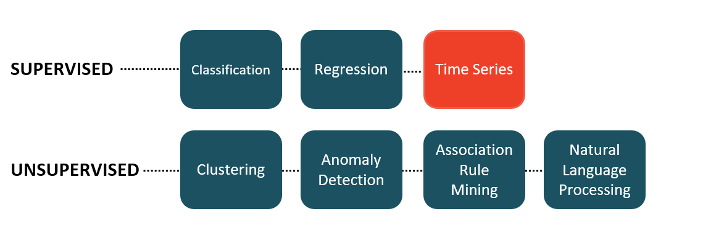

[Home](../modul-4-2.md)

# PyCaret
PyCaret is an open-source, low-code machine learning library in Python that automates machine learning workflows - [pycaret.org](https://pycaret.org)


PyCaret is a simple, easy to learn, low-code machine learning library in Python. With PyCaret, you spend less time coding and more time on analysis.


## Modules in PyCaret
PyCaret is a modular library arranged into modules and each module representing a machine learning use-case, the following modules are supported:

- Classification
- Regression
- Clustering
- Anomaly Detection
- Natural Language Processing
- Association Rules Mining
- Time Series (beta)



**Note**: *Time Series module is in making and will be available in the next major release.*

# Installing PyCaret
You install PyCaret with PIP

    pip3 install pycaret

If you get an **legacy-install-failure** error, try this:

    pip3 install -U --pre pycaret

Alternativ use Jupyter Lab in a new Virtuel Environment, se this guide: [Using Jupyter Lab in a Virtual Environment](./Using_Jupyter_Lab_in_Virtual_Environme.md)

# Data
For this demo you will be using a dataset from a case study by the *Darden School of Business*, published in Harvard Business.

The goal of this tutorial is to predict the diamond price based on its attributes like carat weight, cut, color, etc. You can download the dataset from PyCaret’s repository - [https://github.com/pycaret/pycaret/tree/master/datasets](https://github.com/pycaret/pycaret/tree/master/datasets)

## Load the dataset from PyCaret
You can get the data in Python by thise code:

```python
# Imports
from pycaret.datasets import get_data

# Get data
data = get_data('diamond')

print(data.head())
```


# Links
- [PyCaret Quickstart](https://pycaret.gitbook.io/docs/get-started/quickstart)
- [PyCaret GitHub](https://github.com/pycaret/pycaret)