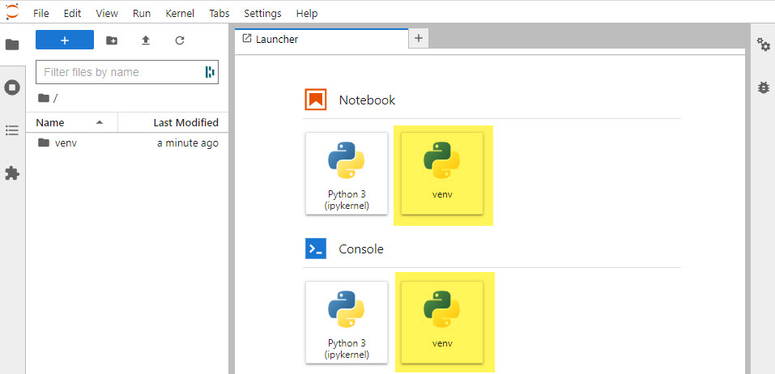

# Using Jupyter Lab in a Virtual Environment
If you want to use Jupyter Lab in a virtual environment so that only selected packages are available in the scope of the notebook. 

To do this we have to add a new kernel for the virtual environment in the list of kernels available for the Jupyter Lab.

## Create a virtual environment
Open the directory where you want to create your project. 

Open a Terminal and navigate to the same directory and run the following commands to create a virtual environment.

    python -m venv venv

## Activat
Now you have our virtual environment, activate it.

    venv\Scripts\activate

## Install jupyter kernel
Install jupyter kernel for the virtual environment using the following command

    ipython kernel install --user --name=venv

## Select the installed kernel when you want to use jupyter notebook in this virtual environment
Run the - **jupyter lab** - command in the terminal the Jupyter environment will open up. 

Click on the **venv** kernel you just created.

## Install modules
You can install modules in 2 ways:

### pip install 
Use **pip install** and install each module one at the time

    pip3 install "module name"

### requirements.txt
You can create an *requirements.txt* file and list the modules in that file, then install all the modules:

    pip3 install -r requirements.txt

## Uninstall kernel
After you are done with the project and no longer need the kernel you can uninstall it by running the following code:

    jupyter-kernelspec uninstall venv