# EDA
## Exploratory data analysis using supermarket sales data


```python
# Install
!pip3 install matplotlib
!pip3 install seaborn
!pip3 install missingno
!pip3 install geopy
!pip3 install folium
!pip3 install dataframe_image
```


```python
# Libraries
import pandas as pd
import numpy as np
import matplotlib.pyplot as plt
import seaborn as sns
import dataframe_image as dfi

# Visualizing NaN values
import missingno as msno

# Visualization
import plotly.express as px
import plotly.graph_objs as go
import plotly.io as pio
from plotly.subplots import make_subplots

# Calendar
import calendar

# Geocode
from geopy.geocoders import Nominatim
from geopy.distance import geodesic
import folium
from folium import plugins
import ipywidgets
from branca.element import Figure

# Plotly Options and Config
pio.templates.default = 'plotly_white'
config = {'displayModeBar': False}
colors_x = ['#E0C95A', '#CBE0CA', '#E0864E', '#CDCCE3', '#E3B8D1']
cmaps = 'Blues'
```


```python
# Read data - CSV file
df = pd.read_csv('supermarket_sales.csv')
df.head()
```


<div>
<style scoped>
    .dataframe tbody tr th:only-of-type {
        vertical-align: middle;
    }

    .dataframe tbody tr th {
        vertical-align: top;
    }

    .dataframe thead th {
        text-align: right;
    }
</style>
<table border="1" class="dataframe">
  <thead>
    <tr style="text-align: right;">
      <th></th>
      <th>Invoice ID</th>
      <th>Branch</th>
      <th>City</th>
      <th>Customer type</th>
      <th>Gender</th>
      <th>Product line</th>
      <th>Unit price</th>
      <th>Quantity</th>
      <th>Tax 5%</th>
      <th>Total</th>
      <th>Date</th>
      <th>Time</th>
      <th>Payment</th>
      <th>cogs</th>
      <th>gross margin percentage</th>
      <th>gross income</th>
      <th>Rating</th>
    </tr>
  </thead>
  <tbody>
    <tr>
      <th>0</th>
      <td>750-67-8428</td>
      <td>A</td>
      <td>Yangon</td>
      <td>Member</td>
      <td>Female</td>
      <td>Health and beauty</td>
      <td>74.69</td>
      <td>7</td>
      <td>26.1415</td>
      <td>548.9715</td>
      <td>1/5/2019</td>
      <td>13:08</td>
      <td>Ewallet</td>
      <td>522.83</td>
      <td>4.761905</td>
      <td>26.1415</td>
      <td>9.1</td>
    </tr>
    <tr>
      <th>1</th>
      <td>226-31-3081</td>
      <td>C</td>
      <td>Naypyitaw</td>
      <td>Normal</td>
      <td>Female</td>
      <td>Electronic accessories</td>
      <td>15.28</td>
      <td>5</td>
      <td>3.8200</td>
      <td>80.2200</td>
      <td>3/8/2019</td>
      <td>10:29</td>
      <td>Cash</td>
      <td>76.40</td>
      <td>4.761905</td>
      <td>3.8200</td>
      <td>9.6</td>
    </tr>
    <tr>
      <th>2</th>
      <td>631-41-3108</td>
      <td>A</td>
      <td>Yangon</td>
      <td>Normal</td>
      <td>Male</td>
      <td>Home and lifestyle</td>
      <td>46.33</td>
      <td>7</td>
      <td>16.2155</td>
      <td>340.5255</td>
      <td>3/3/2019</td>
      <td>13:23</td>
      <td>Credit card</td>
      <td>324.31</td>
      <td>4.761905</td>
      <td>16.2155</td>
      <td>7.4</td>
    </tr>
    <tr>
      <th>3</th>
      <td>123-19-1176</td>
      <td>A</td>
      <td>Yangon</td>
      <td>Member</td>
      <td>Male</td>
      <td>Health and beauty</td>
      <td>58.22</td>
      <td>8</td>
      <td>23.2880</td>
      <td>489.0480</td>
      <td>1/27/2019</td>
      <td>20:33</td>
      <td>Ewallet</td>
      <td>465.76</td>
      <td>4.761905</td>
      <td>23.2880</td>
      <td>8.4</td>
    </tr>
    <tr>
      <th>4</th>
      <td>373-73-7910</td>
      <td>A</td>
      <td>Yangon</td>
      <td>Normal</td>
      <td>Male</td>
      <td>Sports and travel</td>
      <td>86.31</td>
      <td>7</td>
      <td>30.2085</td>
      <td>634.3785</td>
      <td>2/8/2019</td>
      <td>10:37</td>
      <td>Ewallet</td>
      <td>604.17</td>
      <td>4.761905</td>
      <td>30.2085</td>
      <td>5.3</td>
    </tr>
  </tbody>
</table>
</div>


# Location of the branches


```python
city_data = df.City.unique()
cities = pd.DataFrame(data = city_data, columns = {'city_name'})
cities

nom = Nominatim(user_agent='Kaggle')

def geo_cities(cities):
    lat = []
    long = []
    flag = 0
    for city in cities['city_name']:
      location = nom.geocode(city)
      try:
        lat.append(location.latitude)
        long.append(location.longitude)
        print(flag)
      except:
        lat.append('NA')
        long.append('NA')
      flag += 1
    cities['Latitude'] = lat
    cities['Longitude'] = long 
    
#geo_cities(cities)
# The geocoding doesn't seem to work in  kaggle notebook so i'll manually add  the output here.

cities = pd.DataFrame({'city_name': ['Yangon', 'Naypyitaw', 'Mandalay'],
                       'Latitude': [16.79671316,19.690708,21.981275],
                       'Longitude' : [96.160992, 96.165883, 96.082375]})

supermarket_geo = folium.Map(location = [19.680708,	96.265883], zoom_start = 7, tiles = 'CartoDB Positron', control_scale = True)

fig = Figure(width = 800, height = 600)
fig.add_child(supermarket_geo)

for (index, row) in cities.iterrows():
  folium.Marker(location = [row.loc['Latitude'], row.loc['Longitude']], popup = row.loc['city_name'],tooltip = 'click',
                icon = folium.Icon(icon = 'glyphicon-shopping-cart', prefix = 'glyphicon')).add_to(supermarket_geo)

supermarket_geo
```


<iframe srcdoc="&lt;!DOCTYPE html&gt;
&lt;head&gt;    
    &lt;meta http-equiv=&quot;content-type&quot; content=&quot;text/html; charset=UTF-8&quot; /&gt;

        &lt;script&gt;
            L_NO_TOUCH = false;
            L_DISABLE_3D = false;
        &lt;/script&gt;

    &lt;style&gt;html, body {width: 100%;height: 100%;margin: 0;padding: 0;}&lt;/style&gt;
    &lt;style&gt;#map {position:absolute;top:0;bottom:0;right:0;left:0;}&lt;/style&gt;
    &lt;script src=&quot;https://cdn.jsdelivr.net/npm/leaflet@1.6.0/dist/leaflet.js&quot;&gt;&lt;/script&gt;
    &lt;script src=&quot;https://code.jquery.com/jquery-1.12.4.min.js&quot;&gt;&lt;/script&gt;
    &lt;script src=&quot;https://maxcdn.bootstrapcdn.com/bootstrap/3.2.0/js/bootstrap.min.js&quot;&gt;&lt;/script&gt;
    &lt;script src=&quot;https://cdnjs.cloudflare.com/ajax/libs/Leaflet.awesome-markers/2.0.2/leaflet.awesome-markers.js&quot;&gt;&lt;/script&gt;
    &lt;link rel=&quot;stylesheet&quot; href=&quot;https://cdn.jsdelivr.net/npm/leaflet@1.6.0/dist/leaflet.css&quot;/&gt;
    &lt;link rel=&quot;stylesheet&quot; href=&quot;https://maxcdn.bootstrapcdn.com/bootstrap/3.2.0/css/bootstrap.min.css&quot;/&gt;
    &lt;link rel=&quot;stylesheet&quot; href=&quot;https://maxcdn.bootstrapcdn.com/bootstrap/3.2.0/css/bootstrap-theme.min.css&quot;/&gt;
    &lt;link rel=&quot;stylesheet&quot; href=&quot;https://maxcdn.bootstrapcdn.com/font-awesome/4.6.3/css/font-awesome.min.css&quot;/&gt;
    &lt;link rel=&quot;stylesheet&quot; href=&quot;https://cdnjs.cloudflare.com/ajax/libs/Leaflet.awesome-markers/2.0.2/leaflet.awesome-markers.css&quot;/&gt;
    &lt;link rel=&quot;stylesheet&quot; href=&quot;https://cdn.jsdelivr.net/gh/python-visualization/folium/folium/templates/leaflet.awesome.rotate.min.css&quot;/&gt;

            &lt;meta name=&quot;viewport&quot; content=&quot;width=device-width,
                initial-scale=1.0, maximum-scale=1.0, user-scalable=no&quot; /&gt;
            &lt;style&gt;
                #map_6f5fb67c159d9b86cc02b52640b56b77 {
                    position: relative;
                    width: 100.0%;
                    height: 100.0%;
                    left: 0.0%;
                    top: 0.0%;
                }
            &lt;/style&gt;

&lt;/head&gt;
&lt;body&gt;    

            &lt;div class=&quot;folium-map&quot; id=&quot;map_6f5fb67c159d9b86cc02b52640b56b77&quot; &gt;&lt;/div&gt;

&lt;/body&gt;
&lt;script&gt;    

            var map_6f5fb67c159d9b86cc02b52640b56b77 = L.map(
                &quot;map_6f5fb67c159d9b86cc02b52640b56b77&quot;,
                {
                    center: [19.680708, 96.265883],
                    crs: L.CRS.EPSG3857,
                    zoom: 7,
                    zoomControl: true,
                    preferCanvas: false,
                }
            );
            L.control.scale().addTo(map_6f5fb67c159d9b86cc02b52640b56b77);


            var tile_layer_df9885353059967aab59110bacfdd181 = L.tileLayer(
                &quot;https://cartodb-basemaps-{s}.global.ssl.fastly.net/light_all/{z}/{x}/{y}.png&quot;,
                {&quot;attribution&quot;: &quot;\u0026copy; \u003ca href=\&quot;http://www.openstreetmap.org/copyright\&quot;\u003eOpenStreetMap\u003c/a\u003e contributors \u0026copy; \u003ca href=\&quot;http://cartodb.com/attributions\&quot;\u003eCartoDB\u003c/a\u003e, CartoDB \u003ca href =\&quot;http://cartodb.com/attributions\&quot;\u003eattributions\u003c/a\u003e&quot;, &quot;detectRetina&quot;: false, &quot;maxNativeZoom&quot;: 18, &quot;maxZoom&quot;: 18, &quot;minZoom&quot;: 0, &quot;noWrap&quot;: false, &quot;opacity&quot;: 1, &quot;subdomains&quot;: &quot;abc&quot;, &quot;tms&quot;: false}
            ).addTo(map_6f5fb67c159d9b86cc02b52640b56b77);


            var marker_9ba7f5f979a3e4ef897967bd4f367c31 = L.marker(
                [16.79671316, 96.160992],
                {}
            ).addTo(map_6f5fb67c159d9b86cc02b52640b56b77);


            var icon_399233309cf394db02c70be2436f6a89 = L.AwesomeMarkers.icon(
                {&quot;extraClasses&quot;: &quot;fa-rotate-0&quot;, &quot;icon&quot;: &quot;glyphicon-shopping-cart&quot;, &quot;iconColor&quot;: &quot;white&quot;, &quot;markerColor&quot;: &quot;blue&quot;, &quot;prefix&quot;: &quot;glyphicon&quot;}
            );
            marker_9ba7f5f979a3e4ef897967bd4f367c31.setIcon(icon_399233309cf394db02c70be2436f6a89);


        var popup_ca5b346a2887321c84b158bf833791cc = L.popup({&quot;maxWidth&quot;: &quot;100%&quot;});


            var html_cd2ea83b55330ad76eb865b5336ab3af = $(`&lt;div id=&quot;html_cd2ea83b55330ad76eb865b5336ab3af&quot; style=&quot;width: 100.0%; height: 100.0%;&quot;&gt;Yangon&lt;/div&gt;`)[0];
            popup_ca5b346a2887321c84b158bf833791cc.setContent(html_cd2ea83b55330ad76eb865b5336ab3af);


        marker_9ba7f5f979a3e4ef897967bd4f367c31.bindPopup(popup_ca5b346a2887321c84b158bf833791cc)
        ;


            marker_9ba7f5f979a3e4ef897967bd4f367c31.bindTooltip(
                `&lt;div&gt;
                     click
                 &lt;/div&gt;`,
                {&quot;sticky&quot;: true}
            );


            var marker_b357bf19c24e4e971c639eae9bae3b49 = L.marker(
                [19.690708, 96.165883],
                {}
            ).addTo(map_6f5fb67c159d9b86cc02b52640b56b77);


            var icon_0724c8aa22eab990fca59e413b597246 = L.AwesomeMarkers.icon(
                {&quot;extraClasses&quot;: &quot;fa-rotate-0&quot;, &quot;icon&quot;: &quot;glyphicon-shopping-cart&quot;, &quot;iconColor&quot;: &quot;white&quot;, &quot;markerColor&quot;: &quot;blue&quot;, &quot;prefix&quot;: &quot;glyphicon&quot;}
            );
            marker_b357bf19c24e4e971c639eae9bae3b49.setIcon(icon_0724c8aa22eab990fca59e413b597246);


        var popup_906307b67fbadc5c7b8a9d9451192b99 = L.popup({&quot;maxWidth&quot;: &quot;100%&quot;});


            var html_9fcfa433e0f354545b2bc7defa07e562 = $(`&lt;div id=&quot;html_9fcfa433e0f354545b2bc7defa07e562&quot; style=&quot;width: 100.0%; height: 100.0%;&quot;&gt;Naypyitaw&lt;/div&gt;`)[0];
            popup_906307b67fbadc5c7b8a9d9451192b99.setContent(html_9fcfa433e0f354545b2bc7defa07e562);


        marker_b357bf19c24e4e971c639eae9bae3b49.bindPopup(popup_906307b67fbadc5c7b8a9d9451192b99)
        ;


            marker_b357bf19c24e4e971c639eae9bae3b49.bindTooltip(
                `&lt;div&gt;
                     click
                 &lt;/div&gt;`,
                {&quot;sticky&quot;: true}
            );


            var marker_700219e162551b75173b68f9d93da344 = L.marker(
                [21.981275, 96.082375],
                {}
            ).addTo(map_6f5fb67c159d9b86cc02b52640b56b77);


            var icon_5de5b1e37a56c6aefc35d793d55f6ef9 = L.AwesomeMarkers.icon(
                {&quot;extraClasses&quot;: &quot;fa-rotate-0&quot;, &quot;icon&quot;: &quot;glyphicon-shopping-cart&quot;, &quot;iconColor&quot;: &quot;white&quot;, &quot;markerColor&quot;: &quot;blue&quot;, &quot;prefix&quot;: &quot;glyphicon&quot;}
            );
            marker_700219e162551b75173b68f9d93da344.setIcon(icon_5de5b1e37a56c6aefc35d793d55f6ef9);


        var popup_beefc2c315b57dbc1c78b4d374dc392b = L.popup({&quot;maxWidth&quot;: &quot;100%&quot;});


            var html_e731e3d1e5eb05eb106f4fdef43852f3 = $(`&lt;div id=&quot;html_e731e3d1e5eb05eb106f4fdef43852f3&quot; style=&quot;width: 100.0%; height: 100.0%;&quot;&gt;Mandalay&lt;/div&gt;`)[0];
            popup_beefc2c315b57dbc1c78b4d374dc392b.setContent(html_e731e3d1e5eb05eb106f4fdef43852f3);


        marker_700219e162551b75173b68f9d93da344.bindPopup(popup_beefc2c315b57dbc1c78b4d374dc392b)
        ;


            marker_700219e162551b75173b68f9d93da344.bindTooltip(
                `&lt;div&gt;
                     click
                 &lt;/div&gt;`,
                {&quot;sticky&quot;: true}
            );

&lt;/script&gt;" width="800" height="600"style="border:none !important;" "allowfullscreen" "webkitallowfullscreen" "mozallowfullscreen"></iframe>


## Variable transformations
Change the date variable to date


```python
df['Date'] = pd.to_datetime(df['Date'])
df['weekday'] = df['Date'].dt.day_name()
```

## Set the Date as the index of the dataset


```python
df.set_index('Date', inplace=True)
df.head()
```


<div>
<style scoped>
    .dataframe tbody tr th:only-of-type {
        vertical-align: middle;
    }

    .dataframe tbody tr th {
        vertical-align: top;
    }

    .dataframe thead th {
        text-align: right;
    }
</style>
<table border="1" class="dataframe">
  <thead>
    <tr style="text-align: right;">
      <th></th>
      <th>Invoice ID</th>
      <th>Branch</th>
      <th>City</th>
      <th>Customer type</th>
      <th>Gender</th>
      <th>Product line</th>
      <th>Unit price</th>
      <th>Quantity</th>
      <th>Tax 5%</th>
      <th>Total</th>
      <th>Time</th>
      <th>Payment</th>
      <th>cogs</th>
      <th>gross margin percentage</th>
      <th>gross income</th>
      <th>Rating</th>
      <th>weekday</th>
    </tr>
    <tr>
      <th>Date</th>
      <th></th>
      <th></th>
      <th></th>
      <th></th>
      <th></th>
      <th></th>
      <th></th>
      <th></th>
      <th></th>
      <th></th>
      <th></th>
      <th></th>
      <th></th>
      <th></th>
      <th></th>
      <th></th>
      <th></th>
    </tr>
  </thead>
  <tbody>
    <tr>
      <th>2019-01-05</th>
      <td>750-67-8428</td>
      <td>A</td>
      <td>Yangon</td>
      <td>Member</td>
      <td>Female</td>
      <td>Health and beauty</td>
      <td>74.69</td>
      <td>7</td>
      <td>26.1415</td>
      <td>548.9715</td>
      <td>13:08</td>
      <td>Ewallet</td>
      <td>522.83</td>
      <td>4.761905</td>
      <td>26.1415</td>
      <td>9.1</td>
      <td>Saturday</td>
    </tr>
    <tr>
      <th>2019-03-08</th>
      <td>226-31-3081</td>
      <td>C</td>
      <td>Naypyitaw</td>
      <td>Normal</td>
      <td>Female</td>
      <td>Electronic accessories</td>
      <td>15.28</td>
      <td>5</td>
      <td>3.8200</td>
      <td>80.2200</td>
      <td>10:29</td>
      <td>Cash</td>
      <td>76.40</td>
      <td>4.761905</td>
      <td>3.8200</td>
      <td>9.6</td>
      <td>Friday</td>
    </tr>
    <tr>
      <th>2019-03-03</th>
      <td>631-41-3108</td>
      <td>A</td>
      <td>Yangon</td>
      <td>Normal</td>
      <td>Male</td>
      <td>Home and lifestyle</td>
      <td>46.33</td>
      <td>7</td>
      <td>16.2155</td>
      <td>340.5255</td>
      <td>13:23</td>
      <td>Credit card</td>
      <td>324.31</td>
      <td>4.761905</td>
      <td>16.2155</td>
      <td>7.4</td>
      <td>Sunday</td>
    </tr>
    <tr>
      <th>2019-01-27</th>
      <td>123-19-1176</td>
      <td>A</td>
      <td>Yangon</td>
      <td>Member</td>
      <td>Male</td>
      <td>Health and beauty</td>
      <td>58.22</td>
      <td>8</td>
      <td>23.2880</td>
      <td>489.0480</td>
      <td>20:33</td>
      <td>Ewallet</td>
      <td>465.76</td>
      <td>4.761905</td>
      <td>23.2880</td>
      <td>8.4</td>
      <td>Sunday</td>
    </tr>
    <tr>
      <th>2019-02-08</th>
      <td>373-73-7910</td>
      <td>A</td>
      <td>Yangon</td>
      <td>Normal</td>
      <td>Male</td>
      <td>Sports and travel</td>
      <td>86.31</td>
      <td>7</td>
      <td>30.2085</td>
      <td>634.3785</td>
      <td>10:37</td>
      <td>Ewallet</td>
      <td>604.17</td>
      <td>4.761905</td>
      <td>30.2085</td>
      <td>5.3</td>
      <td>Friday</td>
    </tr>
  </tbody>
</table>
</div>


# Univariate analysis

## Question 1
*What does the customer rating look like and is it skewed?*


```python
sns.histplot(df['Rating'], kde=True)
plt.axvline(x=np.mean(df['Rating']), c='red', ls='--', label='mean')
plt.axvline(x=np.percentile(df['Rating'],25),c='green', ls='--', label = '25th percentile:Q1')
plt.axvline(x=np.percentile(df['Rating'],75),c='orange', ls='--',label = '75th percentile:Q3' )
plt.legend()
plt.savefig("uni1.png") 
```


    
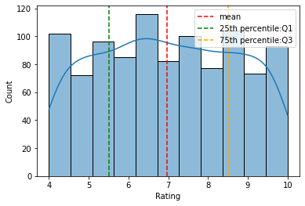
    


The rating distribution looks uniform and there seems to be no skewness on the left or right side of the distribution.

We can plot the mean and the percentiles to show this as well.

The red dotted lime is the mean and the green and orange lines indicate the 25th and 75th quartiles respectively.

The mean rating is ~7 across products.

## Question 2
*Is there any difference in aggregate sales across branches?*


```python
sns.countplot(x=df['Branch'])
df['Branch'].value_counts()
plt.savefig("uni2.png") 
```


    

    


There is not much difference in sales across the 3 branches of A, B and C. 
The sales in branch A is a bit higher than the rest of the branches.

## Question 3
*Which is the most pouplar payment method used by customers?*


```python
sns.countplot(x=df['Payment'])
plt.savefig("uni3.png")
```


    
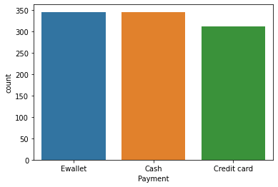
    


The most popular payment method is E-wallet and not credit cards.
Cash payment is also popular

## Bi-variate analysis
Let us consider two (bi) variables together and look at the interaction/relationship between them. 

This is bi-variate analysis that can help to draw important conclusions about the data.
Let us consider gross income and try to answer the following questions:

## Question 4
*Does gross income affect the ratings that the customers provide?*


```python
sns.regplot(x=df['Rating'], y=df['gross income'])
plt.savefig("uni4.png")
```


    
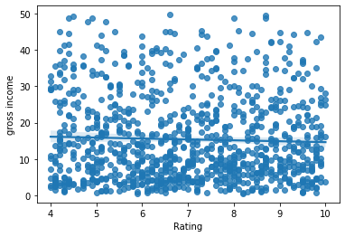
    


*As you can see from the scatter plot and the trend line which is pretty flat that there is no relationship between gross income of a customer and his rating.*

## Question 5: 
*Which branch is the most profitable?*


```python
sns.boxplot(x=df['Branch'], y=df['gross income'])
plt.savefig("uni5.png")
```


    

    


*There is not much difference in gross income by branches at an average level. Branch C has a slightly higher income than A or B, As observed earlier, though branch A has slightly higher sales than the rest C is the most profitable branch in terms of gross income.*

## Question 6 
*What is the relationship between Gender and Gross income?*


```python
sns.boxplot(x=df['Gender'], y=df['gross income'])
plt.savefig("uni6.png")
```


    
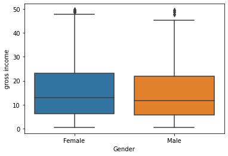
    


*Gross income is similar for both male and female, though female customers spend a bit higher at the 75th percentile.*

## Question 7
*Is there any time trend in gross income?*


```python
df.groupby(df.index).mean()
sns.lineplot(x= df.groupby(df.index).mean().index, 
             y = df.groupby(df.index).mean()['gross income'])
plt.savefig("uni7.png")
```


    
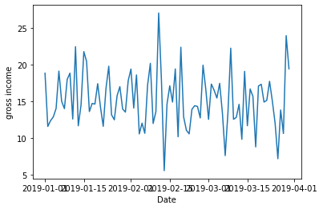
    


*No particular time trend except for some days the gross income is pretty high and some days it is pretty low. Overall it remains at a certain average level.*

## Question 8
*Which product line generates most income?*


```python
cat=df[["Product line", "gross income"]].groupby(['Product line'], as_index=False).sum().sort_values(by='gross income', ascending=False)
plt.figure(figsize=(20,8))
sns.barplot(x='Product line', y='gross income', data=cat)
plt.savefig("uni8.png")
```


    
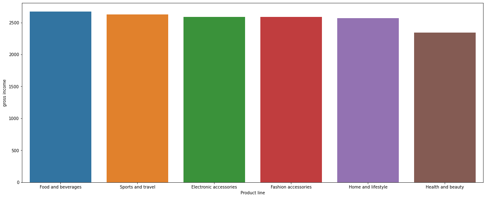
    


*Gross income is highest in sports and travel.*

# Correlation analysis
## Individual correlations


```python
round(np.corrcoef(df['gross income'], df['Rating'])[1][0],2)
```


    -0.04


## Pairwise correlations


```python
np.round(df.corr(),2)
```


<div>
<style scoped>
    .dataframe tbody tr th:only-of-type {
        vertical-align: middle;
    }

    .dataframe tbody tr th {
        vertical-align: top;
    }

    .dataframe thead th {
        text-align: right;
    }
</style>
<table border="1" class="dataframe">
  <thead>
    <tr style="text-align: right;">
      <th></th>
      <th>Unit price</th>
      <th>Quantity</th>
      <th>Tax 5%</th>
      <th>Total</th>
      <th>cogs</th>
      <th>gross margin percentage</th>
      <th>gross income</th>
      <th>Rating</th>
    </tr>
  </thead>
  <tbody>
    <tr>
      <th>Unit price</th>
      <td>1.00</td>
      <td>0.01</td>
      <td>0.63</td>
      <td>0.63</td>
      <td>0.63</td>
      <td>NaN</td>
      <td>0.63</td>
      <td>-0.01</td>
    </tr>
    <tr>
      <th>Quantity</th>
      <td>0.01</td>
      <td>1.00</td>
      <td>0.71</td>
      <td>0.71</td>
      <td>0.71</td>
      <td>NaN</td>
      <td>0.71</td>
      <td>-0.02</td>
    </tr>
    <tr>
      <th>Tax 5%</th>
      <td>0.63</td>
      <td>0.71</td>
      <td>1.00</td>
      <td>1.00</td>
      <td>1.00</td>
      <td>NaN</td>
      <td>1.00</td>
      <td>-0.04</td>
    </tr>
    <tr>
      <th>Total</th>
      <td>0.63</td>
      <td>0.71</td>
      <td>1.00</td>
      <td>1.00</td>
      <td>1.00</td>
      <td>NaN</td>
      <td>1.00</td>
      <td>-0.04</td>
    </tr>
    <tr>
      <th>cogs</th>
      <td>0.63</td>
      <td>0.71</td>
      <td>1.00</td>
      <td>1.00</td>
      <td>1.00</td>
      <td>NaN</td>
      <td>1.00</td>
      <td>-0.04</td>
    </tr>
    <tr>
      <th>gross margin percentage</th>
      <td>NaN</td>
      <td>NaN</td>
      <td>NaN</td>
      <td>NaN</td>
      <td>NaN</td>
      <td>NaN</td>
      <td>NaN</td>
      <td>NaN</td>
    </tr>
    <tr>
      <th>gross income</th>
      <td>0.63</td>
      <td>0.71</td>
      <td>1.00</td>
      <td>1.00</td>
      <td>1.00</td>
      <td>NaN</td>
      <td>1.00</td>
      <td>-0.04</td>
    </tr>
    <tr>
      <th>Rating</th>
      <td>-0.01</td>
      <td>-0.02</td>
      <td>-0.04</td>
      <td>-0.04</td>
      <td>-0.04</td>
      <td>NaN</td>
      <td>-0.04</td>
      <td>1.00</td>
    </tr>
  </tbody>
</table>
</div>


# Other analysis
## Question 10
*What is the spending patterns of females and males and in which category do they spend a lot?*


```python
plt.figure(figsize=(12, 6))
plt.title('Total Monthly transaction by Gender')
sns.countplot(x=df['Product line'], hue = df.Gender)
plt.savefig("uni10.png")
```


    
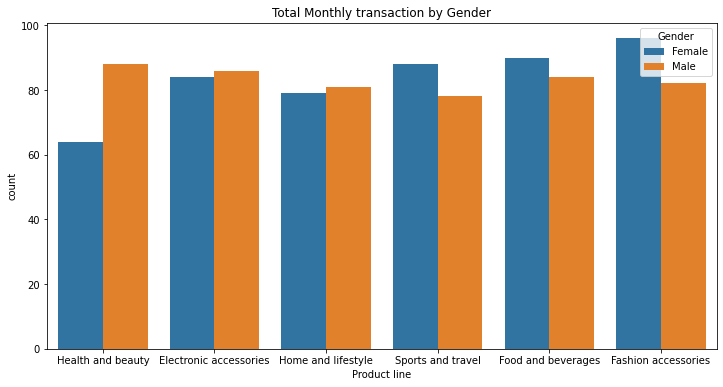
    


*Females spend on 'fashion accessories' the most and for males surprisingly it is 'Health and beauty'. Females also spend more on 'Sports and travel'.*

# Dummy method


```python
gender_dummies  = pd.get_dummies(df['Gender'])
gender_dummies.head()
```


<div>
<style scoped>
    .dataframe tbody tr th:only-of-type {
        vertical-align: middle;
    }

    .dataframe tbody tr th {
        vertical-align: top;
    }

    .dataframe thead th {
        text-align: right;
    }
</style>
<table border="1" class="dataframe">
  <thead>
    <tr style="text-align: right;">
      <th></th>
      <th>Female</th>
      <th>Male</th>
    </tr>
    <tr>
      <th>Date</th>
      <th></th>
      <th></th>
    </tr>
  </thead>
  <tbody>
    <tr>
      <th>2019-01-05</th>
      <td>1</td>
      <td>0</td>
    </tr>
    <tr>
      <th>2019-03-08</th>
      <td>1</td>
      <td>0</td>
    </tr>
    <tr>
      <th>2019-03-03</th>
      <td>0</td>
      <td>1</td>
    </tr>
    <tr>
      <th>2019-01-27</th>
      <td>0</td>
      <td>1</td>
    </tr>
    <tr>
      <th>2019-02-08</th>
      <td>0</td>
      <td>1</td>
    </tr>
  </tbody>
</table>
</div>


Join the Gender dummies with the original data


```python
df1 = pd.concat([df, gender_dummies], axis = 1)
df1.head()
```


<div>
<style scoped>
    .dataframe tbody tr th:only-of-type {
        vertical-align: middle;
    }

    .dataframe tbody tr th {
        vertical-align: top;
    }

    .dataframe thead th {
        text-align: right;
    }
</style>
<table border="1" class="dataframe">
  <thead>
    <tr style="text-align: right;">
      <th></th>
      <th>Invoice ID</th>
      <th>Branch</th>
      <th>City</th>
      <th>Customer type</th>
      <th>Gender</th>
      <th>Product line</th>
      <th>Unit price</th>
      <th>Quantity</th>
      <th>Tax 5%</th>
      <th>Total</th>
      <th>Time</th>
      <th>Payment</th>
      <th>cogs</th>
      <th>gross margin percentage</th>
      <th>gross income</th>
      <th>Rating</th>
      <th>weekday</th>
      <th>Female</th>
      <th>Male</th>
    </tr>
    <tr>
      <th>Date</th>
      <th></th>
      <th></th>
      <th></th>
      <th></th>
      <th></th>
      <th></th>
      <th></th>
      <th></th>
      <th></th>
      <th></th>
      <th></th>
      <th></th>
      <th></th>
      <th></th>
      <th></th>
      <th></th>
      <th></th>
      <th></th>
      <th></th>
    </tr>
  </thead>
  <tbody>
    <tr>
      <th>2019-01-05</th>
      <td>750-67-8428</td>
      <td>A</td>
      <td>Yangon</td>
      <td>Member</td>
      <td>Female</td>
      <td>Health and beauty</td>
      <td>74.69</td>
      <td>7</td>
      <td>26.1415</td>
      <td>548.9715</td>
      <td>13:08</td>
      <td>Ewallet</td>
      <td>522.83</td>
      <td>4.761905</td>
      <td>26.1415</td>
      <td>9.1</td>
      <td>Saturday</td>
      <td>1</td>
      <td>0</td>
    </tr>
    <tr>
      <th>2019-03-08</th>
      <td>226-31-3081</td>
      <td>C</td>
      <td>Naypyitaw</td>
      <td>Normal</td>
      <td>Female</td>
      <td>Electronic accessories</td>
      <td>15.28</td>
      <td>5</td>
      <td>3.8200</td>
      <td>80.2200</td>
      <td>10:29</td>
      <td>Cash</td>
      <td>76.40</td>
      <td>4.761905</td>
      <td>3.8200</td>
      <td>9.6</td>
      <td>Friday</td>
      <td>1</td>
      <td>0</td>
    </tr>
    <tr>
      <th>2019-03-03</th>
      <td>631-41-3108</td>
      <td>A</td>
      <td>Yangon</td>
      <td>Normal</td>
      <td>Male</td>
      <td>Home and lifestyle</td>
      <td>46.33</td>
      <td>7</td>
      <td>16.2155</td>
      <td>340.5255</td>
      <td>13:23</td>
      <td>Credit card</td>
      <td>324.31</td>
      <td>4.761905</td>
      <td>16.2155</td>
      <td>7.4</td>
      <td>Sunday</td>
      <td>0</td>
      <td>1</td>
    </tr>
    <tr>
      <th>2019-01-27</th>
      <td>123-19-1176</td>
      <td>A</td>
      <td>Yangon</td>
      <td>Member</td>
      <td>Male</td>
      <td>Health and beauty</td>
      <td>58.22</td>
      <td>8</td>
      <td>23.2880</td>
      <td>489.0480</td>
      <td>20:33</td>
      <td>Ewallet</td>
      <td>465.76</td>
      <td>4.761905</td>
      <td>23.2880</td>
      <td>8.4</td>
      <td>Sunday</td>
      <td>0</td>
      <td>1</td>
    </tr>
    <tr>
      <th>2019-02-08</th>
      <td>373-73-7910</td>
      <td>A</td>
      <td>Yangon</td>
      <td>Normal</td>
      <td>Male</td>
      <td>Sports and travel</td>
      <td>86.31</td>
      <td>7</td>
      <td>30.2085</td>
      <td>634.3785</td>
      <td>10:37</td>
      <td>Ewallet</td>
      <td>604.17</td>
      <td>4.761905</td>
      <td>30.2085</td>
      <td>5.3</td>
      <td>Friday</td>
      <td>0</td>
      <td>1</td>
    </tr>
  </tbody>
</table>
</div>


## Spending pattern of Female


```python
plt.figure(figsize = (12,6))
sns.barplot(x = 'Product line', y = 'Female', data = df1)
plt.title('Female')
plt.savefig("uni13.png")
```


    
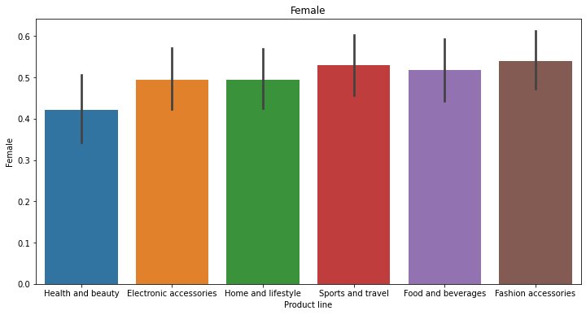
    


## Spending pattern of Female


```python
plt.figure(figsize = (12,6))
sns.barplot(x = 'Product line', y = 'Male', data = df1)
plt.title('Male')
plt.savefig("uni13.png")
```


    
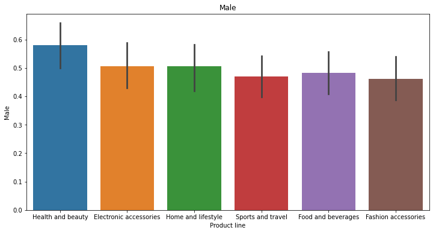
    


## Question 10
*How many products are bought by customers?*


```python
xdata = [1,2,3,4,5,6,7,8,9,10]
plt.figure(figsize = (12,6))
sns.histplot(df['Quantity'], kde=True)
plt.xticks(xdata)
plt.savefig("uni14.png")
```


    
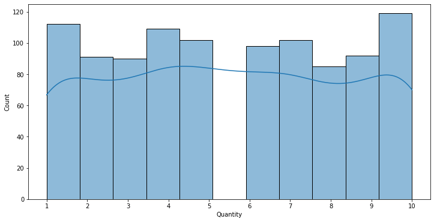
    


## Question 11
*Which day of the week has maximum sales?*


```python
plt.figure(figsize=(8, 6))
plt.title('Daily Sales by Day of the Week')
sns.countplot(x=df['weekday'])
plt.savefig("uni15.png")
```


    
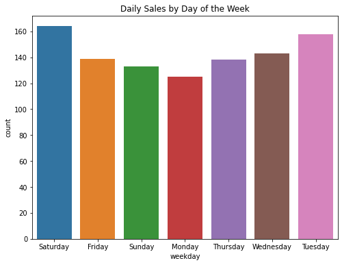
    


Sales is highest on Saturdays probably because it is the weekend. 

Tuesdays is a close second. Mondays is the lowest in sales.

## Question 12 
*Which hour of the day is the busiest?*


```python
df['Time'] = pd.to_datetime(df['Time'])
df['Hour'] = (df['Time']).dt.hour

df.groupby(['Hour']).size().plot(kind = "bar")
```


    <AxesSubplot:xlabel='Hour'>


    
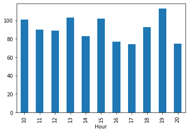
    


## Question 13
*Which product line should the supermarket focus on?*

### Rating of products


```python
xdata = [0,1,2,3,4,5,6,7,8,9,10]
plt.figure(figsize = (12,6))
sns.barplot(y = df['Product line'], x = df['Rating'])
plt.xticks(xdata)
```


    ([<matplotlib.axis.XTick at 0x1c126df9bd0>,
      <matplotlib.axis.XTick at 0x1c126df9ba0>,
      <matplotlib.axis.XTick at 0x1c1260bea40>,
      <matplotlib.axis.XTick at 0x1c126df8d30>,
      <matplotlib.axis.XTick at 0x1c126106bf0>,
      <matplotlib.axis.XTick at 0x1c126e19a20>,
      <matplotlib.axis.XTick at 0x1c126e1ada0>,
      <matplotlib.axis.XTick at 0x1c126e1b4f0>,
      <matplotlib.axis.XTick at 0x1c126e1bc40>,
      <matplotlib.axis.XTick at 0x1c126e283d0>,
      <matplotlib.axis.XTick at 0x1c126e28b20>],
     [Text(0, 0, ''),
      Text(0, 0, ''),
      Text(0, 0, ''),
      Text(0, 0, ''),
      Text(0, 0, ''),
      Text(0, 0, ''),
      Text(0, 0, ''),
      Text(0, 0, ''),
      Text(0, 0, ''),
      Text(0, 0, ''),
      Text(0, 0, '')])


    

    


### Quantity purchased by product


```python
sns.boxenplot(y='Product line', x='Quantity', data=df )
```


    <AxesSubplot:xlabel='Quantity', ylabel='Product line'>


    
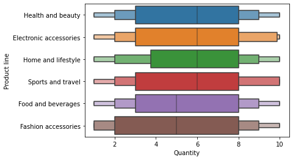
    


Though the rating for 'fashion accessories' and 'food and beverages' is high but quantity purchased is low. Hence, supply for these products need to be increased.

# Question 14
*Which city should be chosen for expansion and which products should it focus on?*


```python
plt.figure(figsize=(20,7))
sns.barplot(x=df['City'], y=df['gross income'], palette='Set1')
plt.xlabel('City name', fontsize='16')
plt.xticks(fontsize='16')
plt.ylabel('Gross income', fontsize='16')
plt.yticks(fontsize='16')
```


    (array([ 0. ,  2.5,  5. ,  7.5, 10. , 12.5, 15. , 17.5, 20. ]),
     [Text(0, 0, ''),
      Text(0, 0, ''),
      Text(0, 0, ''),
      Text(0, 0, ''),
      Text(0, 0, ''),
      Text(0, 0, ''),
      Text(0, 0, ''),
      Text(0, 0, ''),
      Text(0, 0, '')])


    
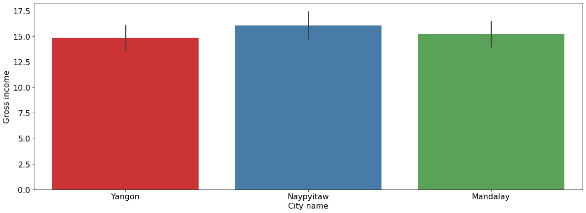
    


Naypyitaw is the most profitable city, hence the expansion plan should be based on this city.


```python
plt.figure(dpi=125)
sns.countplot(y='Product line', hue = "City", data = df) 
plt.xlabel('Count')
plt.show()
```


    
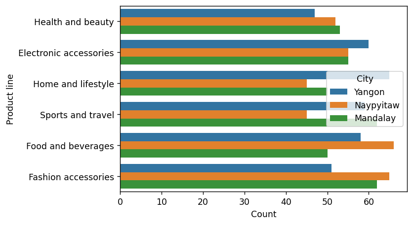
    


Fashion accessories and food and beverages are the most sold product in Naypyitaw and these products should be focused on for expansion along with electronic accessories.
