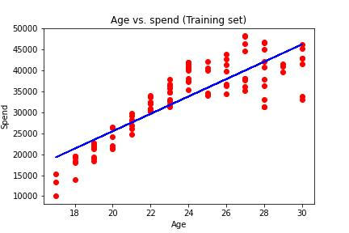

# Webshop - Assignment
Purchases distributed on the different age groups, from a webshop

## Data
Data are in a Excel file: spend_age.xlsx

[Download - spend_age.xlsx](./spend_age.xlsx)


## Tasks
It is your task to make the following:

### Spend pr. group
You have to create a "Table" with the mean spend pr. Age group.

Group by:

```python
group_age_spend = df[['Age', 'Spend']].groupby(['Age'], as_index=False).mean().sort_values(by='Age')
group_age_spend
```


### Linear regression


