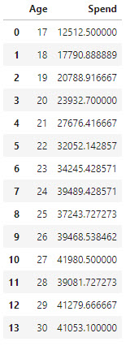
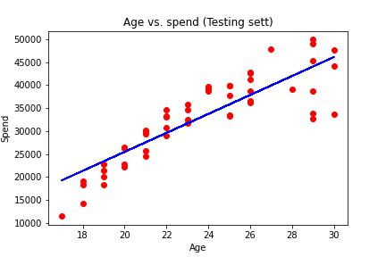

[HOME](./README.md)

# Exploratory data analysis
In statistics, **Exploratory Data Analysis** (*EDA*) is an approach of analyzing data sets to summarize their main characteristics, often using statistical graphics and other data visualization methods.

A statistical model can be used or not, but primarily EDA is for seeing what the data can tell us beyond the formal modeling and thereby contrasts traditional hypothesis testing.

EDA will give you the basic understanding of your data, it's distribution, null values and much more. You can either explore data using graphs or through some Python functions.

# Example Supermarket sales
We are using a data set from [www.kaggle.com](https://www.kaggle.com/datasets/aungpyaeap/supermarket-sales) with historical record of sales data in 3 different supermarkets.

The dataset consists of data from 3 cities or 3 branches in Myanmar:
- Branch A (*Yangoon*)
- Branch B (*Mandalay*)
- Branch C (*Naypyitaw*)

- [Supermarket](./data/eda_supermarket.md)
- [Jupyter Lab file](./data/eda_supermarket.ipynb)

# # Webshop - Assignment
Purchases distributed on the different age groups, from a webshop

## Data
Data are in a Excel file: spend_age.xlsx

[Download - spend_age.xlsx](../06-Machine_Learning_1/data/linear/spend_age.xlsx)


## Tasks
It is your task to make the following:

### Spend pr. group
You have to create a "Table" with the mean spend pr. Age group.

Group by:

```python
group_age_spend = df[['Age', 'Spend']].groupby(['Age'], as_index=False).mean().sort_values(by='Age')
group_age_spend
```




### Linear regression


