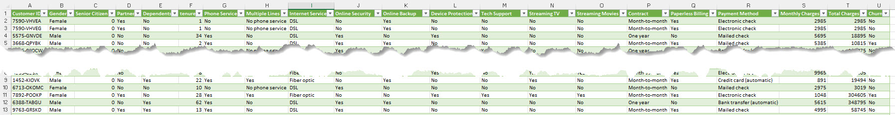

[Home](../modul-4-2.md)
# AI - (Deep Learning)
    - 17-05-2021 - Tirsdag - DK
    - 18-05-2021 - Onsdag - INT

# TensorFlow
TensorFlow is an end-to-end open source platform for machine learning. It has a comprehensive, flexible ecosystem of tools, libraries and community resources that lets researchers push the state-of-the-art in ML and developers easily build and deploy ML powered applications.

# Video fra TensorFlow
## Intro to Machine Learning
<iframe width="560" height="315" src="https://www.youtube.com/embed/KNAWp2S3w94" title="YouTube video player" frameborder="0" allow="accelerometer; autoplay; clipboard-write; encrypted-media; gyroscope; picture-in-picture" allowfullscreen></iframe>

## TensorFlow 2.0 and Keras
<iframe width="560" height="315" src="https://www.youtube.com/embed/wGI_VtE9CJM" title="YouTube video player" frameborder="0" allow="accelerometer; autoplay; clipboard-write; encrypted-media; gyroscope; picture-in-picture" allowfullscreen></iframe>

----

# Simpel Demo
Consider the following sets of **numbers**. **Can you see the relationship between them?**

| X: | -1 | 0 | 1 | 2 | 3  | 4  |
|----|----|---|---|---|----|----|
| Y: | -2 | 1 | 4 | 7 | 10 | 13 |

As you look at them, you might notice that the value of **X** is **increasing** by **1** as you read left to right and the corresponding value of **Y** is **increasing** by **3**.

You probably think that Y equals 3X plus or minus something. 

Look at the **0** on **X** and see that **Y** is **1**, and you'd come up with the relationship

**Y=3X+1**

*How would you train a neural network to do the equivalent task?*

*By feeding it with a set of X's and a set of Y's, it should be able to figure out the relationship between them.*

## Jupyter Lab file
[Simpel_ML.ipynb](./code/Simpel_ML.ipynb)

----

# Predict Churn

## Customer base churn
Churn rate, when applied to a customer base, refers to the proportion of contractual customers or subscribers who leave a supplier during a given time period.

It is a possible indicator of customer dissatisfaction, cheaper and/or better offers from the competition, more successful sales and/or marketing by the competition, or reasons having to do with the customer life cycle.

## Steps
1. Build a simple Tensorflow model to predict Churn
2. Training the model and make predictions on test data with Pandas
3. Save your model to disc and reload it to a Jupyter Notebook for reuse

## Data

Use the data [Churn.csv](./code/Churn.csv)

## Video
<iframe width="560" height="315" src="https://www.youtube.com/embed/6_2hzRopPbQ" title="YouTube video player" frameborder="0" allow="accelerometer; autoplay; clipboard-write; encrypted-media; gyroscope; picture-in-picture" allowfullscreen></iframe>

## Jupyter Lab file
Get the Jupyter Lab file her - [TensorflowDemo.ipynb](./code/TensorflowDemo.ipynb)

----

# Detect Images from Zalando
This guide trains a neural network model to classify images of clothing, like sneakers and shirts. It's okay if you don't understand all the details; this is a fast-paced overview of a complete TensorFlow program with the details explained as you go.

Example from TensorFlow - [www.tensorflow.org/tutorials/keras/classification](https://www.tensorflow.org/tutorials/keras/classification)

## Data
Fashion-MNIST is a dataset of Zalando's article images—consisting of a training set of 60,000 examples and a test set of 10,000 examples.
Each example is a 28x28 grayscale image, associated with a label from 10 classes.

## JupyterLab file
[classification.ipynb](./code/classification.ipynb)

----

# Data Center - Cause analysis of problems
 The use case to solve relates to root cause analysis of problems found in a data center. 
 
 We have a data center that runs a number of software services. Service failures do happen from time to time, and the data center team needs to quickly troubleshoot and identify the root cause. 
 
 The team wants to build a model that can predict root causes reported by customers based on the telemetry generated and errors noticed. 
 
 They already have a system monitoring tool that tracks CPU, memory, and application latency characteristics of their servers. 
 
 In addition, they also track errors reported by their applications. Can we use this information to predict root causes of the issues noticed? 
 
 **The problem statement is as follows**: using data about *CPU loads, memory load, network delays, and three types of errors observed*, build a deep learning model to predict the root cause of the error. 
 
 A data set is available that has one record for each of these incident, indicating if any of the load issues or errors were noticed when the problem happened. 
 The data set is available in the **root_cause_analysis.csv** file. 
 
 Each record in the file has a unique identifier ID that represents the incident. There are seven feature variables:
 
- CPU_LOAD
- MEMORY_LEAK_LOAD
- network DELAY
- ERROR_1000
- ERROR_1001
- ERROR_1002
- ERROR_1003

Each of them is a Boolean value of 1 or 0. The target variable is ROOT_CAUSE. 

It has three possible values:

- MEMORY_LEAK
- NETWORK_DELAY
- DATABASE_ISSUE

We want to build a model to **predict the root cause** based on the other values provided.