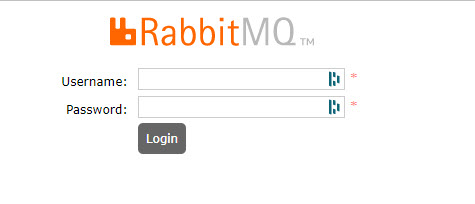
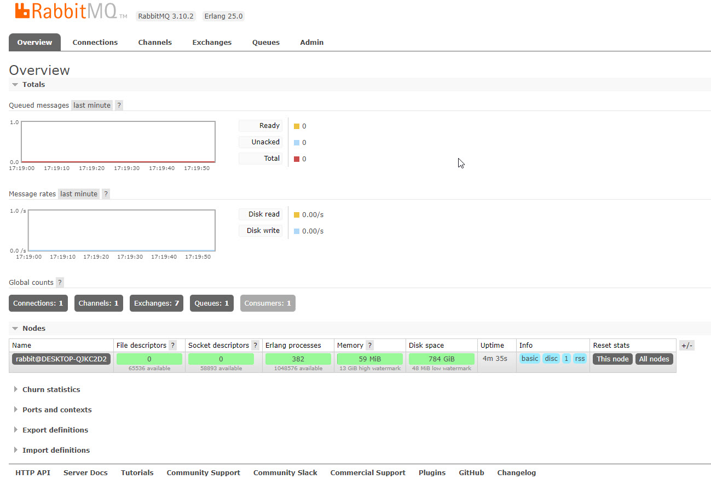
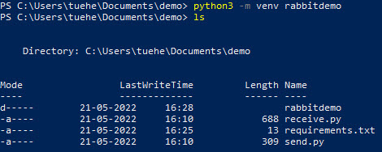
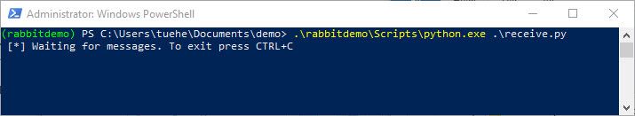
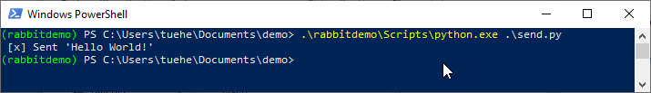
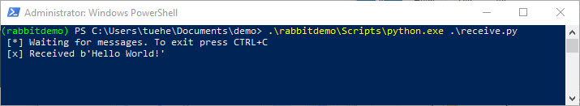

# RabbitMQ
Think of a message broker (*RabbitMQ*) like a delivery person who takes mail from a sender and delivers it to the correct destination. 

In a microservice architecture, there typically are cross-dependencies that mean no single service can perform without getting help from other services. 

This is where it is crucial for systems to have a mechanism in place, allowing services to keep in touch with each other with no blocked responses. 

Message queuing fulfils this purpose by providing a means for services to push messages to a queue asynchronously and ensure they are delivered to the correct destination. 

To implement message queuing, a message broker is required - RabbitMQ

RabbitMQ is the most widely deployed open source message broker - [RabbitMQ](https://www.rabbitmq.com)

*You can think about it as a post office: when you put the mail that you want posting in a post box, you can be sure that the letter carrier will eventually deliver the mail to your recipient.*

*In this analogy, RabbitMQ is a post box, a post office, and a letter carrier.*

## Install RabbitMQ
You need to install RabbitMQ. Installations guides:

- [Windows](https://www.rabbitmq.com/install-windows.html) on Windows you have to install before RabbitMQ [Erlang](https://www.erlang.org/downloads) also. The Windows installer takes you to the download page automatically. 
- [Mac](https://www.rabbitmq.com/install-homebrew.html)

## Install the RabbitMQ Management Plugin
By default, the RabbitMQ Windows installer registers RabbitMQ as a Windows service, so technically we’re all ready to go. 

In addition to the command line utilities provided for managing and monitoring our RabbitMQ instance, a Web-based management plugin is also provided with the standard Windows distribution.

The following steps detail how to get the management plugin up and going.

First, from an elevated command prompt, change directory to the sbin folder within the RabbitMQ Server installation directory (*e.g. %PROGRAMFILES%\RabbitMQ Server\rabbitmq_server-3.10.2\sbin*).

Next, run the following command to enable the rabbitmq management plugin:

    .\rabbitmq-plugins.bat enable rabbitmq_management 

Lastly, to enable the management plugin we need to reinstall the RabbitMQ service. Execute the following sequence of commands to reinstall the service, **you have to do this as administrator**:

    rabbitmq-service.bat stop 
    rabbitmq-service.bat install 
    rabbitmq-service.bat start 

To verify management plugin is up and running, start your browser and navigate to: 

    http://localhost:15672/

If everything went ok, you should see a screen similar to the following:



Default login is:

- User: *guest* 
- Password: *guest*




## RabbitMQ and Python
For use of RabbitMQ in Python you need a client library, we are using [Pika](https://pypi.org/project/pika/)

You install Pika as any other Python module

    pip3 install pika


## Example  - Simpel Hello World
Write two small programs in Python:

- Producer (sender) that sends a single message
- Consumer (receiver) that receives messages and prints them out 

*It's a "Hello World" of messaging.*

In the diagram below, "**P**" is our producer and "**C**" is our consumer. The box in the middle is a queue - a message buffer that RabbitMQ keeps on behalf of the consumer.


Producer sends messages to the "*hello*" queue. The consumer receives messages from that queue.

### Virtuel Environment
Create a **requirements.txt** file containing:

- pika
- sys
- os

Create a Virtuel Environment for the RabbitMQ demo

    python3 -m venv rabbitdemo



Activate the virtual environment
- macOS - source env/bin/activate
- Windows - .\Scripts\activate


### Sending - send.py
The **send.py** program send.py will send a single message to the queue *hello*


```Python
import pika

connection = pika.BlockingConnection(
    pika.ConnectionParameters(host='localhost'))
channel = connection.channel()

channel.queue_declare(queue='hello')

channel.basic_publish(exchange='', routing_key='hello', body='Hello KEA!')
print(" [x] Sent 'Hello KEA!'")
connection.close()
```

Download [send.py](./code/demorabbitmq/send.py)

### Receiving
Your second program **receive.py** will receive messages from the queue and print them on the screen.


```Python
import pika, sys, os

def main():
    connection = pika.BlockingConnection(pika.ConnectionParameters(host='localhost'))
    channel = connection.channel()

    channel.queue_declare(queue='hello')

    def callback(ch, method, properties, body):
        print(" [x] Received %r" % body)

    channel.basic_consume(queue='hello', on_message_callback=callback, auto_ack=True)

    print(' [*] Waiting for messages. To exit press CTRL+C')
    channel.start_consuming()

if __name__ == '__main__':
    try:
        main()
    except KeyboardInterrupt:
        print('Interrupted')
        try:
            sys.exit(0)
        except SystemExit:
            os._exit(0)
```

Download [receive.py](./code/demorabbitmq/receive.py)
### Try out the programs in a terminal.
**First**, start a consumer (**receive.py**), which will run continuously waiting for deliveries:

    .\rabbitdemo\Scripts\python.exe .\receive.py



Second, start the producer (**send.py**). The producer program will stop after every run:

    .\rabbitdemo\Scripts\python.exe .\send.py



You were able to send our first message through RabbitMQ. 



As you might have noticed, the **receive.py** program doesn't exit. It will stay ready to receive further messages, and may be interrupted with **Ctrl-C**.


## RabbitMQ PDF
You can get an good introduction of RabbitMQ in this PDF - [Getting_Started_with_RabbitMQ_and_CloudAMQP.pdf](Getting_Started_with_RabbitMQ_and_CloudAMQP.pdf) from [CloudAMQO](https://www.cloudamqp.com)


