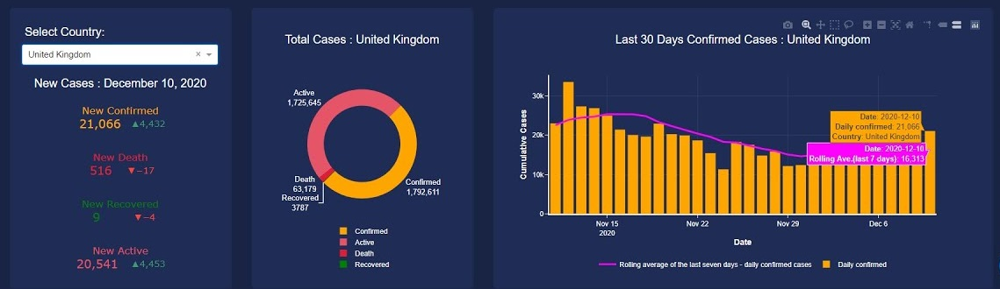

[Home](../modul-4-2.md)

# Delivery 1
First delivery in module 4.2. 2022

- [Dashboard](#dashboard)
- [Azure](#azure)
- [Hand in](#hand-in)
- [Data - Excel](#data---excel)

# Dashboard
You have to create a Python dashboard with **Dash**.

It should include 2 graphs:

- Sales by employee
- Sales by products

The type of the graphs and the general design of the dashboard is entirely up to you. You have to use the data from the Excel file - [my_shop_data.xlsx](./data/my_shop_data.xlsx)

# Azure
Your dashboard solution must be uploaded to Azure App Service.

From her you get a public url for the dashboard.

# Hand in
Submission of your assignment must be done on **Fronter monday the 28-03-2022**.

The hand in is personal, it is **not a group** assignment. You are allowed to work on the solution in groups, but each of you has to hand in a unique Azure url.

The submissions on Fronter, has to be a **PDF** file with:

- Azure URL to the dashboard
- Python code from the main Python file
- Code/Content of other files, *if applicable*
- Screen dump, showing the dashboard

# Data - Excel
The data are located in the Excel file: [my_shop_data.xlsx](./data/my_shop_data.xlsx)

There are 4 sheets in the Excel file:

- *customers*
- *order*
- *employee*
- *products*

You have to "*combine*" the different sheet to get the solution.
