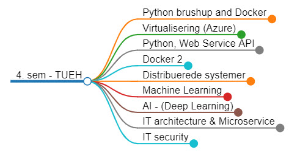

[Home](../README.md)
# Module 4.2

## Introduction

### Slides
- [html](./introduction.html)
- [pdf](./introduction.pdf)

# Teaching Sessions

- [Python brushup, Docker and Azure](./01-Python-brushup_and_Docker_1/README.md)
    - 04-10-2022 - Tirsdag
- [Virtualisering (Azure)](./02-Virtualisering/README.md)
    - 07-10-2022 - Fredag - DK
- [Python, Web Service API](./03-Python_WebService_API/README.md)
    - 13-10-2022 - Torsdag
- [Docker](./04-Docker_2/README.md)
    - 24-10-2022 - Mandag
- [Distribuerede systemer](./05-Distribuerede_systemer/README.md)
    - 01-10-2022 - Tirsdag
- [Power BI](./06-Power_BI/README.md)
    - 01-10-2022 - Fredag
- [Machine Learning 1](./08-Machine_Learning_1/README.md)
    - 08-10-2022 - Tirsdag
- [Machine Learning 2](./08-Machine_Learning_2/README.md)
    - 11-10-2022 - Fredag
- [Power BI](./06-Power_BI/README.md)
    - 14-10-2022 - Mandag
- [Programming](./20-Programing/README.md)
    - 22-10-2022 - Tirsdag
- [AI - (Deep Learning)](./09-AI_DeepLearning/README.md)
    - 25-10-2022 - Fredag
- [IT architecture & Microservice](./10-IT_architecture_Microservice/README.md)
    - 29-10-2022 - Tirsdag
- [IT security](./11-IT_security/README.md)
    - 09-12-2022 - Fredag
- [Delivery 1 - ??](./12-Delivery/Delivery_1.md)
