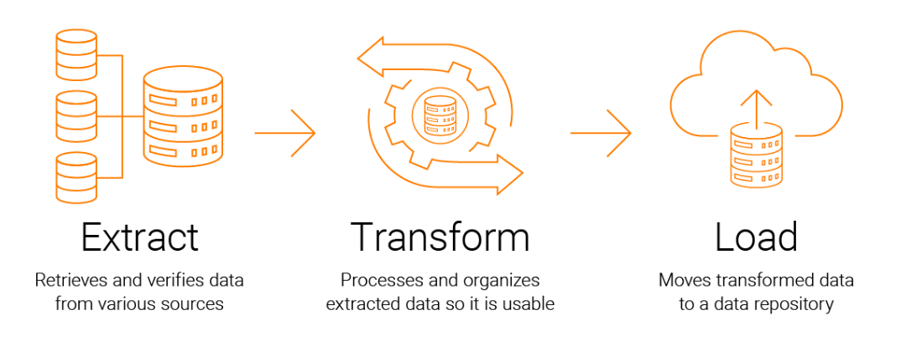

<!-- _backgroundColor: black -->
<!-- _color: white -->
# ETL <!-- fit -->
# Extract - Transform - Load <!-- fit -->

---

<!-- _backgroundColor: black -->
<!-- _color: white -->
# Data sources <!-- fit -->

## Can you name some data sources? <!-- fit -->

---

---

# Why ETL?

- Analyze business data for taking critical business decisions
- Transactional databases cannot answer complex business questions
- Provides a method of moving the data from various sources into a data warehouse
- Allow verification of data transformation, aggregation and calculations rules
- ETL process can perform complex transformations
- ETL helps to Migrate data into a Data Warehouse

---

<!-- _backgroundColor: black -->
<!-- _color: white -->
# Tools <!-- fit -->

## Can you name some ETL tools? <!-- fit -->

---

# Tools

- Excel (*Windows version*)
    - Get and transform
    - Power Query Editor (*DAX*)
    - VBA
    - Office Script
- Python
- MySQL
- Microsoft Power Platform
    - Power BI (*Desktop*)
    - Power Apps
    - Power Automate
    - Power Virtual Agents