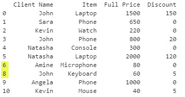
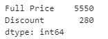

# Automate MS Excel data processing using Python, Pandas, and Openpyxl

## Files

**Excel**
- [sales_data.xlsx](./jupyterlab/sales_data.xlsx)

**Jupyter Lab**
- [Real_world_example.ipynb](../etl/jupyterlab/Real_world_example.ipynb)
- [demo.ipynb](../etl/jupyterlab/demo.ipynb)
- [openpyxl-chart-notebook.ipynb](../etl/jupyterlab/openpyxl-chart-notebook.ipynb)
- [openpyxl-tutorial.ipynb](../etl/jupyterlab/openpyxl-tutorial.ipynb)

## Introduction 
This is all about automating Microsoft Excel using python and two different libraries. 

The first library is **Pandas**. This library is used to process dataframes at high speed. **Pandas** is used all over the world of data analysis, data science, and data engineering. A basic workflow is **Pandas** is to load and excel file into a dataframe, apply all sorts of complex processing wit few lines of code, then save the results into Excel. 

The second library we will be using is **Openpyxl**. This library provides a more familiar automation of excel. Meaning it all us to replicate the exact steps we would use manually in excel using few lines of python code, and with that, automating those steps. **Openpyxl** provides all sorts of supported excel options, from charts, to formulas, to styling…etc. 

# WORKING WITH PANDAS 

## Introduction  
We live in the age of automation where more and more tasks are getting automated by algorithms, so that we can focus more on our core work and not waste valuable time on second degree tasks. 

In this beginner’s friendly post, we will explore how to automate certain Excel tasks related to data processing using the Python programming language and the famous Pandas library. 

This article is a tutorial-based walkthrough where we explain concepts and share code snippets of each step of the process to facilitate for beginners to grasp concepts better. 

## Why Automating Excel
Like we mentioned in the introduction, automation is everywhere and Excel is one of the places where it’s visible in corporations and enterprises. A good example would be that a Data Analyst would do more analyzing work if he/she can automate some tasks and not waste working hours on them. 

Another good reason is that Excel is very popular and used everywhere, meaning that learning how to automate its workflows is a great investment for you and for the company you are working for. 

## Why using Python 
At this point of time in the world of programming, the real question is, why not use Python? 

Python is extremely popular nowadays and it’s used in almost every computer science branch. 

The popularity of Python is due to many factors like the ease of use, the numerous open-source packages it has, and the ever-growing community that is supporting it. 

One of the domains where Python really shines is Automation, and in this article, we will demonstrate how we can use it to automate Excel data processing. 

## Why using Pandas 
Pandas is one of the most used python libraries, especially in the world of data science, data analysis, data engineering, and machine learning. It uses the concepts of dataframes where it reads and then loads data in memory in the format of tabular data. Meaning rows and columns, similar to a database table. 

Dataframes allow us to handle data easily as well as apply complex processing to the data with few lines of code. 

You can think of a Pandas’ dataframe like an Excel spreadsheet on steroids. They may look the same, but a dataframe is more powerful. 

## Installing Python
If you have a new computer or *something is gone wrong* with Python.

To install python, head out to the official website [www.python.org/downloads](https://www.python.org/downloads) and download the specific version for your computer, then install it like any other software. 

## Installing Pandas 
Once python is installed in your machine, we use the pip command to install Python packages. 

To install Pandas, open the terminal or the command prompt, and type the following:

    pip install pandas

then hit enter. 

## Best way to apply the automation
The best way to apply Excel automation is if we have some kind of a report that we always make using some fixed-structure data. If the structure of data does not change, which is the case for reports, we simply automate the steps we usually do in Excel (loading the data, calculation, aggregations, deleting certain rows, … finally, saving the file).

## Getting Started
Now that we have Python and Pandas installed on our local machine, we can start the work.

For this example, we will use the Jupyter Notebook as our text editor. Of course, you can choose any other text editor like VSCode.  

The first thing when using the Pandas library with python, is to import it using the following code:

```python
import pandas as pd
```
Reading Excel and CSV files using pandas 

The data that we will be working with is this:
 


The first step is always to read the file where the data is located, so that we can extract it, process it, and then save it in an Excel friendly format. 

In this example we read data from either an Excel (xlsx) or CSV file. Since those are the two most used formats in Excel. 

To read data from CSV we use the **read_csv** method and give it the path of our csv file as follows: 

```python
df = pd.read_csv(path)
```

To read data from Excel we use the **read_excel** method and give it the path of our csv file as follows: 

```python
df = pd.read_excel(path)
```

To visualize our dataframe we can print it out using **print(df)**. That way we can have an idea about our data, and to confirm that we had no errors when we imported the data. 

Or use **print(df.head())** to print the first 5 records (*rows*) of the dataframe. 

## Working with columns in pandas 

Pandas gives us the possibility to apply all sorts of operations on columns same as Excel does. From slicing, to copying, to applying mathematical calculations, to creating new columns, we can automate it all using Python and Pandas. 

Here are some examples to help you get started:

To get the name of the columns from a pandas dataframe:

```python
list(df.columns)
```

To get how many rows and columns we have:

```python
df.shape
```
 
We can see that we have 11 rows and 5 columns 

To get the values of a single column from the data we use the following code:

```python
column = df['column name']
```

That’s possible since we can get separate columns as follows:


To create a dataframe out of the previous one or just assign a column to another one in pandas we use the following syntax

```python
df['column 2'] = df['column 1']
```

Basically, in the above example we created a new column named "column 2" which is a copy of the previously existing "column 1".

Creating a dataframe from two previous columns:

```python
df2 = df[['Client Name' ,'Item']]
```
 

To delete a column, we use the following syntax:

```python
df.drop('column_name', axis=1, inplace=True)
```



**Note** that **axis=1** refers to the **columns**, and **axis=0** refers to the **rows**. We set **inplace=True** so that we don’t need to assign the dataframe, meaning the changes will saved directly. 

## Working with rows in pandas 

Same as with columns, we have a lot of functions in Pandas that allow us to apply all sorts of handling and calculations directly to the rows of our dataframe. 

To retrieve a row in Pandas we use the loc method:

```python
First_row = df.loc['row_cell_value']
```


 
Notice how the row gets printed in Jupyter. That’s one of the advantages of using it. 

Same as with columns, to delete a row in pandas we use the **drop** method. The only difference is that we set **axis=0**:

```python
df.drop(7, axis=0, inplace=True)
```


In the above example we deleted row 7 and you can notice that if you check rows’ indexes on the far left, we have all values from 0 to 10, except for 7. 

We can also delete multiple rows at by passing the indexes of the rows we wish to delete as a list:

```python
df.drop([2,3,6], axis=0, inplace=True)
```


 
In the above example we deleted rows **2, 3, and 6**. You can verify that that’s true by checking the index column. We have all indexes from 0 to 10 except for 2, 3, and 6. 

We can concatenate two dataframes together using Pandas. The equivalent of that would be concatenating two tables or even two spreadsheets in Excel. 

To concatenate let’s say df1 and df2 into df3, we use the following code:

```python
df3 = pd.concat([df1, df2]).reset_index(drop = True)
```

## Data aggregation – Aggregate Functions

What is an aggregate function? Same as in Excel or SQL, aggregate functions perform a mathematical calculation on a set of values (grouped data) and return a one single value. Basically, when aggregating rows, we get a summary of that row. 

Here are some aggregate functions that are supported by Pandas:

| Function   | Description                                     |
|------------|-------------------------------------------------|
| count()    | Returns count for each group                    |
| size()     | Returns size for each group                     |
| sum()      | Returns total sum for each group                |
| mean()     | Returns mean for each group. Same as average()  |
| average()  | Returns average for each group. Same as mean()  |
| std()      | Returns standard deviation for each group       |
| var()      | Return var for each group                       |
| sem()      | Standard error of the mean of groups            |
| describe() | Returns different statistics                    |


To use an aggregate function in Pandas, we always call the aggregate method, then pass one of the supported functions as a value.

For example, to calculate the sum of the "**Full Price**", and "**Discount**" values, we use the following code: 

```python
results = df[['Full Price', 'Discount']].aggregate('sum')
```



Let’s check a more complex example. To calculate the sum of the "**Full Price**" column, as well as the min and max of the **Discount**" column, we use the following:

```python
results = df.aggregate({'Full Price':'sum','Discount':['min', 'max']})
```        


As we can see from the results, The sum of the "**Full Price** is **6.950**, the **min** and **max** of the **Discount**" are **0, 150** accordingly. 

# Real world example
In this section we will work on a real-world project to visualize the benefits of automating Excel workflows. 

We will use the previously imported data where we have 5 columns which are *Client Name*, *Item*, *Location*, *Full Price*, and *Discount*. 

Let’s say our workflow contains the following steps:
1.	Calculate the Percentages of discounts in a new Column 
2.	Calculate the Final Price after applying the discount in a new column 
3.	Delete all rows where Discount is equal to 0 
4.	Save the results in a new file under the name **final-results.xlsx** 

**We first Import pandas:**

```python
import pandas as pd
```

**Then we read the file:**

```python
df = pd.read_excel('sales_data.xlsx')
```

**We usually print the dataframe to check that everything is okay:**


**Calculating the percentages:**

```python
df['Discount Percentage'] = (df['Discount'] / df['Full Price']) * 100
df['Discount Percentage']= df['Discount Percentage'].map('{:,.2f}'.format)
```python


 
**Calculating the final price:**

```python
df['Final Price'] = df['Full Price'] - df['Discount'] 
```


 
**Deleting Rows where Discount is equal to 0:**

```python
df = df[df['Discount'] > 0]
```


 

**Saving the file:**

```python
df.to_excel('final-results.xlsx', index=False)
```

To save a dataframe to an Excel in pandas we use the **to_excel** function, and we pass it the name of the file. Note that the name of the file has to end with **.xlsx** which is the extension of an Excel workbook. 

We set **index=False**, to tell Pandas to not save the index column which is what we usually want since that column is generated by Pandas. 

Resulted Excel File: 


As you can see on the resulted **final-results.xlsx** Excel workbook, we have got exactly what we needed without opening Excel at all. We automated the whole process using **Python** and the **Pandas library**. 

Now we can take the script and apply it to all our similar structured reports!  

## Conclusion
Python and Pandas are a great combination to automate Excel workflows because they are easy to understand and use. 

Pandas dataframes are more powerful than Excel spreadsheets. In this article, we only scratched the surface on what this library can do to get beginners started. 

Deep dive into Python, Pandas and other libraries to open the full potential of automation!

# WORKING WITH OPENPYXL


## Introduction on openpyxl
**Openpyxl** is an open-source python library used to read and write data from Excel 2010+ xlsx/xlsm files. The library is power and allows us to automate excel file at the cell level. We basically can achieve anything we can manually do in excel using this library and lines of Python code. 


## Getting started 
To get started we need to install the **openpyxl** library by going to the terminal or command prompt and type the following code:

```python
pip install openpyxl 
```

## Working with workbooks 
Now that we have the library installed, we can either use it to load and existing Excel workbook or create an empty one first:

### Load existing workbook

To load an existing excel file we import the load_workbook class, instantiate it by passing the path of the xlsx file as follows:

```python
from openpyxl import load_workbook
wb = load_workbook('sales_data.xlsx')
```

### Create new workbook
To create a new Excel workbook we call the Workbook class from the **openpyxl** library, and instantiate it.

The created workbook will be completely empty and only have one worksheet names Sheet by default. 

*Note that we don’t give a file name right away, but in the end when saving the file.*

```python
from openpyxl import Workbook
wb = Workbook()
```

### Save a workbook
To save a workbook we use the save method which takes the file name as input. **Note** that the file name is a string that must end with **.xlsx** 

Keep in mind that if you save a file under the same name as another file that is located in the same directory, the original file will get overwritten by the new one. 

One more thing to keep in mind is that you **MUST CLOSE THE FILE IN EXCEL** before saving it., otherwise you will get an error and the file won’t be saved. 

```python
wb.save('ExcelFileName.xlsx')
```

### Working with worksheets 
We can get all worksheets present in an Excel workbook. We need to get specific sheets in order to either get data from them or assign data to them. 

**Get active sheet**

To get the active sheet we use the following code: 

```python
ws = wb.active
```

**Get sheet by name **

To get any sheet by its name we use the following: 

```python
ws = wb['Sheet1']
```


**Get all sheets name**

In order to get all the names of the sheets that are present in an excel workbook, we use the following:

```python
wb.sheetnames
```
 

**Create new sheet**

We can also create new sheets using the create_sheet method on the workbook which takes the sheet name as argument: 

```python
wb.create_sheet('NewSheet')
```
 

**Get and set sheet title**

We can get and set current selected sheet titles. 

To get sheet title 

```python
ws.title 
```
 
to set sheet title 

```python
ws.title = 'Sheet2'
```

## Working with Cells, Rows, Columns, and Ranges   
Getting and setting cells values

Using **openpyxl**, we can go as deep as getting and setting data as the cells level, which is the same level of control we have on excel. Not only getting and setting data, but also, we van add style, **Formulas**, and **Charts**. 

To get the value of a specific cell, we use the following syntax:

```python
ws['B4'].value
```

In the above example we use cell **B4**, but we can use any cell. 

To set the value of a certain cell, we use the following code:

```python
ws['B4'] = 'Cup'
ws['B4'].value
```

In the above example we set the string Cup to cell B4.
 
However, setting cells values individually isn’t the best way. We can add entire rows of data at once using the append method, and passing cell values as a list. 

Appending entire rows of data at once 

```python
ws.append(['test1', 'test2', 'test3', 'test4'])
```python

Here’s an example that illustrates what happens when we add entire rows at once:

```python
# Append multiple rows 
ws = wb.active

ws.append(['test1', 'test2', 'test3', 'test4'])
ws.append(['test5', 'test6', 'test3', ])
ws.append(['', 'test7', 'test8'])
ws.append(['test9', '', '', 'test10'])
ws.append(['test11', 'test12', '', 'test13'])

wb.save('test-file.xlsx')
```

*Note that if we pass empty value in the list, we will get empty cells.*

Here’s the resulted file:


 

### Merging and unmerging a range of cells
To merge ranges using this library, same as we do in Excel, we use the **merge_cells** method which takes a range as input: 

```python
ws.merge_cells('A1:D3')
```

*Note that we can lose that if the cells are not empty before merging them.*

To unmerge cells that have been merged before, we use the **unmerge** method and we pass it the desired range:

```python
ws.unmerge_cells('A1:D3')
```

### Inserting empty rows

To insert an entire empty row, we use the **insert_rows** method, and we pass it the position:

```python
ws.insert_rows(3)
```


### Deleting an entire row 
To delete rows, empty or not, we use the **delete_row**s method which takes the row’s position as input:

```python
ws.delete_rows(3)
```


### Inserting an empty column 
To insert columns, we use the **insert_cols** method which takes the column’s position as input:

```python
ws.insert_cols(2)
```


### Deleting an entire column 
To delete columns, empty or not, we use the **delete_cols** method which takes the column’s position as input:

```python
ws.delete_cols(2)
```

In the coming example we will **add 4 filled columns and 5 filled rows**, then add an **empty column** at position 2 and one **empty row** at position 3:

```python
ws = wb.active

ws.append([1, 2, 3, 4])
ws.append([5, 6, 7, 8])
ws.append([9, 10, 11, 12])
ws.append([13, 14, 15, 16])
ws.append([17, 18, 19, 20])

ws.insert_rows(3)
ws.insert_cols(2)

wb.save('test-file2.xlsx')
```

Here’s the resulted file:


 
Moving an entire range of cells 

To move an entire range of cells, we use the move_range method which takes the range as input, as we as by how many rows and columns the range should move:

```python
ws.move_range('A2:D8', rows=3, cols=3)
```
Here’s an example to better illustrate the move_range:

```python
ws = wb.active

ws.append([1, 2, 3, 4])
ws.append([5, 6, 7, 8])
ws.append([9, 10, 11, 12])
ws.append([13, 14, 15, 16])
ws.append([17, 18, 19, 20])

ws.move_range('A1:D5', rows=3, cols=3)

wb.save('test-file3.xlsx')
```

Here’s the resulted excel file:


## Use Excel supported formulas
We reference the cell and pass in the desired formula as a string. One of the advantages of the openpyxl library is that the formula appears on the Excel file, same as when we define it manually on the excel worksheet. 

```python
ws['cell'] = 'formula'
```python

Here’s an example of using the SUM formula to calculate the total sum of the prices 

```python
wb = Workbook()
ws = wb.active

rows = [
    ['Id', 'Quantity', 'Price', 'Solde'],
    ['id-001', 27, 129.99, 24],
    ['id-002', 144, 24.99, 30],
    ['id-003', 57, 35.99, 45],
    ['id-004', 67, 15.99, 40],
    ['id-005', 44, 30.99, 30],
    ['id-006', 17, 25.99, 35],
]

for row in rows:
    ws.append(row)
    
ws['C9'] = '=SUM(C2:C7)' 

wb.save('SUM-formula-file.xlsx')
```

Results


 
As you can see, we have **SUM** of the prices on cell **C9**, and when clicking on the cell, we see that the formula appears on the fx field above, same as when we enter the function manually.


## Working with Charts
We can create all sorts of excel supported chart using **openpyxl** easily. The process will always be the same for all types of charts. 
- We import the specific chart class desired as well as the Reference class from the openpyxl 
- We instantiate the Reference object by passing the data as a range 
- We instantiate the chart object 
- We pass the referenced data to the chart
- We set the title, axis names, legends and any other info
- We add colors if desired to 
- We assign the chart to a sheet at a certain start position 

### Available charts 
We can check all available charts that the library provides on the official documentation at this link: [https://openpyxl.readthedocs.io/en/stable/charts/introduction.html](https://openpyxl.readthedocs.io/en/stable/charts/introduction.html)

The documentation also provides code snippets and examples. 


### For our tutorial we will see how to make a beginner friendly Line Chart 

**First**, we import the **Workbook class** to create a new workbook, the **LineChart** to create a line chart, The Reference class to get and pass the required data to the chart, and finally the **date** class since we will be using some dates in the data.

We instantiate a new workbook, and get the active worksheet. 

**Secondly**, we define the data as a list of lists, and named the variable rows. This makes easy to iterate over it as well as modify it later. We then loop over the rows and append them to the Excel sheet using the append method.

```python
from openpyxl import Workbook
from openpyxl.chart import LineChart, Reference
from datetime import date

wb = Workbook()
ws = wb.active

# Add data to active sheet
rows = [
    ['Date', 'Batch 1', 'Batch 2', 'Batch 3'],
    [date(2015,9, 1), 40, 30, 25],
    [date(2015,9, 2), 40, 25, 30],
    [date(2015,9, 3), 50, 30, 45],
    [date(2015,9, 4), 30, 25, 40],
    [date(2015,9, 5), 25, 35, 30],
    [date(2015,9, 6), 20, 40, 35],
]

for row in rows:
    ws.append(row)
```

**Thirdly**, we instantiate the **LineChart object**, then setup up some properties like the title, the style, and the axis titles of the Chart.

```python
# Setup the Chart    
c1 = LineChart()
c1.title = "Line Chart"
c1.style = 13
c1.y_axis.title = 'Size'
c1.x_axis.title = 'Test Number'
```

*Note that we have different styles that we can call by given a number, in this example we choose style 13. Check out the rest of styles on the official documentation.*


**Forth**, we instantiate the Reference object, and pass the sheet and the range of the data on the sheet. Our data range is A1:D6, if the we take the first column it will become B1:D7. Meaning from column 2 to column 4, and from row 1 to row 7

We the pass the Referenced data to the chart object using the add_data method. Note that we set titles_from_data to true since we referenced the header with the data (row 1)

```python
data = Reference(ws, min_col=2, min_row=1, max_col=4, max_row=7)
c1.add_data(data, titles_from_data=True)
```

Now we style our lines. In this examples data we have 3 columns (*Batch 1, Batch2, and Batch3*) that we want to visualize as time goes on. 

We use series to get each column of data (*line*). series[0] is for line 1, series[1] is for line 2, and series[2] is for line 3. 

After getting each line we can set the color, the symbols, the with and so on, same as using excel. To see the full list of the properties, check out the official documentation of **openpyxl**. 

```python
# Style Line 1
s1 = c1.series[0]
s1.marker.symbol = "triangle"
s1.marker.graphicalProperties.solidFill = "FF0000" # Marker filling
s1.marker.graphicalProperties.line.solidFill = "FF0000" # Marker outline
s1.graphicalProperties.line.noFill = True

# Style Line 2
s2 = c1.series[1]
s2.graphicalProperties.line.solidFill = "00AAAA"
s2.graphicalProperties.line.dashStyle = "sysDot"
s2.graphicalProperties.line.width = 100050 # width in EMUs

# Style line 3
s3 = c1.series[2]
s3.smooth = True # Make the line smooth
```

We then add the chart to desired sheet at a specific cell. In our example we added the chart to the active sheet at cell F1.

```python
# Add chart to sheet 
ws.add_chart(c1, "F1")
```

We finally save the workbook. 

```python
# Save Workbook
wb.save('chart-file.xlsx')
```

Here’s the resulted file. From the left we can see the data we added, and on the right, starting from cell F1 we can see our Chart.


## Using Lookups in openpyxl

**Example**

# Lookup using both pure python as well as using a formula
```python
from openpyxl import Workbook

wb = Workbook()
ws = wb.active

rows = [
    ['Id', 'Quantity', 'Price', 'Solde'],
    ['id-001', 27, 129.99, 24],
    ['id-002', 144, 24.99, 30],
    ['id-003', 57, 35.99, 45],
    ['id-004', 67, 15.99, 40],
    ['id-005', 44, 30.99, 30],
    ['id-006', 17, 25.99, 35],
]

for row in rows:
    ws.append(row)

```python
ws['F1'].value = 'Id'
ws['G1'].value = 'Price'
```

```python
ws['F2'].value = 'id-004'
```

```python
for row in ws.rows:
    if row[0].value == ws['F2'].value:
        ws['G2'] = row[2].value
```

```python
ws['G4'] = '=LOOKUP(F2, A1:A7,C1:C7)'   
```

```python
wb.save('lookup-file.xlsx') 
```

**Results**


## Conclusion 
**Openpyxl** provides powerful methods to automate excel at the cell level. We basically have the full control of any workbook either create or load. This library is very extensive, and have a lot of details to it, that’s why one should always refer back to the documentation.