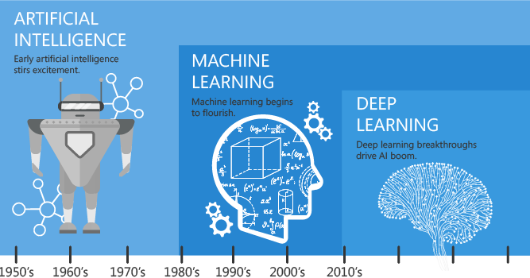

[Home](../README.md)

# Artificial Intelligence, Machine Learning, Deep Learning
Artificial Intelligence, Machine Learning and Deep Learning are 3 terms that are often used to describe software that has intelligent behavior. 

- **Artificial Intelligence** means making computers imitate human behavior in some way.
- **Machine learning** is a subset of Artificial Intelligence and consists of techniques that allow computers to learn things from data and deliver Artificial Intelligence applications.
- **Deep Learning** is a subset of machine learning that enables computers to solve more complex problems.

## Artificial Intelligence
Artificial Intelligence was created in 1956 as an academic discipline whose goal is to make computers perform tasks that are considered unique to humans, namely things that require intelligence. Initially, the researcher worked on problems such as playing chess and solving logic problems.

If you look at the output of one of the chess game programs, you can see some form of “artificial intelligence” behind the move, especially when the computer beats you. The early success led the first researchers to show almost limitless enthusiasm for the possibilities of AI, matched only by the degree to which they misjudged how difficult some problems were to solve.

Artificial Intelligence then refers to the output of the computer. A computer that can do something intelligent, thus showing artificial intelligence or what is commonly called Artificial Intelligence (AI).

## Machine Learning
The reason why early researchers found some of the problems to be much more difficult was because they didn’t match the early techniques used for AI. Hard-coded algorithms or rule-based systems still don’t work well for things like image recognition or extracting meaning from text.

The solution turned out to be not just imitating human behavior (AI) but imitating the way humans learn.

Think about how you learned to read. You don’t sit down, learn spelling and grammar before picking up your first book. You read simple books, passing to more complex ones over time. You really learn the rules (and exceptions) of spelling and grammar from your reading. In other words, you process a lot of data and learn from it.

That’s the idea with Machine Learning. The algorithm (as opposed to your brain) loads of data and let it figure it out. Give the algorithm a lot of data about financial transactions, tell which ones are fraudulent, and let the algorithm know what indicates fraud so that it can predict future fraud. Or provide information about your customer base and let him figure out the best way to segment it. Find out more about machine learning techniques here.

As these algorithms evolve, they can overcome many problems. But some things that are considered easy by humans (such as speech or handwriting recognition) are still difficult for machines to do. However, if machine learning is all about imitating the way humans learn, why not try emulating the human brain? That’s the idea behind neural networks.

The idea of ​​using artificial neurons (neurons, connected by synapses, are the main elements in your brain) have been around for a while. And artificial neural networks that are simulated in software are starting to be used for certain problems. They can show a lot of promise and can solve some complex problems that other algorithms cannot handle.

But machine learning is still stuck on a lot of things that elementary school kids can easily handle, like how many dogs are in this picture or are they really wolves? Walk over there and bring me a ripe banana. What made the characters in this book cry so much?

It turns out that the problem is not with the concept of machine learning or even with the idea of ​​imitating the human brain. A simple neural network with 100s or even 1000s of neurons, connected in relatively simple ways, cannot duplicate what the human brain can do. It shouldn’t come as a surprise when you think about it; The human brain has about 86 billion neurons and very complex interconnectivity.

## Deep Learning
Deep Learning is a subset of machine learning. Usually, when people use the term deep learning, they are referring to a deep artificial neural network.

A deep artificial neural network is like a set of algorithms that have set new records in accuracy for many important problems, such as image recognition, speech recognition, recommendation systems, natural language processing, etc. For example, deep learning is part of the famous AlphaGo DeepMind. algorithm, which beat former world champion Lee Sedol in Go in early 2016, and current world champion Ke Jie in early 2017. A fuller explanation of how nerves work is here.

Deep is a technical term. This refers to the number of layers in a neural network. The shallow network has one called hidden layer and the deep network has more than one. Multiple hidden layers allow a deep neural network to study data features in what is called a feature hierarchy, as simple features (e.g. two pixels) recombine from one layer to the next, to form more complex features (e.g. a line). Nets with multiple layers pass input data (features) through more mathematical operations than nets with fewer layers, and are therefore more computationally intensive to train. Computational intensity is one of the hallmarks of deep learning, and it’s one of the reasons why new types of chip-calling GPUs are needed to train deep learning models.

# Demo Python

- [Predicting Bank Customer Churn](https://github.com/TueHellsternKea/5_semester_code/tree/main/bank-churn)
- [Employee Attrition](https://github.com/TueHellsternKea/5_semester_code/tree/main/employee-attrition-prediction)

# PowerBI

## Set Python Directory in Power BI
Your virtual environment must be linked with Power BI. This can be done using Global Settings in Power BI Desktop

    File → Options → Global → Python scripting

# Install PyCaret
PyCaret is an open-source, low-code machine learning library in Python that automates machine learning workflows.

It is an end-to-end machine learning and model management tool that speeds up the experiment cycle exponentially and makes you more productive.

## How Does PyCaret works?
PyCaret is a workflow automation tool for supervised and unsupervised machine learning. It is organized into six modules and each module has a set of functions available to perform some specific action. Each function takes an input and returns an output, which in most cases is a trained machine learning model. 

Modules available as of the second release are:

- Classification
- Regression
- Clustering
- Anomaly Detection
- Natural Language Processing
- Association Rule Mining

## Create a Virtual Environment and install PyCaret
Create a Virtual Environment and install PyCaret into that.

    python3 -m venv my_bi_env

Activate the virtual environment

    source bin/activate # Mac
    .\Scripts\activate  # Windows

To install the PyCaret library in Python using pip

    pip install pycaret

Installation may take up to 15–20 minutes.