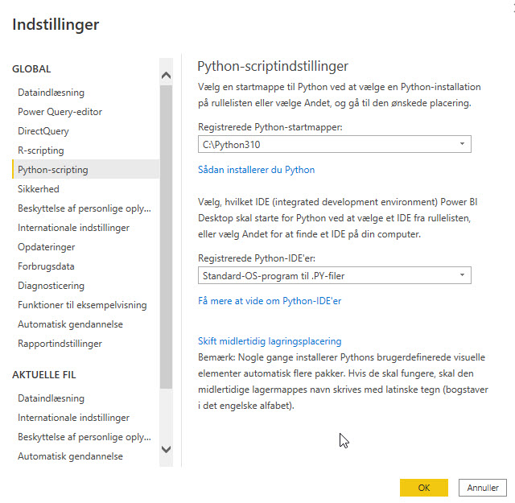

[Home](../README.md)

# Machine Learning

## Set Python Directory in Power BI
Your virtual environment must be linked with Power BI. This can be done using Global Settings in Power BI Desktop

    File → Options → Global → Python scripting

## Install PyCaret
PyCaret is an open-source, low-code machine learning library in Python that automates machine learning workflows.

It is an end-to-end machine learning and model management tool that speeds up the experiment cycle exponentially and makes you more productive.

### Create a Virtual Environment and install PyCaret
Create a Virtual Environment and install PyCaret into that.

    python3 -m venv my_bi_env

Activate the virtual environment

    source bin/activate # Mac
    .\Scripts\activate  # Windows

To install the PyCaret library in Python using pip

    pip install pycaret
