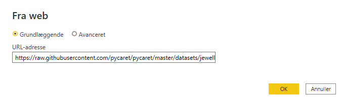

[Home](../README.md)

# Machine Learning

## Set Python Directory in Power BI
Your virtual environment must be linked with Power BI. This can be done using Global Settings in Power BI Desktop

    File → Options → Global → Python scripting

## Install PyCaret
PyCaret is an open-source, low-code machine learning library in Python that automates machine learning workflows.

It is an end-to-end machine learning and model management tool that speeds up the experiment cycle exponentially and makes you more productive.

To install the PyCaret library in Python using pip

    pip install pycaret

## Clustering Analysis in Microsoft Power BI
How to do clustering analysis in Microsoft Power BI using the Python library PyCaret.

### What is Clustering
Clustering is the task of grouping a set of objects in such a way that those in the same group (called a cluster) are more similar to each other than to those in other groups. 

It is an exploratory data mining activity, and a common technique for statistical data analysis used in many fields including machine learning, pattern recognition, image analysis, information retrieval, bioinformatics, data compression, and computer graphics. Some common real-life use cases of clustering are:

- Customer segmentation based on purchase history or interests to design targeted marketing campaigns.
- Cluster documents into multiple categories based on tags, topics, and the content of the document.
- Analysis of outcome in social / life science experiments to find natural groupings and patterns in the data.

Source: [Scikit-Learn](https://scikit-learn.org)

### Dataset
We are using one of the PyCaret demo dataset - jewellery

You can get it her: https://raw.githubusercontent.com/pycaret/pycaret/master/datasets/jewellery.csv

Importing the csv file in Power BI Desktop is very simple.

### K-Means Clustering
To train a clustering model we will execute Python script in Power Query Editor 

    Power Query Editor → Transform → Run python script

