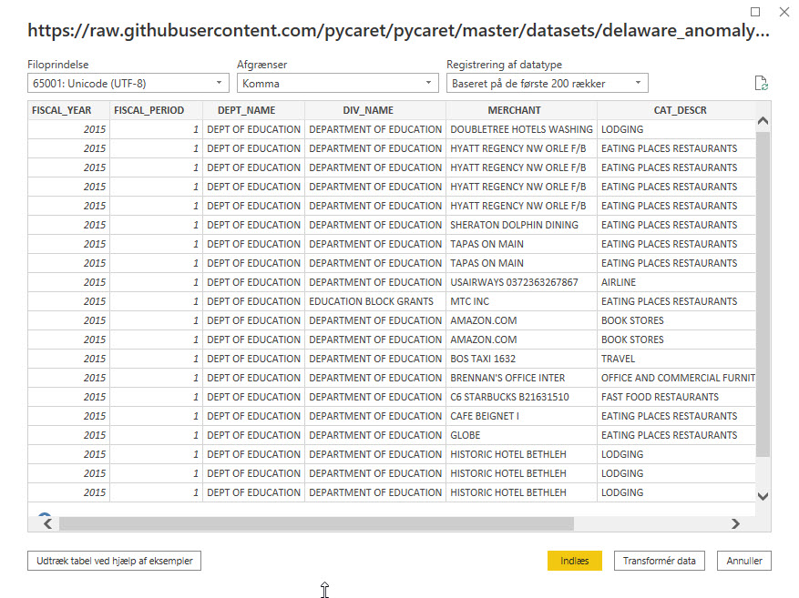
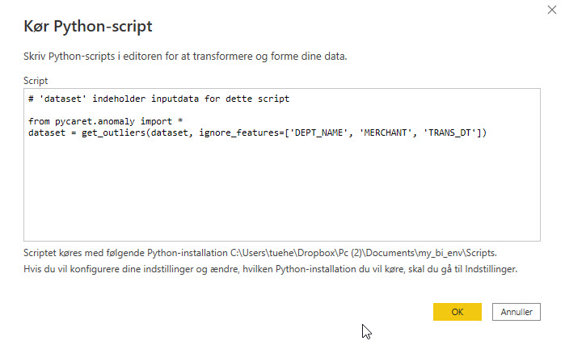

# Anomaly Detection i Power BI
Anomaly Detection is a technique in machine learning used for identifying rare items, events or observations which raise suspicions by differing significantly from the majority of the data.

Typically, the anomalous items will translate to some kind of problem such as bank fraud, a structural defect, medical problems or error. 

There are three ways to implement an anomaly detector:

- **Supervised**: Used when the data set has labels identifying which transactions are anomaly and which are normal. (this is similar to a supervised classification problem).

- **Semi-Supervised**: The idea behind semi-supervised anomaly detection is to train a model on normal data only (without any anomalies). When the trained model is then used on unseen data points, it can predict whether the new data point is normal or not (based on the distribution of the data in the trained model).

- **Unsupervised**: Exactly as it sounds, unsupervised means no labels and therefore no training and test data set. In unsupervised learning a model is trained on the complete dataset and assumes that the majority of the instances are normal. While looking for instances that seem to fit least to the remainder. There are several unsupervised anomaly detection algorithms such as Isolation Forest or One-Class Support Vector Machine. Each has their own method of identifying anomalies in the dataset.

We are implementing unsupervised anomaly detection in Power BI using the Python library PyCaret.

## Data
Most companies issue corporate credit cards to employees for effectively managing operational purchasing. Normally there is a process in place for employees to submit those claims electronically. The data collected is typically transactional and likely to include date of transaction, vendor name, type f expense, merchant and amount.

We will use *State Employees Credit Card Transactions from 2014–2019* for the Department of Education in the State of Delaware, US. The data is available online on their open data platform - [Link](https://data.delaware.gov/Government-and-Finance/Credit-Card-Spend-by-Merchant/8pzf-ge27)

### Get Data
The first step is importing the dataset into Power BI Desktop. You can load the data using a web connector

    Power BI Desktop → Get Data → From Web

https://raw.githubusercontent.com/pycaret/pycaret/master/datasets/delaware_anomaly.csv

## Model Training
To train an anomaly detector in Power BI we will execute a Python script in Power Query Editor

    Power Query Editor → Transform → Run python script

Run the following code as a Python script:

    from pycaret.anomaly import *
    dataset = get_outliers(dataset, ignore_features=['DEPT_NAME', 'MERCHANT', 'TRANS_DT'])

We a ignoring some columns in the dataset by passing them under **ignore_features** parameter.

PyCaret allows you to hide instead of drop unneeded columns from a dataset as you might require those columns for later analysis. 

For example, in this case we don't want to use transactional date for training an algorithm and hence we have passed it under **ignore_features**.

There are over 10 ready-to-use anomaly detection algorithms in PyCaret.

By default, PyCaret trains a K-Nearest Neighbors Anomaly Detector with 5% fraction (*i.e. 5% of the total number of rows in the table will be flagged as outliers*). Default values can be changed easily:

- To change the fraction value you can use the fraction parameter within the **get_outliers()** function.
- To change the model type use the model parameter within **get_outliers()**.

An example code for training an Isolation Forest detector with 0.1 fraction:

    from pycaret.anomaly import *
    dataset = get_outliers(dataset, model = 'iforest', fraction = 0.1, ignore_features=['DEPT_NAME', 'MERCHANT', 'TRANS_DT']

## Dashboard
Once you have Outlier labels in Power BI, here’s an example of how you can visualize it in dashboard:

