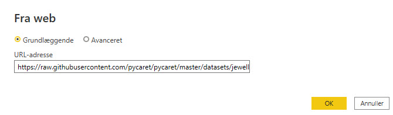
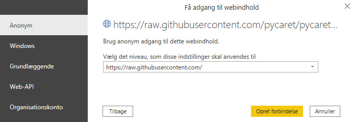
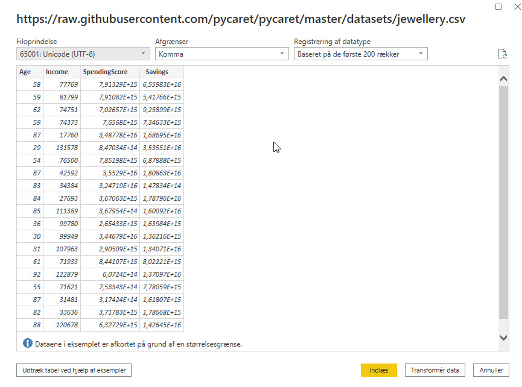

[Home](../README.md)

## Clustering Analysis in Microsoft Power BI
How to do clustering analysis in Microsoft Power BI using the Python library PyCaret.

### What is Clustering
Clustering is the task of grouping a set of objects in such a way that those in the same group (called a cluster) are more similar to each other than to those in other groups. 

It is an exploratory data mining activity, and a common technique for statistical data analysis used in many fields including machine learning, pattern recognition, image analysis, information retrieval, bioinformatics, data compression, and computer graphics. Some common real-life use cases of clustering are:

- Customer segmentation based on purchase history or interests to design targeted marketing campaigns.
- Cluster documents into multiple categories based on tags, topics, and the content of the document.
- Analysis of outcome in social / life science experiments to find natural groupings and patterns in the data.

Source: [Scikit-Learn](https://scikit-learn.org)

### Dataset
We are using one of the PyCaret demo dataset - jewellery.csv

You can get it her: https://raw.githubusercontent.com/pycaret/pycaret/master/datasets/jewellery.csv

Importing the csv file in Power BI Desktop is very simple.

1. Select Import data - Web

2. 

<iframe src="https://www.loom.com/embed/e822f50267634787916efd88a8a4c700" frameborder="0" webkitallowfullscreen mozallowfullscreen allowfullscreen style="position: absolute; top: 0; left: 0; width: 100%; height: 100%;"></iframe>

### K-Means Clustering
To train a clustering model we will execute Python script in Power Query Editor 

    Power Query Editor → Transform → Run python script

    from pycaret.clustering import *
    dataset = get_clusters(data = dataset)

<iframe src="https://www.loom.com/embed/dba53bdc6a444aaea1c6bf45611a18ec" frameborder="0" webkitallowfullscreen mozallowfullscreen allowfullscreen style="position: absolute; top: 0; left: 0; width: 100%; height: 100%;"></iframe>

### Microsoft Power BI - Chart

<iframe src="https://www.loom.com/embed/d333649e105449acba5421bdc1156cb6" frameborder="0" webkitallowfullscreen mozallowfullscreen allowfullscreen style="position: absolute; top: 0; left: 0; width: 100%; height: 100%;"></iframe>

By default, with the **get_clusters** function, K-Means model with **4 clusters** is trained. 

To change the type of model you can simply pass the model parameter. Number of clusters can also be defined in the **num_clusters** parameter.

    from pycaret.clustering import *
    dataset = get_clusters(dataset, model = 'kmodes', num_clusters = 6)

## Read more about K-Means
This article from Stanford about K-Means i very good

[K Means - Written by Chris Piech](https://stanford.edu/~cpiech/cs221/handouts/kmeans.html)