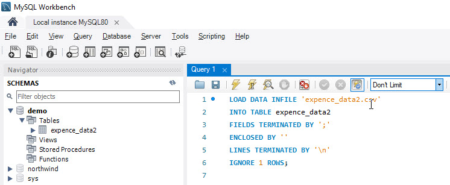
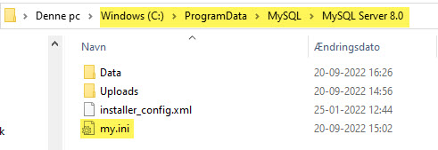

[Home](../README.md)
# Together with "Working as a Business Analyst"


# Content
- [Date](#dates)
- [Case description](#case-description)
- [Your assignment day 1](#your-assignment-day-1)
- [Your assignment day 2](#your-assignment-day-2)
- [Groups](#groups)
- [Files](#files)
- [Videos](#videos)
- [Guides](#guides)
- [Links](#links)

## Dates
- 21-09-2022 - Wednesday
- 30-11-2022 - Wednesday

<iframe width="560" height="315" src="https://www.microsoft.com/en-us/videoplayer/embed/RE4Jq7h?jsapi=true&postJsllMsg=true" title="YouTube video player" frameborder="0" allow="accelerometer; autoplay; clipboard-write; encrypted-media; gyroscope; picture-in-picture" allowfullscreen></iframe>

## Case description - Reimbursement at KEA Retail Consult
The company “KEA Retail Consult” sells software to supermarkets in Europe. The software is installed at the cash registers in the supermarkets. KEA Consult has more than 30 consultants employed visiting supermarkets all over Europe. Their job is to install or update the software.

Each consultant must pay for his own food, travel and accommodation when she is on the road. The expenses are reimbursed afterwards.

For KEA Retail Consult to reimburse expenses each consultant must register her expenses and attach a receipt as proof. There are typically three types of expenses: meals (breakfast, lunch and dinner), accommodation (hotel, b&b, etc) and transport (**flight, car, train, bus**).

It is a very slow and not very streamlined approval process. Sometimes it takes months before the consultants are reimbursed and the money is put into their account.  With 10-20 travelling days a month it sometimes creates liquidity problems for the consultants.

When a consultant has registered his expenses in their common spreadsheet, it must be approved by his manager. The consultant therefor sends a mail to his manager asking him to approve.

The manager will make sure that the expenses were held at a time where she was travelling and that the type of expense and the amount is reasonable. If not or receipts are missing the manager will email the employee and ask him to update or change his registration.

Once the expense has been approved the manager will forward the mail to the accounting department and ask them to transfer the money to the consultant’s bank account.

The accounting department contacts the consultant before transferring the money to make sure that the bank account they have registered is correct.

Both the managers and the accounting department must state in the spreadsheet, when they have approved and paid out the amount, but they quite often forget to do so.

The employees are frustrated because they have no way of knowing how far in the approval process their request is, so they must call or email their manager or the accounting department to get the information.

The managers and the director of KEA Retail Consult would like to have a better overview of the expenses on a monthly basis, so they can keep track of the different expenses. They would also like to keep an eye on how many requests that are awaiting approval or payment.

Attached is a spreadsheet with data from the current, manually based system: [expence_data.xlsx](./files/expence_data.xlsx)


## Your assignment Day 1:
Based on the description about the current processes and the data in the spreadsheet, make a requirement specification for a new system to support the reimbursement process in KEA Retail consult.  

**Your specification should include the following:**

-Description of the Scope of the project, the as-is situation and the business needs and the user needs 
-Description of the user and business requirements (*Functional requirements, user stories and acceptance criteria*) 
    - Relevant models/diagrams to support the understanding of the requirements (*For example: processes, decision diagrams, E/R diagrams, dataflow diagrams, prototypes*) 

You also need to create a database in MySQL based on your E/R diagram and import data from the spreadsheet  

Your SQL file, that can be used to create the database and insert data into the database, and the requirement specification must be handed in as a group assignment on Fronter. 

If you are not done by the end of today's lectures, **hand it in at the latest on October 5th.**

[Hand in folder](https://studkea.sharepoint.com/:f:/s/BE-ITA20common/EnD6eepyduZFkmbLAoNbAGwBI5-qoN1FyndeW1s6DkN_yA?e=nxoFWg)  

## Your assignment Day 2:
To come

## Groups
We have created the groups for the 2 days:
- [Groups](./files/KNY-WaaB.pdf)

## Files
The Excel file that “KEA Retail Consult” is using right now:
- [expence_data.xlsx](./files/expence_data.xlsx)

## Videos
Some videos there give you and understanding of the Microsoft Power Platform. Make sure that you have seen them before day one.

### Microsoft introduction video
<iframe width="560" height="315" src="https://www.youtube.com/embed/OwOWDXteakM" title="Microsoft Power Apps overview" frameborder="0" allow="accelerometer; autoplay; clipboard-write; encrypted-media; gyroscope; picture-in-picture" allowfullscreen></iframe>

### Overview video from 365.Training
<iframe width="560" height="315" src="https://www.youtube.com/embed/p3B4JRexdRM" title="YouTube video player" frameborder="0" allow="accelerometer; autoplay; clipboard-write; encrypted-media; gyroscope; picture-in-picture" allowfullscreen></iframe>

### Ekstra video from Microsoft - 55 min!
- [Real-World Examples of Microsoft Power Automate in Action - 55 minutter](https://videos.microsoft.com/cloud/watch/b3RqhL5q11xD7EBQTqLrpg?)


# Guides

## MySQL - Import from Excel
### 1. First you have to save the Excel file as CSV files.
When you import data into MySQL, you have to use the CSV format.

<div style="position: relative; padding-bottom: 71.23287671232877%; height: 0;"><iframe src="https://www.loom.com/embed/ad9bf3a19b6c4b2c868e1b692f08cfea" frameborder="0" webkitallowfullscreen mozallowfullscreen allowfullscreen style="position: absolute; top: 0; left: 0; width: 100%; height: 100%;"></iframe></div>


### 2. Then you have to import your CSV file(s) into MySQL
You have to import the current Data into your MySQL file. It might be one CSV file or multiply CSV files.

Because there are over 300.000 rows this import will take "*some time*", if you use the "wrong" method.

The Import guide in MySQL is very slow and the import of 300.000 rows will tage a verrrry log time.

You have to use a litte bit of SQL kode to get it done.

Use the this SQL in Workbench:
```sql
LOAD DATA INFILE 'name-of-file.csv' 
INTO TABLE name-of-table
FIELDS TERMINATED BY ';' 
ENCLOSED BY ''
LINES TERMINATED BY '\n'
IGNORE 1 ROWS;
```
Could be something like this:
```sql
LOAD DATA INFILE 'expence_data2.csv' 
INTO TABLE expence_data2
FIELDS TERMINATED BY ';' 
ENCLOSED BY ''
LINES TERMINATED BY '\n'
IGNORE 1 ROWS;
```



**Location of CSV file**

Make sure that your CSV is located in the folder: 

**C:\ProgramData\MySQL\MySQL Server 8.0\Data\demo**

Where **demo** is the name of the Database

### error code 1290 secure-file-priv
You might get an error - **error code 1290 secure-file-priv**

This is in fact a security setting in MySQL.

**The solution is:**

- Find the MySQL file: my,ini
  - In Windows it is located in the folder: *C:\ProgramData\MySQL\MySQL Server 8.0*



- Open the as Administrator - *It is a protected file*
- Find the line: **secure-file-priv="......"** and change it to:
  - **secure-file-priv=""**
- Save the my.ini file
- Restart the MySQL server - *Can be done from Workbench* - **Server >Startup/Shutdown**
- Run the SQL import code


### 3. Export
You have to create a file with both the Database **Struktur** and the **Data**.

With this SQL file you could be able to create the database struktur and the data on a new (*another*) MySQL server.

**Create a "backup" using MySQL Workbench**
- Connect to your MySQL database
- Click Server on the main tool bar
- Select Data Export
- Select the database you want to "backup"
- Under Export Options, select where you want your dump saved
- Click Start Export

<div style="position: relative; padding-bottom: 71.23287671232877%; height: 0;"><iframe src="https://www.loom.com/embed/6dd451522d5a45048b63ecf44471bed2" frameborder="0" webkitallowfullscreen mozallowfullscreen allowfullscreen style="position: absolute; top: 0; left: 0; width: 100%; height: 100%;"></iframe></div>

**This file must be handed in at the latest on October 5th.**

### 4. Import
When you have the file, cerated in step 3 and wants to use it on a new server.

<div style="position: relative; padding-bottom: 71.23287671232877%; height: 0;"><iframe src="https://www.loom.com/embed/8a9599c30477485a96d53f5b8a1fbd5b" frameborder="0" webkitallowfullscreen mozallowfullscreen allowfullscreen style="position: absolute; top: 0; left: 0; width: 100%; height: 100%;"></iframe></div>

### Power Automate
Microsoft guides installing Power Automate on your computer:

- [DK version](https://docs.microsoft.com/da-dk/power-automate/desktop-flows/
install)
- [UK version](https://docs.microsoft.com/en-us/power-automate/desktop-flows/install)

## Links

- [SQL Data Export and Import Wizard](https://dev.mysql.com/doc/workbench/en/wb-admin-export-import-management.html)
- [powerplatform.microsoft.com/en-us](https://powerplatform.microsoft.com/en-us/)
- [powerplatform.microsoft.com/en-us/what-is-power-platform](https://powerplatform.microsoft.com/en-us/what-is-power-platform/)
- [Microsoft Power Platform documentation](https://docs.microsoft.com/en-us/power-platform/)
- [YouTube MS Power Platform](https://www.youtube.com/c/mspowerplatform)
- [Power Platform Admin Center](https://admin.powerplatform.microsoft.com/home)
- [Microsoft Power Platform Stories](https://powerapps.microsoft.com/en-us/blog/power-platform-stories/)