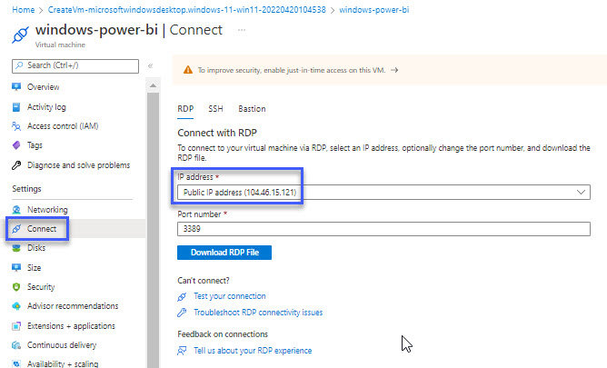
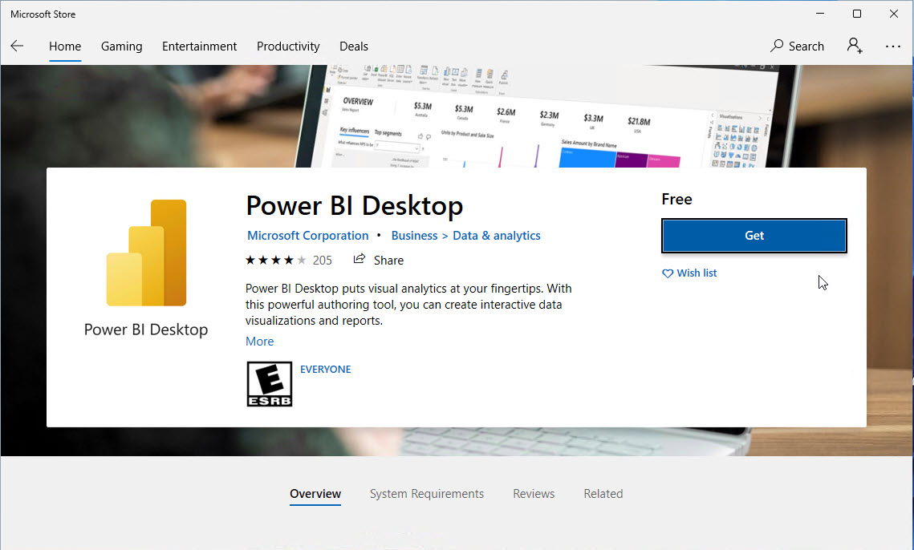

# Windows VM - Power BI
Microsoft Power BI Desktop is Windows only.

One way of using Power BI Desk is a Windows Virtual machine.

## Content
- [Windows VM - Power BI](#windows-vm---power-bi)
  - [Content](#content)
  - [Windows Virtual Machine](#windows-virtual-machine)
  - [Minimum requirements System Requirements](#minimum-requirements-system-requirements)
  - [Create VM](#create-vm)
  - [Video](#video)
- [Connect to VM](#connect-to-vm)
- [Install Power BI Desktop](#install-power-bi-desktop)
- [Links](#links)

## Windows Virtual Machine
We are going to create a Azure Windows Virtual Machine for the Power Bi Desktop.

## Minimum requirements System Requirements
- Windows 10, Windows Server 2012 R2, Windows Server 2012, Windows 8, Windows 8.1, Windows Server 2016, Windows Server 2019, Windows 11
- Internet Explorer 11 or greater
- .NET 4.6.2 or later
- At least 2 GB available memory (RAM), 4 GB or more recommended
- Microsoft Power BI Desktop is available for 32-bit (x86) and 64-bit (x64) platforms

## Create VM
- Login - [portal.azure.com](https://portal.azure.com/)
- Create a resource
- Virtual machine
- Select Windows 11

## Video

<iframe src="https://www.loom.com/embed/175aae60839c451fa9c5d101e2f3dfad" frameborder="0" webkitallowfullscreen mozallowfullscreen allowfullscreen style="position: absolute; top: 0; left: 0; width: 100%; height: 100%;"></iframe>

# Connect to VM
We are going to use RDP to connect from your desktop to the Virtual Machine.

- Select Connect
- Select RDP
- Download RDP file

You can now use the RDP on your Mac computer. Se more at:
- [docs.microsoft.com/en-us/windows-server/remote/remote-desktop-services/clients/remote-desktop-mac](https://docs.microsoft.com/en-us/windows-server/remote/remote-desktop-services/clients/remote-desktop-mac)
- [install.appcenter.ms/orgs/rdmacios-k2vy/apps/microsoft-remote-desktop-for-mac/distribution_groups/all-users-of-microsoft-remote-desktop-for-mac](https://install.appcenter.ms/orgs/rdmacios-k2vy/apps/microsoft-remote-desktop-for-mac/distribution_groups/all-users-of-microsoft-remote-desktop-for-mac)

# Install Power BI Desktop
When you are connected to the Virtual machine you can install Microsoft Power BI Desktop.

It is possible to install from the Microsoft Store

*You do not have to use an Microsoft Account - Just bypass the login!*

Now you can use Microsoft Power BI on the Virtual machine.

# Links
- [docs.microsoft.com/en-us/power-bi/](https://docs.microsoft.com/en-us/power-bi/)
- [docs.microsoft.com/en-us/power-bi/fundamentals/desktop-get-the-desktop](https://docs.microsoft.com/en-us/power-bi/fundamentals/desktop-get-the-desktop)
- [docs.microsoft.com/en-us/power-bi/fundamentals/service-service-vs-desktop](https://docs.microsoft.com/en-us/power-bi/fundamentals/service-service-vs-desktop)
- [docs.microsoft.com/en-us/windows-server/remote/remote-desktop-services/clients/remote-desktop-mac](https://docs.microsoft.com/en-us/windows-server/remote/remote-desktop-services/clients/remote-desktop-mac)
- [install.appcenter.ms/orgs/rdmacios-k2vy/apps/microsoft-remote-desktop-for-mac/distribution_groups/all-users-of-microsoft-remote-desktop-for-mac](https://install.appcenter.ms/orgs/rdmacios-k2vy/apps/microsoft-remote-desktop-for-mac/distribution_groups/all-users-of-microsoft-remote-desktop-for-mac)