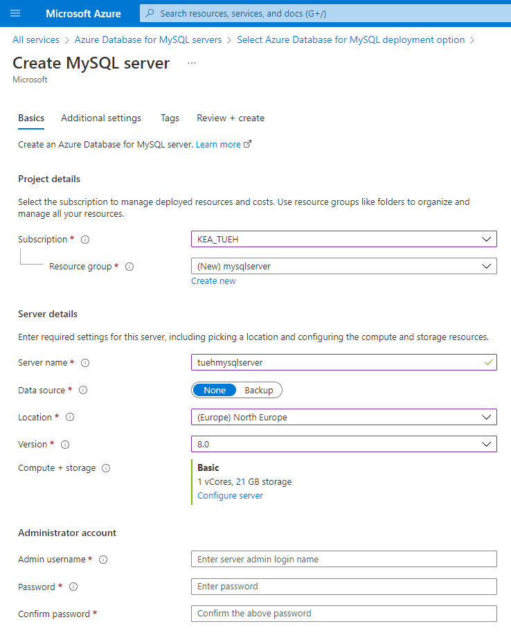
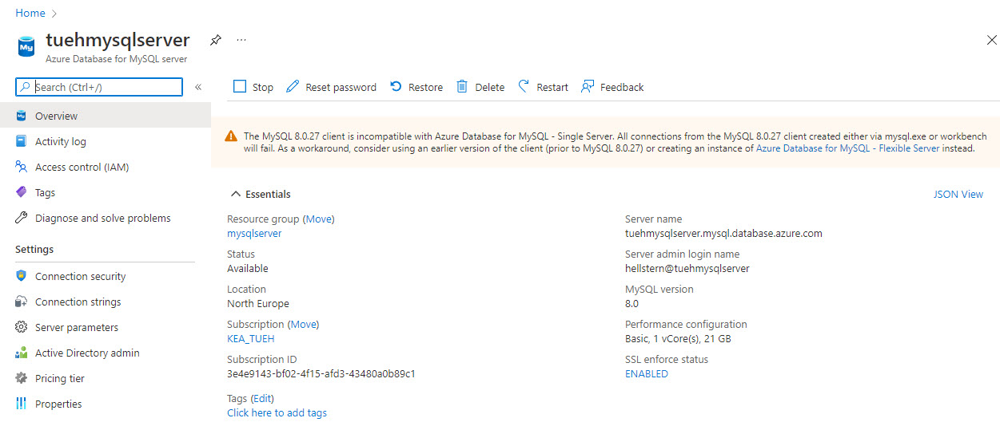
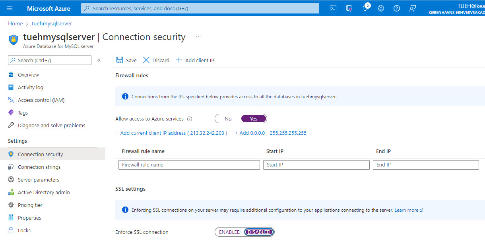

# Create MySQL Database

<iframe width="560" height="315" src="./video/createmysqlserver.mp4" frameborder="0" allow="accelerometer; autoplay=false; encrypted-media; gyroscope; picture-in-picture" allowfullscreen></iframe>

## Creating a MySQL Database server on Azure

- Login with your students email at [portal.azure.com] (https://portal.azure.com)
- Select *All services*
- Select the section with *Databases*
- Select *Azure Database for MySQL server*
- Click on *Create Azure Database for MySQL server*
- Select *Single server* - Click on *Create*
- Select the following options:
  - **Project details**
    - Subscription: *Your subscription name*
    - Resource group: *Create a new one*: mysqlserver
  - **Server details**
    - Server name: *Name for your server*: xxxhmysqlserver
    - Data source: *None*
    - Location: *(Europa) North Europa*
    - Version: *8.0*
    - Compute + storage: *Select configure server*: 
      - *Basic*
      - *1 vCore*
      - *Storage: 20 GB*
  - **Administrator account**
    - Admin username:*Your admin name*
    - Password: *Your password*
    - Confirm password: *Your password*

- Click *Next: Additional settings*
- Click *Next: Tags*
- Click *Next: Review + create*
- Click *Create*

Your mysql database server is now set up and you can start using it, e.g. with *Workbench*

To connect to server you need:

- Server name
- Server admin login name
- Server password

## Access & SSL
You need to allow access tol your MySQL server for all IP adresses.

If it is not a production server, it may be beneficial to turn off SSL. This makes it easier to connect to the server, but less secure.

- Click on *SSL enforce status ENABLED*

### Allow access
- **Firewall rules**
  - Allow access to Azure services: *Yes*
  - Click *Add 0.0.0.0 - 255.255.255.255* (*Access form all ip adresses*)

### Disable SSL
- **SSL settings**
  - Enforce SSL connection: *DISABLED* (*Less secure, but easy access*)

- Click *Save*

