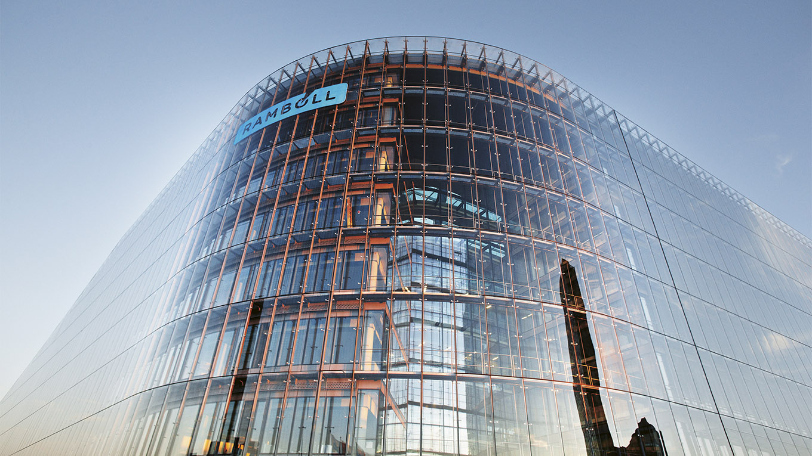
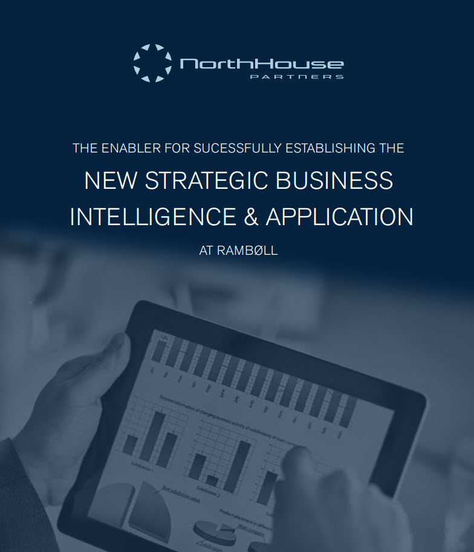

<!-- _backgroundColor: black -->
<!-- _color: white -->

# NEW STRATEGIC <!-- fit -->
# BUSINESS INTELLIGENCE  & APPLICATION <!-- fit -->
## AT RAMBØLL <!-- fit -->

---

# The enabler for successfully establishing the new **Strategic Business Intelligence & Applications**

# A new **datadriven** agile **delivery setup** at Rambøll

---

<!-- _backgroundColor: black -->
<!-- _color: white -->
The ways that Rambøll internal stakeholders, management and their clients use
data have changed significantly.

Timely and predictive business data driven analysis is a key part of both the strategy and execution internally and with clients.

The demand for working with these data is increasing fast and becoming an extremely valuable asset for growing the Rambøll business in an effective way

---

<!-- _backgroundColor: black -->
<!-- _color: white -->
## CHALLENGES // SOLUTION // OUTCOMES <!-- fit -->

---

# NortHouse PDF <!-- fit -->
- Fronter
- [https://bit.ly/ramboll_case](https://bit.ly/ramboll_case)

# Anual report PDF <!-- fit -->
- Fronter
- [https://bit.ly/ramboll_report](https://bit.ly/ramboll_report)

----

# Plan for the case <!-- fit -->

- Read the PDF in groups
- Back at 10:00 
    - Questions/Presentation in groups
- Solutions
